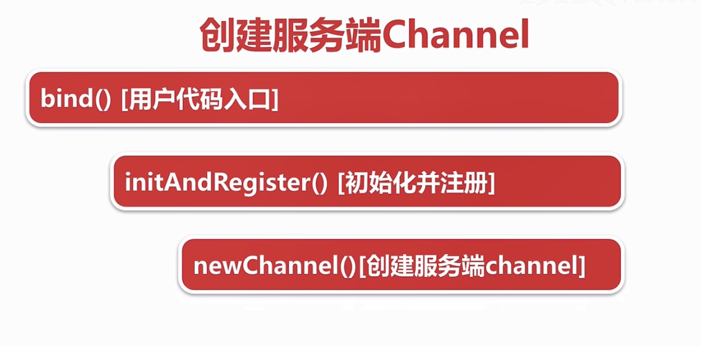
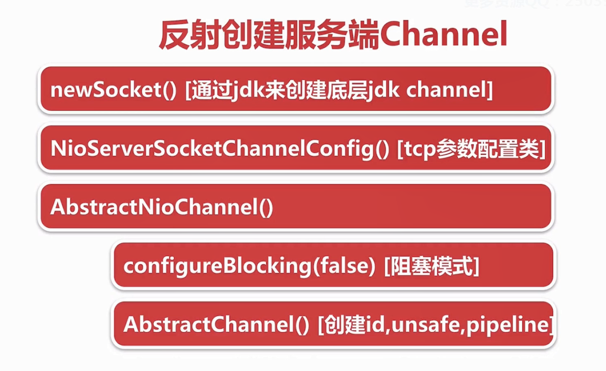
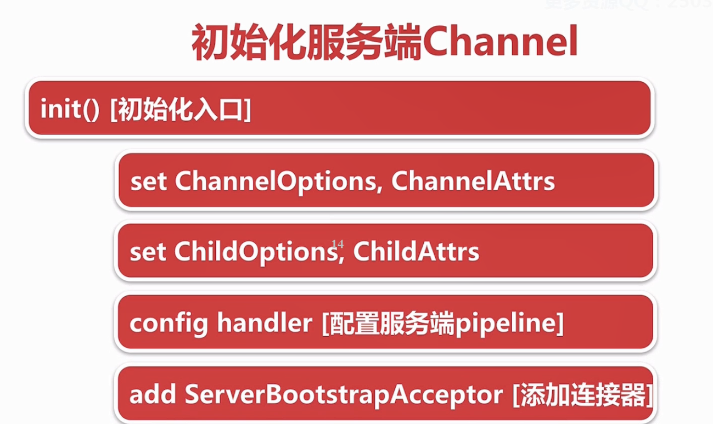
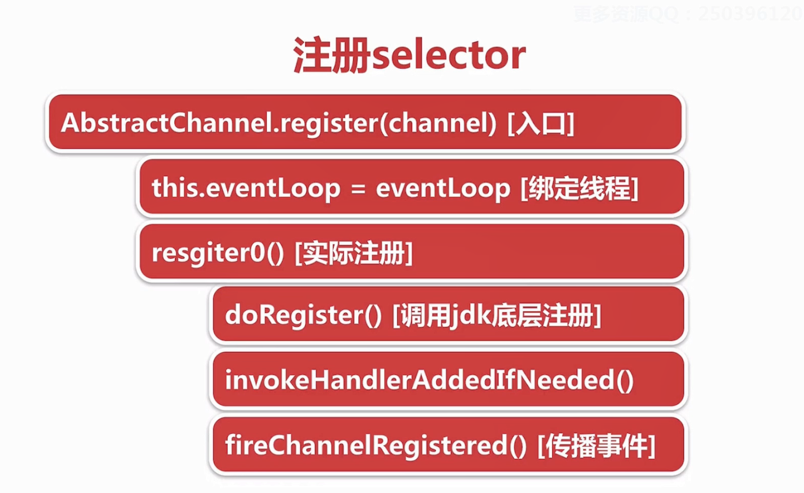
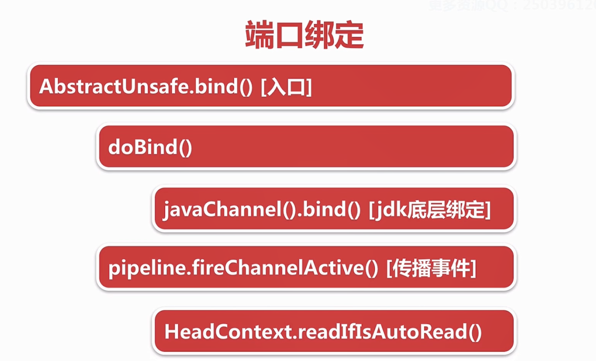
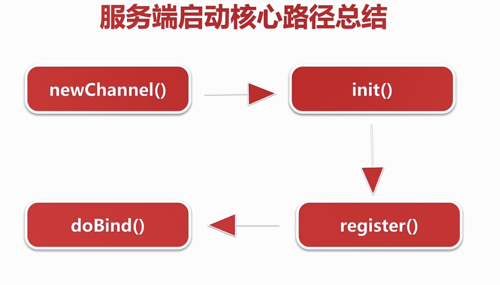

版本 4.1.29 final


关注两个问题
1. 服务端socket 哪里初始化
2. 在哪里accept的

由 bind入手

## 服务端启动步骤
### 1.创建服务端channel
	调用底层的channel,包装成自己的channel,在绑定一些组件

io.netty.bootstrap.AbstractBootstrap<B, C>
```
doBind(final SocketAddress localAddress) {
		// 初始化话 并注册
        final ChannelFuture regFuture = initAndRegister();
        final Channel channel = regFuture.channel();
		........................
		}
```
	进入initAndRegister 
```
 final ChannelFuture initAndRegister() {
        Channel channel = null;
        try {
			// 这里的 channelFactory 随后会说到是由最开始的NioServerSocketChannel.class 反射行程的
            channel = channelFactory.newChannel();
            init(channel);
			....................
			}
		}
```
	找到具体实现 newChannel() 的 io.netty.channel.ReflectiveChannelFactory<T> 的 
```
	// 创建Channel
	@Override
	public T newChannel() {
		try {
			return clazz.getConstructor().newInstance();
		} catch (Throwable t) {
			throw new ChannelException("Unable to create Channel from class " + clazz, t);
		}
	}
	
```
	具体找到clazz
	这一步 其实在  启动的时候.channel (.channel(NioServerSocketChannel.class))那里完成,进去看一下
```
	public B channel(Class<? extends C> channelClass) {
		if (channelClass == null) {
			throw new NullPointerException("channelClass");
		}
		return channelFactory(new ReflectiveChannelFactory<C>(channelClass));
	}
```
	在这里创建了 ReflectiveChannelFactory 上面提到的 clazz 其实就是这个 channelClass = NioServerSocketChannel.class;
	
	那我们又继续去看一下 NioServerSocketChannel 的构造函数又做了哪些事情

io.netty.channel.socket.nio.NioServerSocketChannel
1.newSocket(通过底层创建channel)
	最后到了:
```
	  private static ServerSocketChannel newSocket(SelectorProvider provider) {
        try {
            /**
             *  Use the {@link SelectorProvider} to open {@link SocketChannel} and so remove condition in
             *  {@link SelectorProvider#provider()} which is called by each ServerSocketChannel.open() otherwise.
             *
             *  See <a href="https://github.com/netty/netty/issues/2308">#2308</a>.
             */
			// 这里其实就是调用底层的 NIO 获得一个channel
            return provider.openServerSocketChannel();
        } catch (IOException e) {
            throw new ChannelException(
                    "Failed to open a server socket.", e);
        }
    }
```
2.NioServerSocketChannelConfig[TCP参数配置类]
```
 /**
     * Create a new instance using the given {@link ServerSocketChannel}.
     */
    public NioServerSocketChannel(ServerSocketChannel channel) {
        super(null, channel, SelectionKey.OP_ACCEPT);
        config = new NioServerSocketChannelConfig(this, javaChannel().socket());
    }
```
3.调用父类的AbstractNioChannel 确定是否是阻塞模式   configureBlocking(false);
```
  public NioServerSocketChannel(ServerSocketChannel channel) {
	  // 这里的super 就是调用父类的方法 
        super(null, channel, SelectionKey.OP_ACCEPT);
        config = new NioServerSocketChannelConfig(this, javaChannel().socket());
    }
```
一直跟上去  io.netty.channel.nio.AbstractNioChannel
```
 protected AbstractNioChannel(Channel parent, SelectableChannel ch, int readInterestOp) {
        super(parent);
        this.ch = ch;
        this.readInterestOp = readInterestOp;
        try {
			// 确定是非阻塞
            ch.configureBlocking(false);
        } catch (IOException e) {
            try {
                ch.close();
            } catch (IOException e2) {
                if (logger.isWarnEnabled()) {
                    logger.warn(
                            "Failed to close a partially initialized socket.", e2);
                }
            }

            throw new ChannelException("Failed to enter non-blocking mode.", e);
        }
    }
```
4. abstractChannel [创建id,unsafe,pipeline],在上一个的super方法中实现 io.netty.channel.AbstractChannel
```
  protected AbstractChannel(Channel parent) {
        this.parent = parent;
        id = newId();
        unsafe = newUnsafe();
        pipeline = newChannelPipeline();
    }
```


### 2.初始化channel
	绑定一些属性,添加逻辑处理器 在新的连接后都会使用这些属性
	
init 方法就是前面说的那个initAndRegister方法
```
 final ChannelFuture initAndRegister() {
        Channel channel = null;
        try {
			// 这里的 channelFactory 随后会说到是由最开始的NioServerSocketChannel.class 反射行程的
            channel = channelFactory.newChannel();
            init(channel);
			....................
			}
		}
```
进入init方法 io.netty.bootstrap.ServerBootstrap
1. set在channelOptions 和channelAttrs   没有什么逻辑处理 知识保存起来
```
void init(Channel channel) throws Exception {
        final Map<ChannelOption<?>, Object> options = options0();
		// 的options 创建进去
        synchronized (options) {
            setChannelOptions(channel, options, logger);
        }

		// attr
        final Map<AttributeKey<?>, Object> attrs = attrs0();
        synchronized (attrs) {
            for (Entry<AttributeKey<?>, Object> e: attrs.entrySet()) {
                @SuppressWarnings("unchecked")
                AttributeKey<Object> key = (AttributeKey<Object>) e.getKey();
                channel.attr(key).set(e.getValue());
            }
        }

        ChannelPipeline p = channel.pipeline();

        final EventLoopGroup currentChildGroup = childGroup;
        final ChannelHandler currentChildHandler = childHandler;
        final Entry<ChannelOption<?>, Object>[] currentChildOptions;
        final Entry<AttributeKey<?>, Object>[] currentChildAttrs;
        synchronized (childOptions) {
            currentChildOptions = childOptions.entrySet().toArray(newOptionArray(0));
        }
        synchronized (childAttrs) {
            currentChildAttrs = childAttrs.entrySet().toArray(newAttrArray(0));
        }

        p.addLast(new ChannelInitializer<Channel>() {
            @Override
            public void initChannel(final Channel ch) throws Exception {
                final ChannelPipeline pipeline = ch.pipeline();
                ChannelHandler handler = config.handler();
                if (handler != null) {
                    pipeline.addLast(handler);
                }

                ch.eventLoop().execute(new Runnable() {
                    @Override
                    public void run() {
                        pipeline.addLast(new ServerBootstrapAcceptor(
                                ch, currentChildGroup, currentChildHandler, currentChildOptions, currentChildAttrs));
                    }
                });
            }
        });
    } 
	
	
```
io.netty.bootstrap.AbstractBootstrap<B, C> 类中
```
 static void setChannelOptions(
            Channel channel, Map<ChannelOption<?>, Object> options, InternalLogger logger) {
        for (Map.Entry<ChannelOption<?>, Object> e: options.entrySet()) {
            setChannelOption(channel, e.getKey(), e.getValue(), logger);
        }
    }
	
 @SuppressWarnings("unchecked")
    private static void setChannelOption(
            Channel channel, ChannelOption<?> option, Object value, InternalLogger logger) {
        try {
			// 这里的channel.config() 其实就是我们上一部分讲的config
            if (!channel.config().setOption((ChannelOption<Object>) option, value)) {
                logger.warn("Unknown channel option '{}' for channel '{}'", option, channel);
            }
        } catch (Throwable t) {
            logger.warn(
                    "Failed to set channel option '{}' with value '{}' for channel '{}'", option, value, channel, t);
        }
    }
	
```
attr 更明显 就不说了
2. 设置childOptions 和 childAttrs 也没有什么逻辑处理 
```
 final Entry<ChannelOption<?>, Object>[] currentChildOptions;
        final Entry<AttributeKey<?>, Object>[] currentChildAttrs;
        synchronized (childOptions) {
            currentChildOptions = childOptions.entrySet().toArray(newOptionArray(0));
        }
        synchronized (childAttrs) {
            currentChildAttrs = childAttrs.entrySet().toArray(newAttrArray(0));
        }
```
3. 配置服务端pipeline
```
.................
    ChannelPipeline p = channel.pipeline();
.................
final ChannelPipeline pipeline = ch.pipeline();
                ChannelHandler handler = config.handler();
                if (handler != null) {
                    pipeline.addLast(handler);
                }
	
```
这里有个handler 是在我们用户代码server中创建的(ServerDemo1) 中的
```
	.handler(new ServerHandler())
	
```
把用户自定义的handler变成一个成员变量,进行添加进pipeline
4. add ServerBootstrapAcceptor(添加连接器) 
	一个默认的handler

### 3. 注册selector
	将channel注册到轮询器 selector上
	在newChannel()后 ,创建channel后,随后便会注册到selector上

```
 final ChannelFuture initAndRegister() {
        Channel channel = null;
        try {
			// 创建channel
            channel = channelFactory.newChannel();
			// 初始化channel
            init(channel);
        } catch (Throwable t) {
            if (channel != null) {
                // channel can be null if newChannel crashed (eg SocketException("too many open files"))
                channel.unsafe().closeForcibly();
                // as the Channel is not registered yet we need to force the usage of the GlobalEventExecutor
                return new DefaultChannelPromise(channel, GlobalEventExecutor.INSTANCE).setFailure(t);
            }
            // as the Channel is not registered yet we need to force the usage of the GlobalEventExecutor
            return new DefaultChannelPromise(new FailedChannel(), GlobalEventExecutor.INSTANCE).setFailure(t);
        }
		
		// channel注册轮寻器
        ChannelFuture regFuture = config().group().register(channel);
        if (regFuture.cause() != null) {
            if (channel.isRegistered()) {
                channel.close();
            } else {
                channel.unsafe().closeForcibly();
            }
        }

        // If we are here and the promise is not failed, it's one of the following cases:
        // 1) If we attempted registration from the event loop, the registration has been completed at this point.
        //    i.e. It's safe to attempt bind() or connect() now because the channel has been registered.
        // 2) If we attempted registration from the other thread, the registration request has been successfully
        //    added to the event loop's task queue for later execution.
        //    i.e. It's safe to attempt bind() or connect() now:
        //         because bind() or connect() will be executed *after* the scheduled registration task is executed
        //         because register(), bind(), and connect() are all bound to the same thread.

        return regFuture;
    }
	```
	
	最后会调用 io.netty.channel.AbstractChannel
```
  @Override
        public final void register(EventLoop eventLoop, final ChannelPromise promise) {
            if (eventLoop == null) {
                throw new NullPointerException("eventLoop");
            }
            if (isRegistered()) {
                promise.setFailure(new IllegalStateException("registered to an event loop already"));
                return;
            }
            if (!isCompatible(eventLoop)) {
                promise.setFailure(
                        new IllegalStateException("incompatible event loop type: " + eventLoop.getClass().getName()));
                return;
            }
			
			
			 // 这里就是告诉channel 以后所有的IO事件都是交给这个eventLoop来处理
            AbstractChannel.this.eventLoop = eventLoop;

            if (eventLoop.inEventLoop()) {
				//实际的注册
                register0(promise);
            } else {
                try {
                    eventLoop.execute(new Runnable() {
                        @Override
                        public void run() {
                            register0(promise);
                        }
                    });
                } catch (Throwable t) {
                    logger.warn(
                            "Force-closing a channel whose registration task was not accepted by an event loop: {}",
                            AbstractChannel.this, t);
                    closeForcibly();
                    closeFuture.setClosed();
                    safeSetFailure(promise, t);
                }
            }
        }
		
	 private void register0(ChannelPromise promise) {
            try {
                // check if the channel is still open as it could be closed in the mean time when the register
                // call was outside of the eventLoop
                if (!promise.setUncancellable() || !ensureOpen(promise)) {
                    return;
                }
                boolean firstRegistration = neverRegistered;
				// 1.注册
                doRegister();
                neverRegistered = false;
                registered = true;

                // Ensure we call handlerAdded(...) before we actually notify the promise. This is needed as the
                // user may already fire events through the pipeline in the ChannelFutureListener.
				// 2.触发一个事件
                pipeline.invokeHandlerAddedIfNeeded();

                safeSetSuccess(promise);
				// 3.触发一个事件
                pipeline.fireChannelRegistered();
                // Only fire a channelActive if the channel has never been registered. This prevents firing
                // multiple channel actives if the channel is deregistered and re-registered.
                if (isActive()) {
                    if (firstRegistration) {
                        pipeline.fireChannelActive();
                    } else if (config().isAutoRead()) {
                        // This channel was registered before and autoRead() is set. This means we need to begin read
                        // again so that we process inbound data.
                        //
                        // See https://github.com/netty/netty/issues/4805
                        beginRead();
                    }
                }
            } catch (Throwable t) {
                // Close the channel directly to avoid FD leak.
                closeForcibly();
                closeFuture.setClosed();
                safeSetFailure(promise, t);
            }
        }
```
因为我们是Nio 所以上面的(1) 我们直接进入AbstractNioChannel里面 io.netty.channel.nio.AbstractNioChannel
```
 @Override
    protected void doRegister() throws Exception {
        boolean selected = false;
        for (;;) {
            try {
				// JDK底层的一个方法  0 代表不关心任何事件 ,把this(服务端的channel)注册去selector
                selectionKey = javaChannel().register(eventLoop().unwrappedSelector(), 0, this);
                return;
            } catch (CancelledKeyException e) {
                if (!selected) {
                    // Force the Selector to select now as the "canceled" SelectionKey may still be
                    // cached and not removed because no Select.select(..) operation was called yet.
                    eventLoop().selectNow();
                    selected = true;
                } else {
                    // We forced a select operation on the selector before but the SelectionKey is still cached
                    // for whatever reason. JDK bug ?
                    throw e;
                }
            }
        }
    }
```
后面的两个方法,实际是我们用户自定义的handle的 方法.根据写的 ServerDemo1 来看.handle 会首先 执行先执行handlerAdded再channelRegistered
```
  @Override
    public void channelActive(ChannelHandlerContext ctx) {
        System.out.println("channelActive");
    }

    @Override
    public void channelRegistered(ChannelHandlerContext ctx) {
        System.out.println("channelRegistered");
    }

    @Override
    public void handlerAdded(ChannelHandlerContext ctx) {
        System.out.println("handlerAdded");
    }
	
	// 打印结果:
	handlerAdded
	channelRegistered
	channelActive
```
需要注意的是: channelActive 并不是上面注册selector处理的. 上面有个方法isActive(); 返回会是false,只有当下一节讲了后才会active
### 4.端口绑定 
	调用底层api,绑定本地的port io.netty.channel.AbstractChannel 就在注册后的一个方法

```
@Override
        public final void bind(final SocketAddress localAddress, final ChannelPromise promise) {
            assertEventLoop();

            if (!promise.setUncancellable() || !ensureOpen(promise)) {
                return;
            }

            // See: https://github.com/netty/netty/issues/576
            if (Boolean.TRUE.equals(config().getOption(ChannelOption.SO_BROADCAST)) &&
                localAddress instanceof InetSocketAddress &&
                !((InetSocketAddress) localAddress).getAddress().isAnyLocalAddress() &&
                !PlatformDependent.isWindows() && !PlatformDependent.maybeSuperUser()) {
                // Warn a user about the fact that a non-root user can't receive a
                // broadcast packet on *nix if the socket is bound on non-wildcard address.
                logger.warn(
                        "A non-root user can't receive a broadcast packet if the socket " +
                        "is not bound to a wildcard address; binding to a non-wildcard " +
                        "address (" + localAddress + ") anyway as requested.");
            }

            boolean wasActive = isActive();
            try {
				// 调用底层方法的一个绑定
                doBind(localAddress);
            } catch (Throwable t) {
                safeSetFailure(promise, t);
                closeIfClosed();
                return;
            }
			
			// 这里意思是 在绑定前不是active 绑定后是active了 ,后面执行一个方法
            if (!wasActive && isActive()) {
                invokeLater(new Runnable() {
                    @Override
                    public void run() {
						// 触发一个actice的事件 传播事件
                        pipeline.fireChannelActive();
                    }
                });
            }

            safeSetSuccess(promise);
        }
```
bing调用底层的方法 io.netty.channel.socket.nio.NioServerSocketChannel
```
  @Override
    protected void doBind(SocketAddress localAddress) throws Exception {
        if (PlatformDependent.javaVersion() >= 7) {
			// 以前创建的 JDK底层的channel 
            javaChannel().bind(localAddress, config.getBacklog());
        } else {
            javaChannel().socket().bind(localAddress, config.getBacklog());
        }
    }
```

关注前面触发的一个fireChannelActive事件,因为是从ChannelPipeline 所以我们先去io.netty.channel.DefaultChannelPipeline 第一个节点就是
```
   @Override
        public void channelActive(ChannelHandlerContext ctx) throws Exception {
			// 这里才调用active方法 :就是注册selector的时候
            ctx.fireChannelActive();

            readIfIsAutoRead();
        }
```
跟进 readIfActoRead()

```

        private void readIfIsAutoRead() {
            if (channel.config().isAutoRead()) {
                channel.read();
            }
        }
```
跟进read方法
```
  @Override
    public Channel read() {
        pipeline.read();
        return this;
    }
```
继续
```
 @Override
    public final ChannelPipeline read() {
		// tail 是pipeline一个默认节点 默认致尾部的一个节点
        tail.read();
        return this;
    }
```
io.netty.channel.AbstractChannelHandlerContext
```
@Override
    public ChannelHandlerContext read() {
        final AbstractChannelHandlerContext next = findContextOutbound();
        EventExecutor executor = next.executor();
        if (executor.inEventLoop()) {
            next.invokeRead();
        } else {
            Runnable task = next.invokeReadTask;
            if (task == null) {
                next.invokeReadTask = task = new Runnable() {
                    @Override
                    public void run() {
                        next.invokeRead();
                    }
                };
            }
            executor.execute(task);
        }

        return this;
    }
	
```
会传播到 AbstractChannel的 beginRead() 方法 会执行 doBeginRead()方法 AbstractNioChannel
```
  @Override
    protected void doBeginRead() throws Exception {
        // Channel.read() or ChannelHandlerContext.read() was called
        final SelectionKey selectionKey = this.selectionKey;
        if (!selectionKey.isValid()) {
            return;
        }

        readPending = true;
		// 最开始注册selector的时候 事件这里注册的 0 
        final int interestOps = selectionKey.interestOps();
        if ((interestOps & readInterestOp) == 0) {
			// 这里的含义是前面注册了一个事件,现在又增加一个事件 accept时间
            selectionKey.interestOps(interestOps | readInterestOp);
        }
    }
```
查看readInterestOp  返回去NioServerSocketChannel的构造函数
```
 public NioServerSocketChannel(ServerSocketChannel channel) {
	 // 调用父类的构造函数
        super(null, channel, SelectionKey.OP_ACCEPT);
        config = new NioServerSocketChannelConfig(this, javaChannel().socket());
    }
```
### 5.服务端启动总结

1.  调用newChannel() 调用底层JDK的方法创建JDK的channel 然后包装成 netty的Channel,然后创建基本的组件比如pipeLine
2.  调用init() 初始化服务端Channel 最主要的是添加一个连接处理器
3.  调用register() 注册selector .将底层的Channel注册到轮询器selector上,并把netty的Channel 作为一个attrbuilte绑定到对应的JDK底层的Channel上 
4.  调用bind  实际是调用JDK的方法bind本地端口,谁有netty会向selector重新注册一个op_accept事件.那么netty就可以接收新的连接了