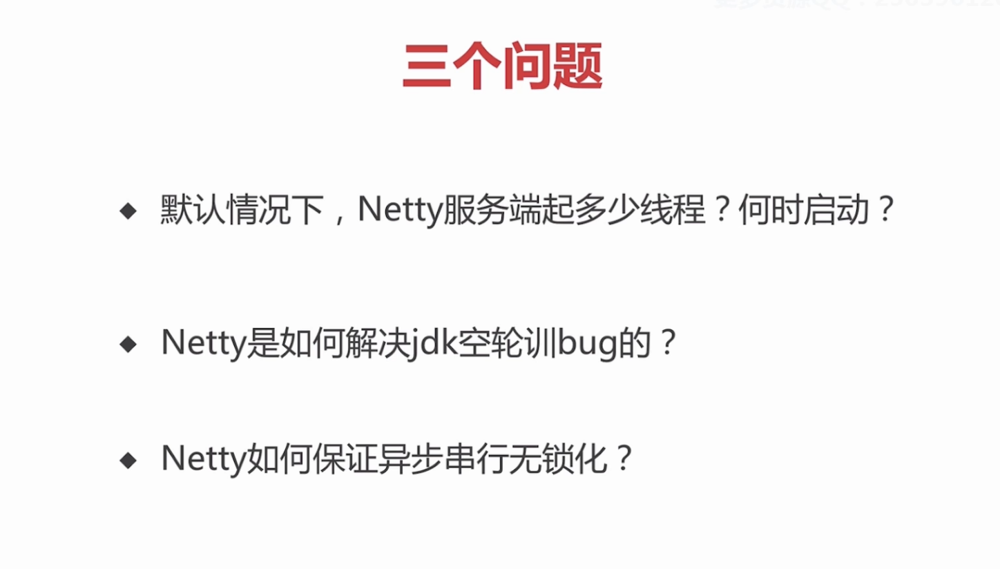
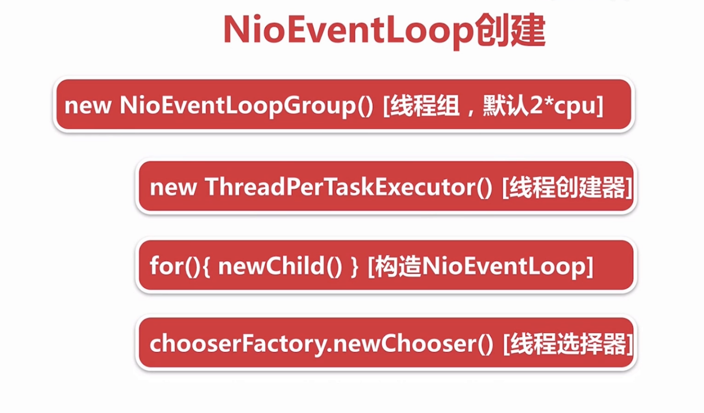
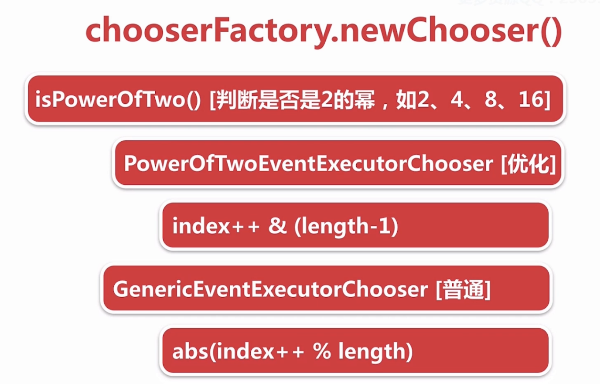
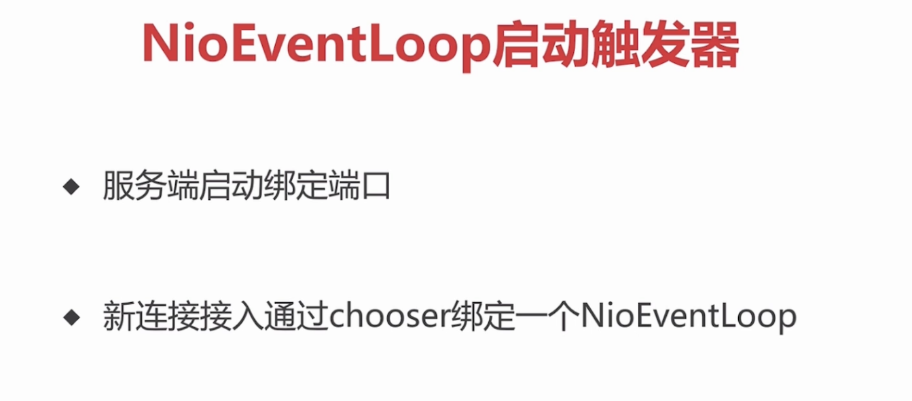
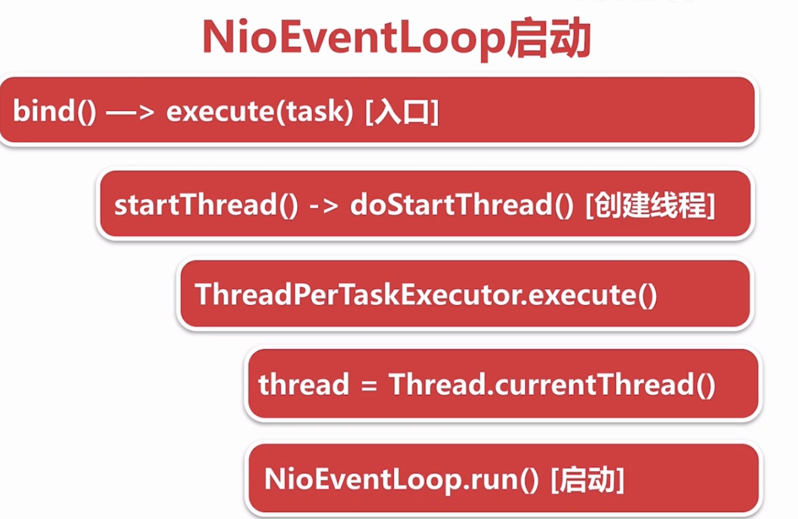
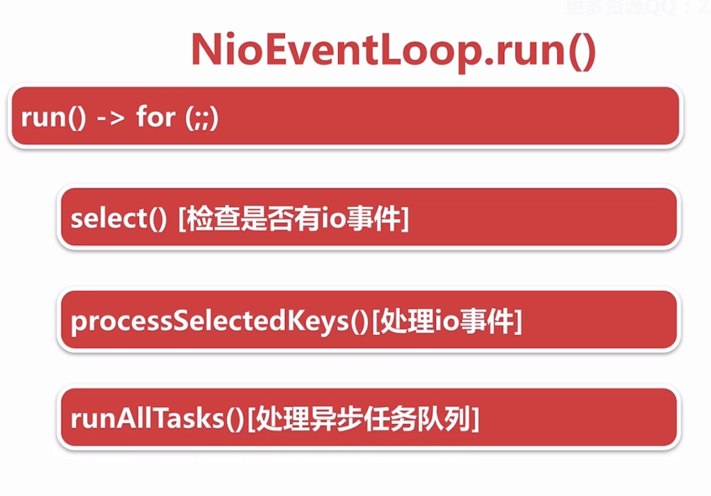
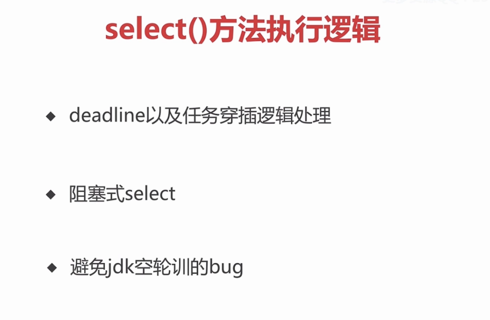
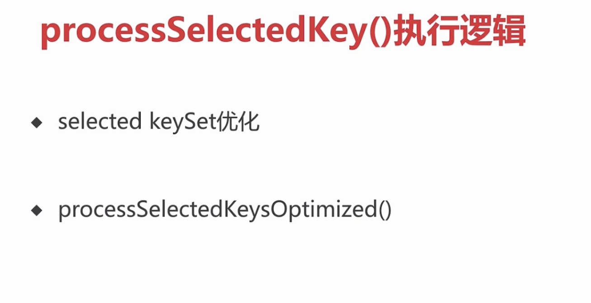
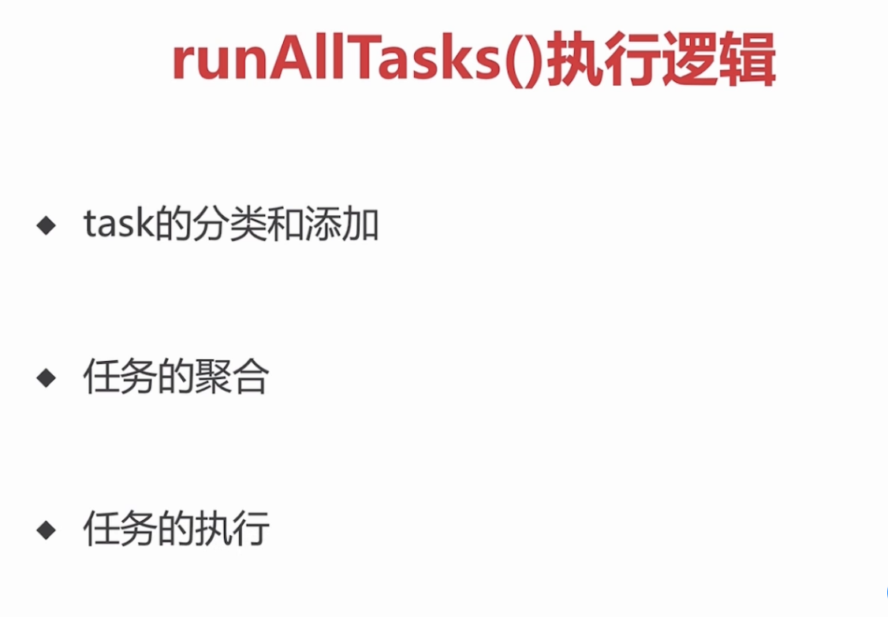

本章主要说的是NioEventLoop

## 基本介绍

1. 默认启动2 * cpu ；当在里面execute的时候。判断当前线程是否是本线程（成员变量）；如果是说明已经启动；如果不是说明是外部线程调用，先执行startThread.判断当前线程是否启动，如果没启动就启动
2. 判断如果当前阻塞的一select操作,实际上并没有花这么多时间就可能触发一次空轮训的bug；默认这种情况发生512次那么。就新建一个selector，将原来的所有key都移交到新的上面
3. 外部线程去调用Eventloop的时候，通过inEventLoop()去判断是否是外部线程，是外部线程就把所有操作封装成一个task。扔到taskQueue里面。在后面（第三过程？）这些会挨个执行
## NioEventLoop创建

new NioEventLoop() 可以跟到io.netty.channel.MultithreadEventLoopGroup;当不填线程数时会默认一个线程数时 cpu*2
```
   /**
     * @see MultithreadEventExecutorGroup#MultithreadEventExecutorGroup(int, Executor, Object...)
     */
    protected MultithreadEventLoopGroup(int nThreads, Executor executor, Object... args) {
        super(nThreads == 0 ? DEFAULT_EVENT_LOOP_THREADS : nThreads, executor, args);
    }
```
实际创建过程 io.netty.util.concurrent.MultithreadEventExecutorGroup
```
/**
     * Create a new instance.
     *
     * @param nThreads          the number of threads that will be used by this instance.
     * @param executor          the Executor to use, or {@code null} if the default should be used.
     * @param chooserFactory    the {@link EventExecutorChooserFactory} to use.
     * @param args              arguments which will passed to each {@link #newChild(Executor, Object...)} call
     */
    protected MultithreadEventExecutorGroup(int nThreads, Executor executor,
                                            EventExecutorChooserFactory chooserFactory, Object... args) {
        if (nThreads <= 0) {
            throw new IllegalArgumentException(String.format("nThreads: %d (expected: > 0)", nThreads));
        }
		
		// 构建线程选择器
        if (executor == null) {
            executor = new ThreadPerTaskExecutor(newDefaultThreadFactory());
        }

        children = new EventExecutor[nThreads];
		// 构造NioEcentLoop
        for (int i = 0; i < nThreads; i ++) {
            boolean success = false;
            try {
				// 重点 下面会讲到
                children[i] = newChild(executor, args);
                success = true;
            } catch (Exception e) {
                // TODO: Think about if this is a good exception type
                throw new IllegalStateException("failed to create a child event loop", e);
            } finally {
                if (!success) {
                    for (int j = 0; j < i; j ++) {
                        children[j].shutdownGracefully();
                    }

                    for (int j = 0; j < i; j ++) {
                        EventExecutor e = children[j];
                        try {
                            while (!e.isTerminated()) {
                                e.awaitTermination(Integer.MAX_VALUE, TimeUnit.SECONDS);
                            }
                        } catch (InterruptedException interrupted) {
                            // Let the caller handle the interruption.
                            Thread.currentThread().interrupt();
                            break;
                        }
                    }
                }
            }
        }

		// 线程选择器
        chooser = chooserFactory.newChooser(children);

        final FutureListener<Object> terminationListener = new FutureListener<Object>() {
            @Override
            public void operationComplete(Future<Object> future) throws Exception {
                if (terminatedChildren.incrementAndGet() == children.length) {
                    terminationFuture.setSuccess(null);
                }
            }
        };

        for (EventExecutor e: children) {
            e.terminationFuture().addListener(terminationListener);
        }

        Set<EventExecutor> childrenSet = new LinkedHashSet<EventExecutor>(children.length);
        Collections.addAll(childrenSet, children);
        readonlyChildren = Collections.unmodifiableSet(childrenSet);
    }
```
### ThreadPerTaskExecutor 字面意思就是每次执行任务都会创建一个线程
#### 1.每次执行任务都会创建一个线程实体
```
public final class ThreadPerTaskExecutor implements Executor {
    private final ThreadFactory threadFactory;
	// 有个构造方法
    public ThreadPerTaskExecutor(ThreadFactory threadFactory) {
        if (threadFactory == null) {
            throw new NullPointerException("threadFactory");
        }
        this.threadFactory = threadFactory;
    }

	// 每次有一个任务来的时候都创建一个线程然后把任务扔进去然后执行
    @Override
    public void execute(Runnable command) {
        threadFactory.newThread(command).start();
    }

```
#### 2. NioEventLoop 线程命名规则 nioEventLoop-1-xx    1 代表第几个NioEventLoopGroup  xx 是代表这个线程是这个group下第几个线程
io.netty.util.concurrent.DefaultThreadFactory   跟着下去就行
```
public DefaultThreadFactory(Class<?> poolType, boolean daemon, int priority) {
        this(toPoolName(poolType), daemon, priority);
    }

    public static String toPoolName(Class<?> poolType) {
        if (poolType == null) {
            throw new NullPointerException("poolType");
        }

        String poolName = StringUtil.simpleClassName(poolType);
        switch (poolName.length()) {
            case 0:
                return "unknown";
            case 1:
                return poolName.toLowerCase(Locale.US);
            default:
				// 转换首字母小写 然后拼接
                if (Character.isUpperCase(poolName.charAt(0)) && Character.isLowerCase(poolName.charAt(1))) {
                    return Character.toLowerCase(poolName.charAt(0)) + poolName.substring(1);
                } else {
                    return poolName;
                }
        }
    }
	
	。。。。。。。。。。。。。。。
	public DefaultThreadFactory(String poolName, boolean daemon, int priority, ThreadGroup threadGroup) {
        if (poolName == null) {
            throw new NullPointerException("poolName");
        }
        if (priority < Thread.MIN_PRIORITY || priority > Thread.MAX_PRIORITY) {
            throw new IllegalArgumentException(
                    "priority: " + priority + " (expected: Thread.MIN_PRIORITY <= priority <= Thread.MAX_PRIORITY)");
        }

		// 又拼接了一波
        prefix = poolName + '-' + poolId.incrementAndGet() + '-';
        this.daemon = daemon;
        this.priority = priority;
        this.threadGroup = threadGroup;
    }
	
	。。。。。。。。。。。。。
	// 这里的newThread方法其实对应 ThreadPerTaskExecutor 里面的newThread方法
	@Override
    public Thread newThread(Runnable r) {
        Thread t = newThread(FastThreadLocalRunnable.wrap(r), prefix + nextId.incrementAndGet());
        try {
            if (t.isDaemon() != daemon) {
                t.setDaemon(daemon);
            }

            if (t.getPriority() != priority) {
                t.setPriority(priority);
            }
        } catch (Exception ignored) {
            // Doesn't matter even if failed to set.
        }
        return t;
    }
	 // 跟进newThread  这里其实不是原生的一个Thread 是一个经过封装的Thread
	 protected Thread newThread(Runnable r, String name) {
        return new FastThreadLocalThread(threadGroup, r, name);
    }
```
### newChild 做了哪些事情
#### 1. 保存ThreadPerTaskExecutor
#### 2. 创建一个mpscQueue
#### 3. 创建一个selector  轮询
io.netty.channel.nio.NioEventLoopGroup
```

 @Override
    protected EventLoop newChild(Executor executor, Object... args) throws Exception {
        return new NioEventLoop(this, executor, (SelectorProvider) args[0],
            ((SelectStrategyFactory) args[1]).newSelectStrategy(), (RejectedExecutionHandler) args[2]);
    }
   
```
再到io.netty.channel.nio.NioEventLoop
```
 NioEventLoop(NioEventLoopGroup parent, Executor executor, SelectorProvider selectorProvider,
                 SelectStrategy strategy, RejectedExecutionHandler rejectedExecutionHandler) {
        super(parent, executor, false, DEFAULT_MAX_PENDING_TASKS, rejectedExecutionHandler);
        if (selectorProvider == null) {
            throw new NullPointerException("selectorProvider");
        }
        if (strategy == null) {
            throw new NullPointerException("selectStrategy");
        }
        provider = selectorProvider;
		// 这里一个NioEventLoop 就和一个selector进行绑定
        final SelectorTuple selectorTuple = openSelector();
        selector = selectorTuple.selector;
        unwrappedSelector = selectorTuple.unwrappedSelector;
        selectStrategy = strategy;
    }
```
到io.netty.util.concurrent.SingleThreadEventExecutor
```
 protected SingleThreadEventExecutor(EventExecutorGroup parent, Executor executor,
                                        boolean addTaskWakesUp, int maxPendingTasks,
                                        RejectedExecutionHandler rejectedHandler) {
        super(parent);
        this.addTaskWakesUp = addTaskWakesUp;
        this.maxPendingTasks = Math.max(16, maxPendingTasks);
        this.executor = ObjectUtil.checkNotNull(executor, "executor");
		// 判断外部线程执行任务时 不是在NioEventLoop对应的线程  直接塞到一个队列里面 然后由NioEventLoop对应的线程去执行 可以去点进去看一下
        taskQueue = newTaskQueue(this.maxPendingTasks);
		
        rejectedExecutionHandler = ObjectUtil.checkNotNull(rejectedHandler, "rejectedHandler");
    }
```
### chooserFactory.newChooser(children); 给新连接创建对应的EventLoop
创建chooser
```
   chooser = chooserFactory.newChooser(children);
```
点进去

```

    @SuppressWarnings("unchecked")
    @Override
    public EventExecutorChooser newChooser(EventExecutor[] executors) {
		// 判断是不是2的次幂 这里其实是个小优化
        if (isPowerOfTwo(executors.length)) {
            return new PowerOfTwoEventExecutorChooser(executors);
        } else {
            return new GenericEventExecutorChooser(executors);
        }
    }
```

```
	...............
	
        chooser = chooserFactory.newChooser(children);
	...............
	在这里使用	
    @Override
    public EventExecutor next() {
        return chooser.next();
    }
```
在这里就能看见创建了一个EventLoop io.netty.channel.MultithreadEventLoopGroup
```
  @Override
    public EventLoop next() {
        return (EventLoop) super.next();
    }
```
## NioEventLoop启动

先以_服务端启动绑定端口为例_ 

### 1. bind()->executor[入口] io.netty.bootstrap.AbstractBootstrap<B, C>
```
 private static void doBind0(
            final ChannelFuture regFuture, final Channel channel,
            final SocketAddress localAddress, final ChannelPromise promise) {

        // This method is invoked before channelRegistered() is triggered.  Give user handlers a chance to set up
        // the pipeline in its channelRegistered() implementation.
		// 这里就 execute 一个任务 
        channel.eventLoop().execute(new Runnable() {
            @Override
            public void run() {
                if (regFuture.isSuccess()) {
					// 这里其实就是bind端口
                    channel.bind(localAddress, promise).addListener(ChannelFutureListener.CLOSE_ON_FAILURE);
                } else {
                    promise.setFailure(regFuture.cause());
                }
            }
        });
    }
```
### 2. doStartThread    进入execute方法  io.netty.util.concurrent.SingleThreadEventExecutor
```

    @Override
    public void execute(Runnable task) {
        if (task == null) {
            throw new NullPointerException("task");
        }
		// 判断是否在本线程里面，也就是判断当前执行的线程是否是EventLoop的线程
        boolean inEventLoop = inEventLoop();
        addTask(task);
        if (!inEventLoop) {
			//返回false  启动一个线程
            startThread();
            if (isShutdown() && removeTask(task)) {
                reject();
            }
        }

        if (!addTaskWakesUp && wakesUpForTask(task)) {
            wakeup(inEventLoop);
    
	。。。。。。。。。。。。。。。。。
	// io.netty.util.concurrent.AbstractEventExecutor
	// 这里传入的线程其实就是主线程，并不是EventLoop的线程
	@Override
    public boolean inEventLoop() {
        return inEventLoop(Thread.currentThread());
    }
	
	...................
	// io.netty.util.concurrent.SingleThreadEventExecutor
	//判断当前线程
	  @Override
    public boolean inEventLoop(Thread thread) {
		// 线程还没有创建 所以返回false
        return thread == this.thread;
    }  
```
### 3. doStartThread  启动线程 io.netty.util.concurrent.SingleThreadEventExecutor
```
  private void startThread() {
	  // 判断线程是否是未启动的
        if (state == ST_NOT_STARTED) {
            if (STATE_UPDATER.compareAndSet(this, ST_NOT_STARTED, ST_STARTED)) {
                try {
					// 这里去实际启动
                    doStartThread();
                } catch (Throwable cause) {
                    STATE_UPDATER.set(this, ST_NOT_STARTED);
                    PlatformDependent.throwException(cause);
                }
            }
        }
    }

```
### 4. ThreadPerTaskExecutor 前一节其实已经说过来了
```
private void doStartThread() {
		// 断言线程还是null
        assert thread == null;
		// 这里的executor其实就是  io.netty.util.concurrent.ThreadPerTaskExecutor 创建一个线程并启动
		/**
		 * @Override
		 *	public void execute(Runnable command) {
		 *		threadFactory.newThread(command).start();
		 *		}
		 */
        executor.execute(new Runnable() {
            @Override
            public void run() {
				// 这里就是下面说了5
                thread = Thread.currentThread();
                // 下面5说。。。。。
        });
    }
```
### 5. thread = Thread.currentThread 看启动执行了哪些事情
```
				// 把当前线程进行保存 NioEventLoop这个对象与唯一一个线程进行绑定
				thread = Thread.currentThread();
				if (interrupted) {
                    thread.interrupt();
                }

                boolean success = false;
                updateLastExecutionTime();
                try {
					// 这里就run了  进入这个方法去看一下下一小节 这里执行的其实NioEventLoop的run方法
                    SingleThreadEventExecutor.this.run();
                    success = true;
                } catch (Throwable t) {
                    logger.warn("Unexpected exception from an event executor: ", t);
                } finally {
                    for (;;) {
                        int oldState = state;
                        if (oldState >= ST_SHUTTING_DOWN || STATE_UPDATER.compareAndSet(
                                SingleThreadEventExecutor.this, oldState, ST_SHUTTING_DOWN)) {
                            break;
                        }
                    }

                    // Check if confirmShutdown() was called at the end of the loop.
                    if (success && gracefulShutdownStartTime == 0) {
                        if (logger.isErrorEnabled()) {
                            logger.error("Buggy " + EventExecutor.class.getSimpleName() + " implementation; " +
                                    SingleThreadEventExecutor.class.getSimpleName() + ".confirmShutdown() must " +
                                    "be called before run() implementation terminates.");
                        }
                    }

                    try {
                        // Run all remaining tasks and shutdown hooks.
                        for (;;) {
                            if (confirmShutdown()) {
                                break;
                            }
                        }
                    } finally {
                        try {
                            cleanup();
                        } finally {
                            STATE_UPDATER.set(SingleThreadEventExecutor.this, ST_TERMINATED);
                            threadLock.release();
                            if (!taskQueue.isEmpty()) {
                                if (logger.isWarnEnabled()) {
                                    logger.warn("An event executor terminated with " +
                                            "non-empty task queue (" + taskQueue.size() + ')');
                                }
                            }

                            terminationFuture.setSuccess(null);
                        }
                    }
                }
            }
```
## NioEventLoop执行逻辑 其实就是run 干了什么


```
  @Override
    protected void run() {
        for (;;) {
            try {
                switch (selectStrategy.calculateStrategy(selectNowSupplier, hasTasks())) {
                    case SelectStrategy.CONTINUE:
                        continue;
                    case SelectStrategy.SELECT:
					// 轮询煮着到这个的IO事件
                        select(wakenUp.getAndSet(false));

                        // 'wakenUp.compareAndSet(false, true)' is always evaluated
                        // before calling 'selector.wakeup()' to reduce the wake-up
                        // overhead. (Selector.wakeup() is an expensive operation.)
                        //
                        // However, there is a race condition in this approach.
                        // The race condition is triggered when 'wakenUp' is set to
                        // true too early.
                        //
                        // 'wakenUp' is set to true too early if:
                        // 1) Selector is waken up between 'wakenUp.set(false)' and
                        //    'selector.select(...)'. (BAD)
                        // 2) Selector is waken up between 'selector.select(...)' and
                        //    'if (wakenUp.get()) { ... }'. (OK)
                        //
                        // In the first case, 'wakenUp' is set to true and the
                        // following 'selector.select(...)' will wake up immediately.
                        // Until 'wakenUp' is set to false again in the next round,
                        // 'wakenUp.compareAndSet(false, true)' will fail, and therefore
                        // any attempt to wake up the Selector will fail, too, causing
                        // the following 'selector.select(...)' call to block
                        // unnecessarily.
                        //
                        // To fix this problem, we wake up the selector again if wakenUp
                        // is true immediately after selector.select(...).
                        // It is inefficient in that it wakes up the selector for both
                        // the first case (BAD - wake-up required) and the second case
                        // (OK - no wake-up required).

                        if (wakenUp.get()) {
                            selector.wakeup();
                        }
                        // fall through
                    default:
                }

                cancelledKeys = 0;
                needsToSelectAgain = false;
                final int ioRatio = this.ioRatio;
				// ioRatio 主要是觉得 finally里面执行的时间
                if (ioRatio == 100) {
                    try {
						// 处理IO的逻辑
                        processSelectedKeys();
                    } finally {
                        // Ensure we always run tasks.
						// 这个是处理 外部线程扔到TaskQueue里面的任务
                        runAllTasks();
                    }
                } else {
                    final long ioStartTime = System.nanoTime();
                    try {
                        processSelectedKeys();
                    } finally {
                        // Ensure we always run tasks.
                        final long ioTime = System.nanoTime() - ioStartTime;
                        runAllTasks(ioTime * (100 - ioRatio) / ioRatio);
                    }
                }
            } catch (Throwable t) {
                handleLoopException(t);
            }
            // Always handle shutdown even if the loop processing threw an exception.
            try {
                if (isShuttingDown()) {
                    closeAll();
                    if (confirmShutdown()) {
                        return;
                    }
                }
            } catch (Throwable t) {
                handleLoopException(t);
            }
        }
    }

```
### 1. select

#### deaaline以及任务逻辑穿插的处理 io.netty.channel.nio.NioEventLoop
```
private void select(boolean oldWakenUp) throws IOException {
        Selector selector = this.selector;
        try {
            int selectCnt = 0;
            long currentTimeNanos = System.nanoTime();
						// 当前时间 + 截至时间   netty底层有一个定时队列 以后再说 delay方法时计算队列中第一个任务的截至时间
            long selectDeadLineNanos = currentTimeNanos + delayNanos(currentTimeNanos);

            for (;;) {
                long timeoutMillis = (selectDeadLineNanos - currentTimeNanos + 500000L) / 1000000L;
								// 到了截至时间
                if (timeoutMillis <= 0) {
                    if (selectCnt == 0) {
                        selector.selectNow();
                        selectCnt = 1;
                    }
                    break;
                }

                // If a task was submitted when wakenUp value was true, the task didn't get a chance to call
                // Selector#wakeup. So we need to check task queue again before executing select operation.
                // If we don't, the task might be pended until select operation was timed out.
                // It might be pended until idle timeout if IdleStateHandler existed in pipeline.
								// 未到截至时间
								// hasTasks() 判断队列里面是否有任务
                if (hasTasks() && wakenUp.compareAndSet(false, true)) {
									// 非阻塞方法
                    selector.selectNow();
                    selectCnt = 1;
                    break;
                }
								// 默认阻塞1s
                int selectedKeys = selector.select(timeoutMillis);
								// 轮询次数++ 
                selectCnt ++;
								// 如果截至时间未到并且队列为空 就阻塞式操作
                if (selectedKeys != 0 || oldWakenUp || wakenUp.get() || hasTasks() || hasScheduledTasks()) {
                    // - Selected something,
                    // - waken up by user, or
                    // - the task queue has a pending task.
                    // - a scheduled task is ready for processing
                    break;
                }
                if (Thread.interrupted()) {
                    // Thread was interrupted so reset selected keys and break so we not run into a busy loop.
                    // As this is most likely a bug in the handler of the user or it's client library we will
                    // also log it.
                    //
                    // See https://github.com/netty/netty/issues/2426
                    if (logger.isDebugEnabled()) {
                        logger.debug("Selector.select() returned prematurely because " +
                                "Thread.currentThread().interrupt() was called. Use " +
                                "NioEventLoop.shutdownGracefully() to shutdown the NioEventLoop.");
                    }
                    selectCnt = 1;
                    break;
                }
								// 避免JDK空轮训bug
                long time = System.nanoTime();
								// 当前时间 - 超时时间 >= 开始时间  --》 当前时间-开始时间>= 超时时间 说明最少轮询了一次 说并没有阻塞就立即返回了
                if (time - TimeUnit.MILLISECONDS.toNanos(timeoutMillis) >= currentTimeNanos) {
                    // timeoutMillis elapsed without anything selected.
                    selectCnt = 1;
                } else if (SELECTOR_AUTO_REBUILD_THRESHOLD > 0 &&
                        selectCnt >= SELECTOR_AUTO_REBUILD_THRESHOLD) {
										// 如果空轮询次数大于一个值 默认 512 就把旧的selectionKey绑定到新的selector上面去
                    // The selector returned prematurely many times in a row.
                    // Rebuild the selector to work around the problem.
                    logger.warn(
                            "Selector.select() returned prematurely {} times in a row; rebuilding Selector {}.",
                            selectCnt, selector);

                    rebuildSelector();
                    selector = this.selector;

                    // Select again to populate selectedKeys.
                    selector.selectNow();
                    selectCnt = 1;
                    break;
                }

                currentTimeNanos = time;
            }

            if (selectCnt > MIN_PREMATURE_SELECTOR_RETURNS) {
                if (logger.isDebugEnabled()) {
                    logger.debug("Selector.select() returned prematurely {} times in a row for Selector {}.",
                            selectCnt - 1, selector);
                }
            }
        } catch (CancelledKeyException e) {
            if (logger.isDebugEnabled()) {
                logger.debug(CancelledKeyException.class.getSimpleName() + " raised by a Selector {} - JDK bug?",
                        selector, e);
            }
            // Harmless exception - log anyway
        }
    }
```
### 2.processSelectedKey 执行逻辑

#### 1. 先跟一下opSelector 优化selected KeySet优化
```
 NioEventLoop(NioEventLoopGroup parent, Executor executor, SelectorProvider selectorProvider,
                 SelectStrategy strategy, RejectedExecutionHandler rejectedExecutionHandler) {
        super(parent, executor, false, DEFAULT_MAX_PENDING_TASKS, rejectedExecutionHandler);
        if (selectorProvider == null) {
            throw new NullPointerException("selectorProvider");
        }
        if (strategy == null) {
            throw new NullPointerException("selectStrategy");
        }
        provider = selectorProvider;
				// 跟一下这个方法
        final SelectorTuple selectorTuple = openSelector();
        selector = selectorTuple.selector;
        unwrappedSelector = selectorTuple.unwrappedSelector;
        selectStrategy = strategy;
    }
		。。。。。。。。。。。。。
		
		 private SelectorTuple openSelector() {
        final Selector unwrappedSelector;
        try {
					// JDK 底层创建一个selector
            unwrappedSelector = provider.openSelector();
        } catch (IOException e) {
            throw new ChannelException("failed to open a new selector", e);
        }
				// 判断是否优化  一般是false
        if (DISABLE_KEYSET_OPTIMIZATION) {
            return new SelectorTuple(unwrappedSelector);
        }
				
				// 通过反射去拿到这个类
        Object maybeSelectorImplClass = AccessController.doPrivileged(new PrivilegedAction<Object>() {
            @Override
            public Object run() {
                try {
                    return Class.forName(
                            "sun.nio.ch.SelectorImpl",
                            false,
                            PlatformDependent.getSystemClassLoader());
                } catch (Throwable cause) {
                    return cause;
                }
            }
        });
				
				// 判断是否是这个  不是就直接返回原生的selector
        if (!(maybeSelectorImplClass instanceof Class) ||
                // ensure the current selector implementation is what we can instrument.
                !((Class<?>) maybeSelectorImplClass).isAssignableFrom(unwrappedSelector.getClass())) {
            if (maybeSelectorImplClass instanceof Throwable) {
                Throwable t = (Throwable) maybeSelectorImplClass;
                logger.trace("failed to instrument a special java.util.Set into: {}", unwrappedSelector, t);
            }
            return new SelectorTuple(unwrappedSelector);
        }

        final Class<?> selectorImplClass = (Class<?>) maybeSelectorImplClass;
				// 可以看一下这个keySet
        final SelectedSelectionKeySet selectedKeySet = new SelectedSelectionKeySet();
					<!--
						final class SelectedSelectionKeySet extends AbstractSet<SelectionKey>
						虽然写的是一个set其实是用一个数组+size的方式去实现的 外部其实就一个add方法 
					-->
					
        Object maybeException = AccessController.doPrivileged(new PrivilegedAction<Object>() {
            @Override
            public Object run() {
                try {
									// 通过反射拿到这两个类对象  然后进行操作
                    Field selectedKeysField = selectorImplClass.getDeclaredField("selectedKeys");
                    Field publicSelectedKeysField = selectorImplClass.getDeclaredField("publicSelectedKeys");

                    Throwable cause = ReflectionUtil.trySetAccessible(selectedKeysField, true);
                    if (cause != null) {
                        return cause;
                    }
                    cause = ReflectionUtil.trySetAccessible(publicSelectedKeysField, true);
                    if (cause != null) {
                        return cause;
                    }
										// 将原来的KeySet 设置成优化后的KeySet
                    selectedKeysField.set(unwrappedSelector, selectedKeySet);
                    publicSelectedKeysField.set(unwrappedSelector, selectedKeySet);
                    return null;
                } catch (NoSuchFieldException e) {
                    return e;
                } catch (IllegalAccessException e) {
                    return e;
                }
            }
        });

        if (maybeException instanceof Exception) {
            selectedKeys = null;
            Exception e = (Exception) maybeException;
            logger.trace("failed to instrument a special java.util.Set into: {}", unwrappedSelector, e);
            return new SelectorTuple(unwrappedSelector);
        }
        selectedKeys = selectedKeySet;
        logger.trace("instrumented a special java.util.Set into: {}", unwrappedSelector);
        return new SelectorTuple(unwrappedSelector,
                                 new SelectedSelectionKeySetSelector(unwrappedSelector, selectedKeySet));
    }
```
#### 调用processSelectedKeysOptimized
```
 private void processSelectedKeys() {
        if (selectedKeys != null) {
            processSelectedKeysOptimized();
        } else {
            processSelectedKeysPlain(selector.selectedKeys());
        }
    }
		
		.....
		
 private void processSelectedKeysOptimized() {
        for (int i = 0; i < selectedKeys.size; ++i) {
            final SelectionKey k = selectedKeys.keys[i];
            // null out entry in the array to allow to have it GC'ed once the Channel close
            // See https://github.com/netty/netty/issues/2363
            selectedKeys.keys[i] = null;

            final Object a = k.attachment();

            if (a instanceof AbstractNioChannel) {
							// 核心方法 
                processSelectedKey(k, (AbstractNioChannel) a);
            } else {
                @SuppressWarnings("unchecked")
                NioTask<SelectableChannel> task = (NioTask<SelectableChannel>) a;
                processSelectedKey(k, task);
            }

            if (needsToSelectAgain) {
                // null out entries in the array to allow to have it GC'ed once the Channel close
                // See https://github.com/netty/netty/issues/2363
                selectedKeys.reset(i + 1);

                selectAgain();
                i = -1;
            }
        }
    }
```
进入核心方法
```
   private void processSelectedKey(SelectionKey k, AbstractNioChannel ch) {
        final AbstractNioChannel.NioUnsafe unsafe = ch.unsafe();
				// 验证合法性
        if (!k.isValid()) {
            final EventLoop eventLoop;
            try {
                eventLoop = ch.eventLoop();
            } catch (Throwable ignored) {
                // If the channel implementation throws an exception because there is no event loop, we ignore this
                // because we are only trying to determine if ch is registered to this event loop and thus has authority
                // to close ch.
                return;
            }
            // Only close ch if ch is still registered to this EventLoop. ch could have deregistered from the event loop
            // and thus the SelectionKey could be cancelled as part of the deregistration process, but the channel is
            // still healthy and should not be closed.
            // See https://github.com/netty/netty/issues/5125
            if (eventLoop != this || eventLoop == null) {
                return;
            }
            // close the channel if the key is not valid anymore
            unsafe.close(unsafe.voidPromise());
            return;
        }

        try {
					// 合法的 就是所有的IO事件
            int readyOps = k.readyOps();
            // We first need to call finishConnect() before try to trigger a read(...) or write(...) as otherwise
            // the NIO JDK channel implementation may throw a NotYetConnectedException.
            if ((readyOps & SelectionKey.OP_CONNECT) != 0) {
                // remove OP_CONNECT as otherwise Selector.select(..) will always return without blocking
                // See https://github.com/netty/netty/issues/924
                int ops = k.interestOps();
                ops &= ~SelectionKey.OP_CONNECT;
                k.interestOps(ops);

                unsafe.finishConnect();
            }

            // Process OP_WRITE first as we may be able to write some queued buffers and so free memory.
            if ((readyOps & SelectionKey.OP_WRITE) != 0) {
                // Call forceFlush which will also take care of clear the OP_WRITE once there is nothing left to write
                ch.unsafe().forceFlush();
            }

            // Also check for readOps of 0 to workaround possible JDK bug which may otherwise lead
            // to a spin loop
            if ((readyOps & (SelectionKey.OP_READ | SelectionKey.OP_ACCEPT)) != 0 || readyOps == 0) {
                unsafe.read();
            }
        } catch (CancelledKeyException ignored) {
            unsafe.close(unsafe.voidPromise());
        }
    }
```
#### reactor线程任务的执行

在NioEventLoop 中有个runAllTasks 方法 我们可以跟进去看一下
```
......
//这里其实说的是你传进来的时间不能大于当前时间
  final long ioTime = System.nanoTime() - ioStartTime;
  runAllTasks(ioTime * (100 - ioRatio) / ioRatio);
......
```
io.netty.util.concurrent.SingleThreadEventExecutor.class
```
 protected boolean runAllTasks(long timeoutNanos) {
	 // 定时任务队列
        fetchFromScheduledTaskQueue();
        Runnable task = pollTask();
        if (task == null) {
            afterRunningAllTasks();
            return false;
        }

        final long deadline = ScheduledFutureTask.nanoTime() + timeoutNanos;
        long runTasks = 0;
        long lastExecutionTime;
        for (;;) {
            safeExecute(task);

            runTasks ++;

            // Check timeout every 64 tasks because nanoTime() is relatively expensive.
            // XXX: Hard-coded value - will make it configurable if it is really a problem.
            if ((runTasks & 0x3F) == 0) {
                lastExecutionTime = ScheduledFutureTask.nanoTime();
                if (lastExecutionTime >= deadline) {
                    break;
                }
            }

            task = pollTask();
            if (task == null) {
                lastExecutionTime = ScheduledFutureTask.nanoTime();
                break;
            }
        }

        afterRunningAllTasks();
        this.lastExecutionTime = lastExecutionTime;
        return true;
    }
```

```
//按时间优先级进行排序的定时任务   
 private boolean fetchFromScheduledTaskQueue() {
        long nanoTime = AbstractScheduledEventExecutor.nanoTime();
				// 去这里看一下
        Runnable scheduledTask  = pollScheduledTask(nanoTime);
				// 这个while执行完 所有的定时任务都塞到了普通任务队列taskQueue里面
        while (scheduledTask != null) {
					// 任务不为null，就加入普通任务队列 失败了又加入定时任务中去执行
            if (!taskQueue.offer(scheduledTask)) {
                // No space left in the task queue add it back to the scheduledTaskQueue so we pick it up again.
								// 去这个队列里面看一下 ScheduledFutureTask
                scheduledTaskQueue().add((ScheduledFutureTask<?>) scheduledTask);
                return false;
            }
						// 重新去定时任务中去拿 截至时间是nanoTime的定时任务
            scheduledTask  = pollScheduledTask(nanoTime);
        }
        return true;
    }
```
io.netty.util.concurrent.ScheduledFutureTask<V>
```
l里面有个compareTo方法 按照截至时间排序。如果时间一样就按照添加时间进行排序
  @Override
    public int compareTo(Delayed o) {
        if (this == o) {
            return 0;
        }

        ScheduledFutureTask<?> that = (ScheduledFutureTask<?>) o;
        long d = deadlineNanos() - that.deadlineNanos();
        if (d < 0) {
            return -1;
        } else if (d > 0) {
            return 1;
        } else if (id < that.id) {
            return -1;
        } else if (id == that.id) {
            throw new Error();
        } else {
            return 1;
        }
    }
```
	// 去这里看一下
Runnable scheduledTask  = pollScheduledTask(nanoTime);
io.netty.util.concurrent.AbstractScheduledEventExecutor.class
```
  protected final Runnable pollScheduledTask(long nanoTime) {
        assert inEventLoop();

        Queue<ScheduledFutureTask<?>> scheduledTaskQueue = this.scheduledTaskQueue;
				// 拿到第一个任务
        ScheduledFutureTask<?> scheduledTask = scheduledTaskQueue == null ? null : scheduledTaskQueue.peek();
        if (scheduledTask == null) {
            return null;
        }
				// 如果任务截至时间小于传进来的时间 就删除，然后返回
        if (scheduledTask.deadlineNanos() <= nanoTime) {
            scheduledTaskQueue.remove();
            return scheduledTask;
        }
        return null;
    }
```
3. 任务的执行
又回到io.netty.util.concurrent.SingleThreadEventExecutor.class
```
  protected boolean runAllTasks(long timeoutNanos) {
		// 任务聚合完成后 所有的任务都在taskQueuel里面了
        fetchFromScheduledTaskQueue();
				// 从普通任务里面去拿个task
        Runnable task = pollTask();
        if (task == null) {
            afterRunningAllTasks();
            return false;
        }

        final long deadline = ScheduledFutureTask.nanoTime() + timeoutNanos;
        long runTasks = 0;
        long lastExecutionTime;
        for (;;) {
            safeExecute(task);

            runTasks ++;

            // Check timeout every 64 tasks because nanoTime() is relatively expensive.
            // XXX: Hard-coded value - will make it configurable if it is really a problem.
						// 执行到64个的时候 。判断一下当前时间 如果当前时间 大于了截至时间。就不执行了
            if ((runTasks & 0x3F) == 0) {
                lastExecutionTime = ScheduledFutureTask.nanoTime();
                if (lastExecutionTime >= deadline) {
                    break;
                }
            }

            task = pollTask();
            if (task == null) {
                lastExecutionTime = ScheduledFutureTask.nanoTime();
                break;
            }
        }

        afterRunningAllTasks();
        this.lastExecutionTime = lastExecutionTime;
        return true;
    }
```
总结： 任务的聚合其实就是将 定时任务添加到普通任务队列里面