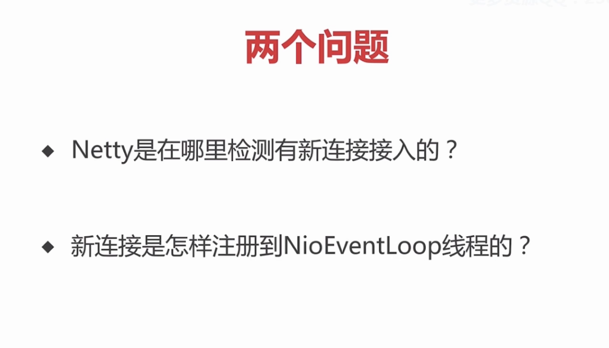
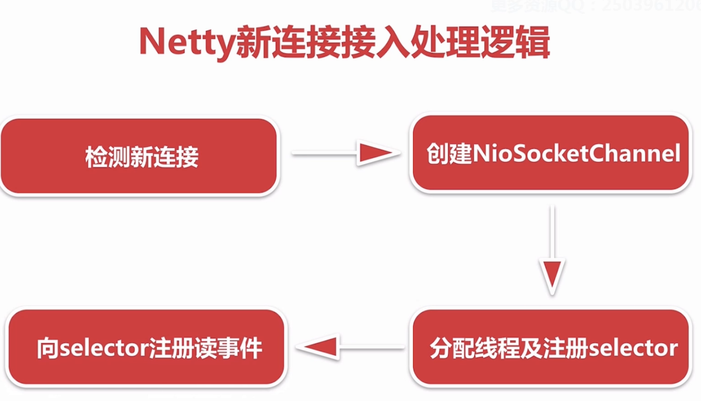
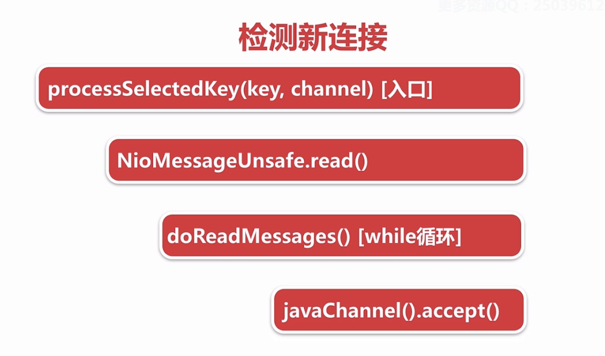
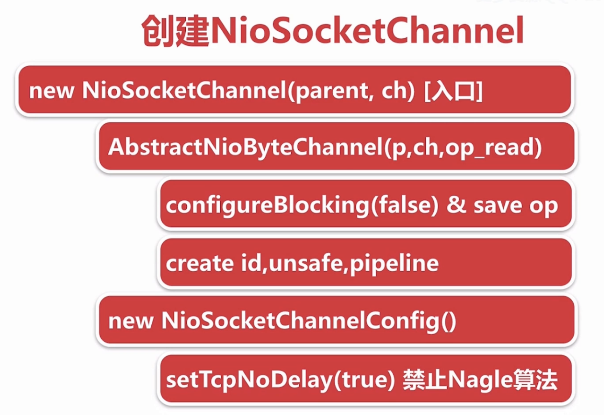
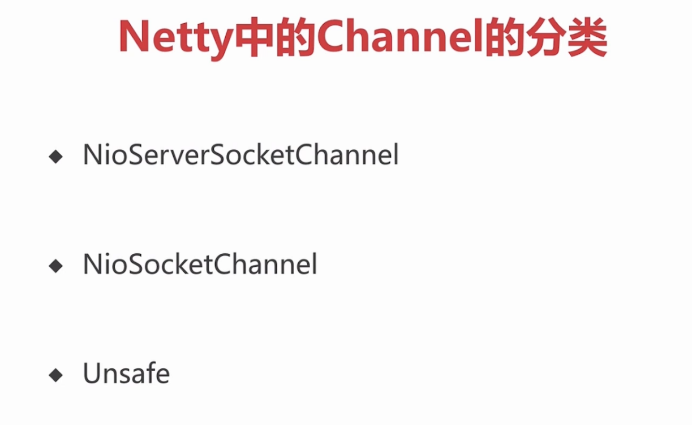
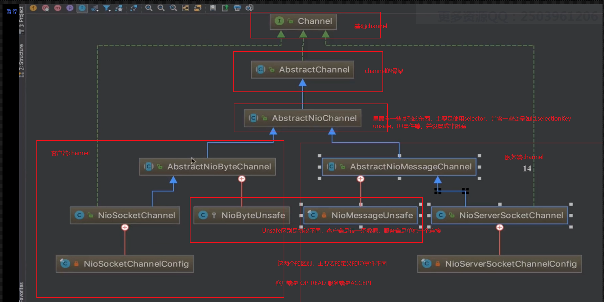
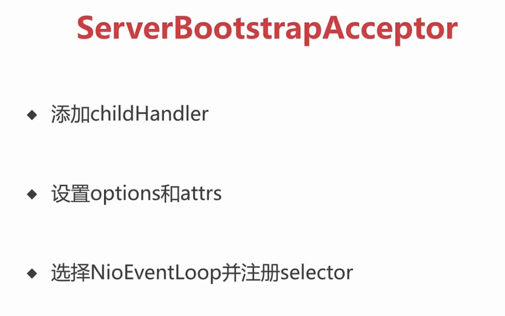
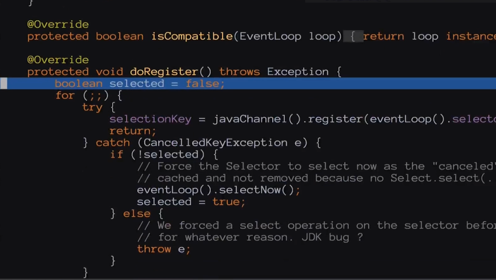

## netty新连接

1. boss线程轮询出accept事件，通过JDK底层方法区创建这个链接
2. boss线程调用chooser的next方法拿到一个NioEventLoop，将这条连接注册到NioEventLoop的selector上去

### 检测新连接

#### 1. ioeventloop.run方法的第二个过程 processSelectedKey开始
这个是从服务端启动Nioeventloop.run方法的第二个过程 processSelectedKey开始
```
......
          final int ioRatio = this.ioRatio;
				// ioRatio 主要是觉得 finally里面执行的时间
                if (ioRatio == 100) {
                    try {
						// 处理IO的逻辑 这个地方 
                        processSelectedKeys();
                    } finally {
                        // Ensure we always run tasks.
						// 这个是处理 外部线程扔到TaskQueue里面的任务
                        runAllTasks();
                    }
......
``` 
#### 2 3.点调试的的方法来写 io.netty.channel.nio.NioEventLoop.class 打断点
```
 private void processSelectedKeysPlain(Set<SelectionKey> selectedKeys) {
        // check if the set is empty and if so just return to not create garbage by
        // creating a new Iterator every time even if there is nothing to process.
        // See https://github.com/netty/netty/issues/597
        if (selectedKeys.isEmpty()) {
            return;
        }

        Iterator<SelectionKey> i = selectedKeys.iterator();
        for (;;) {
            final SelectionKey k = i.next();
            final Object a = k.attachment();
            i.remove();

            if (a instanceof AbstractNioChannel) {
                processSelectedKey(k, (AbstractNioChannel) a);
            } else {
                @SuppressWarnings("unchecked")
                NioTask<SelectableChannel> task = (NioTask<SelectableChannel>) a;
				// 在这个方法里打断点就能找到所有的了
                processSelectedKey(k, task);
            }

            if (!i.hasNext()) {
                break;
            }

            if (needsToSelectAgain) {
                selectAgain();
                selectedKeys = selector.selectedKeys();

                // Create the iterator again to avoid ConcurrentModificationException
                if (selectedKeys.isEmpty()) {
                    break;
                } else {
                    i = selectedKeys.iterator();
                }
            }
        }
    }
	
	............
	
    private void processSelectedKey(SelectionKey k, AbstractNioChannel ch) {
      ......
            if ((readyOps & (SelectionKey.OP_READ | SelectionKey.OP_ACCEPT)) != 0 || readyOps == 0) {
				// 进入read方法
                unsafe.read();
            }
       ......
    }
	............
```
io.netty.channel.nio.AbstractNioMessageChannel
```
 @Override
        public void read() {
            assert eventLoop().inEventLoop();
            final ChannelConfig config = config();
            final ChannelPipeline pipeline = pipeline();
            final RecvByteBufAllocator.Handle allocHandle = unsafe().recvBufAllocHandle();
            allocHandle.reset(config);

            boolean closed = false;
            Throwable exception = null;
            try {
                try {
                    do {
						// 创建NioChannel 下节详细讲
                        int localRead = doReadMessages(readBuf);
                        if (localRead == 0) {
                            break;
                        }
                        if (localRead < 0) {
                            closed = true;
                            break;
                        }

                        allocHandle.incMessagesRead(localRead);
                    } while (allocHandle.continueReading());
                } catch (Throwable t) {
                    exception = t;
                }

                int size = readBuf.size();
                for (int i = 0; i < size; i ++) {
                    readPending = false;
                    pipeline.fireChannelRead(readBuf.get(i));
                }
                readBuf.clear();
                allocHandle.readComplete();
                pipeline.fireChannelReadComplete();

                if (exception != null) {
                    closed = closeOnReadError(exception);

                    pipeline.fireExceptionCaught(exception);
                }

                if (closed) {
                    inputShutdown = true;
                    if (isOpen()) {
                        close(voidPromise());
                    }
                }
            } finally {
                // Check if there is a readPending which was not processed yet.
                // This could be for two reasons:
                // * The user called Channel.read() or ChannelHandlerContext.read() in channelRead(...) method
                // * The user called Channel.read() or ChannelHandlerContext.read() in channelReadComplete(...) method
                //
                // See https://github.com/netty/netty/issues/2254
                if (!readPending && !config.isAutoRead()) {
                    removeReadOp();
                }
            }
        }
    }
```
总结： 在服务端的NioEventLoop启动（run方法）的第二个过程中检测出ACCEPT事件后，通过JDK的accept方法区创建JDK的channel,把它包装成netty自定义的channel，
		在这个过程中通过一个handle的一个对象控制连接接入的一个速率。默认一次读取16个连接
#### 4.javaChannel.accept（） 创建NioSocketChannel 

这里创建NioSocketChanenl 是直接调用的额构造函数，服务端是通过反射的方法。为什么呢？
##### 1. 入口 new NioSocketChannel(parent,ch)入口;
在io.netty.channel.socket.nio.NioServerSocketChannel 接上上节说的
```
   @Override
    protected int doReadMessages(List<Object> buf) throws Exception {
        SocketChannel ch = SocketUtils.accept(javaChannel());

        try {
            if (ch != null) {
				// new 常见客户端的channel  this是服务端的channel ch客户端channel是JDK底层创建的channel 
                buf.add(new NioSocketChannel(this, ch));
                return 1;
            }
        } catch (Throwable t) {
            logger.warn("Failed to create a new channel from an accepted socket.", t);

            try {
                ch.close();
            } catch (Throwable t2) {
                logger.warn("Failed to close a socket.", t2);
            }
        }

        return 0;
    }
```
1. 调用父类构造函数
	1.configBlocked(false) & save op
	设置成非阻塞，并把感兴趣的读事件放到成员变量中去
	2. 创建create id unsafe pipeline
```
   public NioSocketChannel(Channel parent, SocketChannel socket) {
        super(parent, socket);
        config = new NioSocketChannelConfig(this, socket.socket());
    }
	。。。。
	
```
io.netty.channel.nio.AbstractNioChannel.AbstractNioChannel(Channel, SelectableChannel, int)
``` 
protected AbstractNioChannel(Channel parent, SelectableChannel ch, int readInterestOp) {
        super(parent);
        this.ch = ch;
		// 读事件
        this.readInterestOp = readInterestOp;
        try {
			// 非阻塞
            ch.configureBlocking(false);
        } catch (IOException e) {
            try {
                ch.close();
            } catch (IOException e2) {
                if (logger.isWarnEnabled()) {
                    logger.warn(
                            "Failed to close a partially initialized socket.", e2);
                }
            }

            throw new ChannelException("Failed to enter non-blocking mode.", e);
        }
    }

```
io.netty.channel.AbstractChannel.AbstractChannel(Channel)
```
 protected AbstractChannel(Channel parent) {
		// parent 是服务端的channel
        this.parent = parent;
        id = newId();
        unsafe = newUnsafe();
        pipeline = newChannelPipeline();
    }
```
2. 创建new NioScketChanenlConfig
	setTcpNoDelay(true) 禁止Nagle算法
	Nagle算法：把小的数据包集合成打的数据包发送出去
```
config = new NioSocketChannelConfig(this, socket.socket());
```
io.netty.channel.socket.DefaultSocketChannelConfig.DefaultSocketChannelConfig(SocketChannel, Socket)
```
 public DefaultSocketChannelConfig(SocketChannel channel, Socket javaSocket) {
        super(channel);
        if (javaSocket == null) {
            throw new NullPointerException("javaSocket");
        }
        this.javaSocket = javaSocket;

        // Enable TCP_NODELAY by default if possible.
        if (PlatformDependent.canEnableTcpNoDelayByDefault()) {
            try {
				// 禁止
                setTcpNoDelay(true);
            } catch (Exception e) {
                // Ignore.
            }
        }
    }
```
小结：创建NioSocketChannel 可分为1.逐层调用父类方法，设置成非阻塞，创建Id pipeline 等2.创建config，禁止Nagle算法,让小数据包尽快的发出去，降低延迟

### channel的分类


### 新连接NioEventLoop的分配和selector注册
先回顾服务channel的初始化
io.netty.bootstrap.AbstractBootstrap.initAndRegister()
```
final ChannelFuture initAndRegister() {
        Channel channel = null;
        try {
            channel = channelFactory.newChannel();
			// 初始化channel
            init(channel);
        } catch (Throwable t) {
            if (channel != null) {
                // channel can be null if newChannel crashed (eg SocketException("too many open files"))
                channel.unsafe().closeForcibly();
                // as the Channel is not registered yet we need to force the usage of the GlobalEventExecutor
                return new DefaultChannelPromise(channel, GlobalEventExecutor.INSTANCE).setFailure(t);
            }
            // as the Channel is not registered yet we need to force the usage of the GlobalEventExecutor
            return new DefaultChannelPromise(new FailedChannel(), GlobalEventExecutor.INSTANCE).setFailure(t);
        }

        ChannelFuture regFuture = config().group().register(channel);
        if (regFuture.cause() != null) {
            if (channel.isRegistered()) {
                channel.close();
            } else {
                channel.unsafe().closeForcibly();
            }
        }
```
io.netty.bootstrap.ServerBootstrap.init(Channel)
```
@Override
    void init(Channel channel) throws Exception {
       。。。。。。。。。。。。

                ch.eventLoop().execute(new Runnable() {
                    @Override
                    public void run() {
						// 这里默认会添加一个 ServerBootstrapAcceptor
                        pipeline.addLast(new ServerBootstrapAcceptor(
                                ch, currentChildGroup, currentChildHandler, currentChildOptions, currentChildAttrs));
                    }
                });
         。。。。。
    }
```

#### ServerBootstrapAcceptor.png

io.netty.bootstrap.ServerBootstrap.ServerBootstrapAcceptor.channelRead(ChannelHandlerContext, Object)
1. 添加channelhandle
2. 设置option和attr
3. 选择NioEventLoop并注册selector
```
@Override
        @SuppressWarnings("unchecked")
        public void channelRead(ChannelHandlerContext ctx, Object msg) {
            final Channel child = (Channel) msg;
			// 1.添加channelHandle  这个channel其实是服务端代码的
			/*.childHandler(new ChannelInitializer<SocketChannel>() {
                        @Override
                        public void initChannel(SocketChannel ch) {
                            ch.pipeline().addLast(new ServerHandler());
                            //..

                        }
                    });  可由这个添加自定义的handle*/
            child.pipeline().addLast(childHandler);
			
			// 2. 设置option   option和底层的读写有关系
            setChannelOptions(child, childOptions, logger);
			// 设置attr   主要在客户端channel绑定一些属性 比如密钥
            for (Entry<AttributeKey<?>, Object> e: childAttrs) {
                child.attr((AttributeKey<Object>) e.getKey()).set(e.getValue());
            }

            try {
				// 3 这里的group是workgroup
                childGroup.register(child).addListener(new ChannelFutureListener() {
                    @Override
                    public void operationComplete(ChannelFuture future) throws Exception {
                        if (!future.isSuccess()) {
                            forceClose(child, future.cause());
                        }
                    }
                });
            } catch (Throwable t) {
                forceClose(child, t);
            }
        }
```
2. 设置option和attr
io.netty.bootstrap.AbstractBootstrap.setChannelOptions(Channel, Entry<ChannelOption<?>, Object>[], InternalLogger)
```
static void setChannelOptions(
            Channel channel, Map.Entry<ChannelOption<?>, Object>[] options, InternalLogger logger) {
        for (Map.Entry<ChannelOption<?>, Object> e: options) {
            setChannelOption(channel, e.getKey(), e.getValue(), logger);
        }
    }
	@SuppressWarnings("unchecked")
    private static void setChannelOption(
            Channel channel, ChannelOption<?> option, Object value, InternalLogger logger) {
        try {
			// channelconfig 将客户自定义的设置进去
            if (!channel.config().setOption((ChannelOption<Object>) option, value)) {
                logger.warn("Unknown channel option '{}' for channel '{}'", option, channel);
            }
        } catch (Throwable t) {
            logger.warn(
                    "Failed to set channel option '{}' with value '{}' for channel '{}'", option, value, channel, t);
        }
    }
```
3. sd
根据debug 我们可以跟到
io.netty.channel.AbstractChannel.AbstractUnsafe.register(EventLoop, ChannelPromise)
```
  @Override
        public final void register(EventLoop eventLoop, final ChannelPromise promise) {
            if (eventLoop == null) {
                throw new NullPointerException("eventLoop");
            }
            if (isRegistered()) {
                promise.setFailure(new IllegalStateException("registered to an event loop already"));
                return;
            }
            if (!isCompatible(eventLoop)) {
                promise.setFailure(
                        new IllegalStateException("incompatible event loop type: " + eventLoop.getClass().getName()));
                return;
            }
			// 帮当前的eventLoop帮到客户端上
            AbstractChannel.this.eventLoop帮到客户端上 = eventLoop;
			// 因为我是debug不是 telnet连接 所以这个eventLoop是服务端的EventLoop 所以返回false
            if (eventLoop.inEventLoop()) {
                register0(promise);
            } else {
                try {
					// 这里会启动选择的一个eventLoop
                    eventLoop.execute(new Runnable() {
                        @Override
                        public void run() {
							// 继续跟
                            register0(promise);
                        }
                    });
                } catch (Throwable t) {
                    logger.warn(
                            "Force-closing a channel whose registration task was not accepted by an event loop: {}",
                            AbstractChannel.this, t);
                    closeForcibly();
                    closeFuture.setClosed();
                    safeSetFailure(promise, t);
                }
            }
        }
```
io.netty.channel.AbstractChannel.AbstractUnsafe.register0(ChannelPromise)
```
 private void register0(ChannelPromise promise) {
            try {
                // check if the channel is still open as it could be closed in the mean time when the register
                // call was outside of the eventLoop
                if (!promise.setUncancellable() || !ensureOpen(promise)) {
                    return;
                }
                boolean firstRegistration = neverRegistered;
				// 这里是最关键的额一个方法 register方法  我没找到方法但是下面有图片，是以前的 然后我找不到了 找不到了补充.png
                doRegister();
                neverRegistered = false;
                registered = true;

                // Ensure we call handlerAdded(...) before we actually notify the promise. This is needed as the
                // user may already fire events through the pipeline in the ChannelFutureListener.
                pipeline.invokeHandlerAddedIfNeeded();

                safeSetSuccess(promise);
                pipeline.fireChannelRegistered();
                // Only fire a channelActive if the channel has never been registered. This prevents firing
                // multiple channel actives if the channel is deregistered and re-registered.
                if (isActive()) {
                    if (firstRegistration) {
                        pipeline.fireChannelActive();
                    } else if (config().isAutoRead()) {
                        // This channel was registered before and autoRead() is set. This means we need to begin read
                        // again so that we process inbound data.
                        //
                        // See https://github.com/netty/netty/issues/4805
                        beginRead();
                    }
                }
            } catch (Throwable t) {
                // Close the channel directly to avoid FD leak.
                closeForcibly();
                closeFuture.setClosed();
                safeSetFailure(promise, t);
            }
        }
```

拿到JDK底层的channel，注册到eventLoop的selector上去
io.netty.channel.nio.AbstractNioChannel.doRegister()
```
 @Override
    protected void doRegister() throws Exception {
        boolean selected = false;
        for (;;) {
            try {
                selectionKey = javaChannel().register(eventLoop().unwrappedSelector(), 0, this);
                return;
            } catch (CancelledKeyException e) {
                if (!selected) {
                    // Force the Selector to select now as the "canceled" SelectionKey may still be
                    // cached and not removed because no Select.select(..) operation was called yet.
                    eventLoop().selectNow();
                    selected = true;
                } else {
                    // We forced a select operation on the selector before but the SelectionKey is still cached
                    // for whatever reason. JDK bug ?
                    throw e;
                }
            }
        }
    }
```
总结： 服务端channel检测到新连接并创建完客户端channel时，会调用一个连接器做一些处理，
1. 添加channelhandle
2. 设置option和attr
3. 选择NioEventLoop并注册selector
	3是调用一个chooser，选择一个eventLoop，将该channel绑定到selector上
	
### NioSocketChannel读事件的注册
紧跟上面的方法
io.netty.channel.AbstractChannel.AbstractUnsafe.register0(ChannelPromise)
```
 private void register0(ChannelPromise promise) {
            try {
           。。。。。。。。。。。。
                if (isActive()) {
                    if (firstRegistration) {
											// 注册读事件
                        pipeline.fireChannelActive();
                    } else if (config().isAutoRead()) {
                        // This channel was registered before and autoRead() is set. This means we need to begin read
                        // again so that we process inbound data.
                        //
                        // See https://github.com/netty/netty/issues/4805
                        beginRead();
                    }
                }
            } catch (Throwable t) {
                // Close the channel directly to avoid FD leak.
                closeForcibly();
                closeFuture.setClosed();
                safeSetFailure(promise, t);
            }
        }
```
一路跟进去io.netty.channel.DefaultChannelPipeline.HeadContext.channelActive(ChannelHandlerContext)
```
  @Override
        public void channelActive(ChannelHandlerContext ctx) throws Exception {
            ctx.fireChannelActive();

            readIfIsAutoRead();
        }
				
		// 默认是自动读的		
	  private void readIfIsAutoRead() {
            if (channel.config().isAutoRead()) {
                channel.read();
            }
        }

```
io.netty.channel.AbstractChannelHandlerContext.read()
```
 @Override
    public ChannelHandlerContext read() {
        final AbstractChannelHandlerContext next = findContextOutbound();
        EventExecutor executor = next.executor();
        if (executor.inEventLoop()) {
					// 再进这个方法
            next.invokeRead();
        } else {
            Runnable task = next.invokeReadTask;
            if (task == null) {
                next.invokeReadTask = task = new Runnable() {
                    @Override
                    public void run() {
                        next.invokeRead();
                    }
                };
            }
            executor.execute(task);
        }

        return this;
    }
		
		  private void invokeRead() {
        if (invokeHandler()) {
            try {
                ((ChannelOutboundHandler) handler()).read(this);
            } catch (Throwable t) {
                notifyHandlerException(t);
            }
        } else {
            read();
        }
    }
```
io.netty.channel.AbstractChannelHandlerContext.invokeRead()
```
    private void invokeRead() {
        if (invokeHandler()) {
            try {
                ((ChannelOutboundHandler) handler()).read(this);
            } catch (Throwable t) {
                notifyHandlerException(t);
            }
        } else {
            read();
        }
    }
```
io.netty.channel.DefaultChannelPipeline.HeadContext.read(ChannelHandlerContext)
```
 @Override
        public void read(ChannelHandlerContext ctx) {
            unsafe.beginRead();
        }
```
io.netty.channel.AbstractChannel.AbstractUnsafe.beginRead()
```
   @Override
        public final void beginRead() {
            assertEventLoop();

            if (!isActive()) {
                return;
            }

            try {
                doBeginRead();
            } catch (final Exception e) {
                invokeLater(new Runnable() {
                    @Override
                    public void run() {
                        pipeline.fireExceptionCaught(e);
                    }
                });
                close(voidPromise());
            }
        }
```
io.netty.channel.nio.AbstractNioChannel.doBeginRead()
```

    @Override
    protected void doBeginRead() throws Exception {
        // Channel.read() or ChannelHandlerContext.read() was called
				//  这里是原来绑定到selector上返回的一个key 
        final SelectionKey selectionKey = this.selectionKey;
        if (!selectionKey.isValid()) {
            return;
        }

        readPending = true;
						// 当时传入的是一个不关心所有事的 0 现在要发生改变 把读的事件放进去
        final int interestOps = selectionKey.interestOps();
        if ((interestOps & readInterestOp) == 0) {
            selectionKey.interestOps(interestOps | readInterestOp);
        }
    }
```

总结：  在bossGroup的EventLoop（服务端channel）检测到accept事件，调用服务端的JDKchannel创建一个客户端的channel，并且封装成netty的一个channel（NioSocketChannel）,
			创建一系列组件，其中最主要的是 unsafe 和pipeline；Unsafe主要实现事件的读写，pipeline负责业务处理的逻辑链。
			然后通过一个接入器ServerBootstrapAcceptor给当前的客户端channel分配NioEventLoop并注册到selector上去

