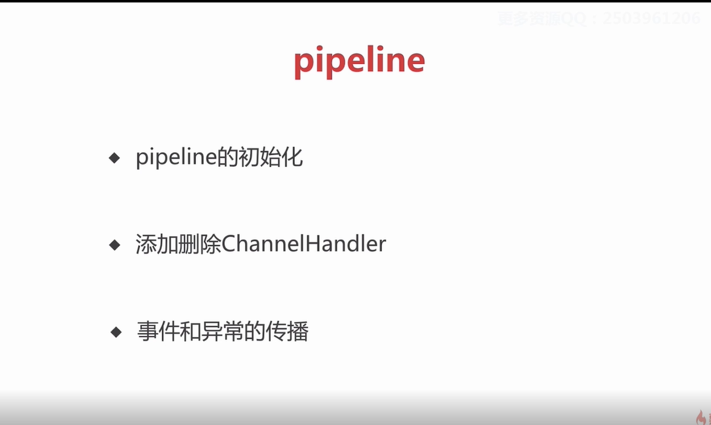

# Pipeline

1. 当使用pipeline去添加handler的时候，会有通过 handler instanceof 父类去判定是in还是out 用一个boolan类型来表示，其实就是查看父类是那个  
2. inboud 的添加顺序和运行是正相关 ，outbound是逆相关 
3. 1.通过channel去触发 要不是从head（inboud事件）或者tail （outbound）开始传播，如果是当前节点自己触发，则从当前往head（out）或者tail(in) 进行传播


## 1.pipeline初始化

### 1.1 初始化channel的时候初始化pipeline
io.netty.channel.AbstractChannel.AbstractChannel(Channel)
```
  protected AbstractChannel(Channel parent) {
        this.parent = parent;
        id = newId();
        unsafe = newUnsafe();
        pipeline = newChannelPipeline();
    }
```
io.netty.channel.DefaultChannelPipeline.DefaultChannelPipeline(Channel)
```
 protected DefaultChannelPipeline(Channel channel) {
        this.channel = ObjectUtil.checkNotNull(channel, "channel");
        succeededFuture = new SucceededChannelFuture(channel, null);
        voidPromise =  new VoidChannelPromise(channel, true);
		// 这里会创建一个双向列表结构
        tail = new TailContext(this);
        head = new HeadContext(this);

        head.next = tail;
        tail.prev = head;
    }
```
### 1.2 pipeline节点数据结构 ChannelHandleContext
```
public interface ChannelHandlerContext extends AttributeMap, ChannelInboundInvoker, ChannelOutboundInvoker 
AttributeMap: 可以自定义一些属性
ChannelInboundInvoker （读事件，注册事件）： 可以出发一些时间 如 register ，active,异常等
ChannelOutboundInvoker（传播写事件的一个功能）
```
主要实现
io.netty.channel.AbstractChannelHandlerContext.AbstractChannelHandlerContext(DefaultChannelPipeline, EventExecutor, String, boolean, boolean)
```
AbstractChannelHandlerContext(DefaultChannelPipeline pipeline, EventExecutor executor, String name,
                                  boolean inbound, boolean outbound) {
        this.name = ObjectUtil.checkNotNull(name, "name");
        this.pipeline = pipeline;
        this.executor = executor;
        this.inbound = inbound;
        this.outbound = outbound;
        // Its ordered if its driven by the EventLoop or the given Executor is an instanceof OrderedEventExecutor.
        ordered = executor == null || executor instanceof OrderedEventExecutor;
    }
```
### 1.3 pipeline的两大哨兵 tail head
tail: 主要做，处理。当你代码没有处理，然后就在这里进行提醒：异常和没做处理的东西
io.netty.channel.DefaultChannelPipeline.TailContext
```
   // A special catch-all handler that handles both bytes and messages.
    final class TailContext extends AbstractChannelHandlerContext implements ChannelInboundHandler
	
	 TailContext(DefaultChannelPipeline pipeline) {
		 // 根据构造函数可知  true,false，穿进去后，这是个读的传播事件
            super(pipeline, null, TAIL_NAME, true, false);
            setAddComplete();
        }
		
		  @Override
        public void exceptionCaught(ChannelHandlerContext ctx, Throwable cause) throws Exception {
            onUnhandledInboundException(cause);
        }
```
进构造函数，super
io.netty.channel.AbstractChannelHandlerContext.AbstractChannelHandlerContext(DefaultChannelPipeline, EventExecutor, String, boolean, boolean)
```
AbstractChannelHandlerContext(DefaultChannelPipeline pipeline, EventExecutor executor, String name,
                                  boolean inbound, boolean outbound) {
        this.name = ObjectUtil.checkNotNull(name, "name");
        this.pipeline = pipeline;
        this.executor = executor;
        this.inbound = inbound; 
        this.outbound = outbound;
        // Its ordered if its driven by the EventLoop or the given Executor is an instanceof OrderedEventExecutor.
        ordered = executor == null || executor instanceof OrderedEventExecutor;
    }

```
head
io.netty.channel.DefaultChannelPipeline.HeadContext.HeadContext(DefaultChannelPipeline, DefaultChannelPipeline)
```
// 写事件传播
 super(pipeline, null, HEAD_NAME, false, true);
```
headcontext
将读写操作都委托给Unsafe进行操作
```
  @Override
        public void channelActive(ChannelHandlerContext ctx) throws Exception {
            ctx.fireChannelActive();
			// 一个自动读事件
            readIfIsAutoRead();
        }
```
## 2. 添加handler  handler被channelContext包装
代码中的添加
```
.childHandler(new ChannelInitializer<SocketChannel>() {
                        @Override
                        public void initChannel(SocketChannel ch) {
                            ch.pipeline().addLast(new ServerHandler());
                            //..

                        }
                    })
```
看一下addLast

```
   @Override
    public final ChannelPipeline addLast(EventExecutorGroup group, String name, ChannelHandler handler) {
        final AbstractChannelHandlerContext newCtx;
        synchronized (this) {
			// 1.判断是否重复添加
            checkMultiplicity(handler);
			// 2.创建节点并添加至链表
            newCtx = newContext(group, filterName(name, handler), handler);

            addLast0(newCtx);

            // If the registered is false it means that the channel was not registered on an eventloop yet.
            // In this case we add the context to the pipeline and add a task that will call
            // ChannelHandler.handlerAdded(...) once the channel is registered.
            if (!registered) {
                newCtx.setAddPending();
                callHandlerCallbackLater(newCtx, true);
                return this;
            }
			// 3. 添加回调事件
            EventExecutor executor = newCtx.executor();
			// 是否是netty线程 不是就扔到npscQueue里面
            if (!executor.inEventLoop()) {
                newCtx.setAddPending();
                executor.execute(new Runnable() {
                    @Override
                    public void run() {
                        callHandlerAdded0(newCtx);
                    }
                });
                return this;
            }
        }
		// 是就直接执行
        callHandlerAdded0(newCtx);
        return this;
    }
```
### 2.1 判断是否重复添加
 io.netty.channel.DefaultChannelPipeline.checkMultiplicity(ChannelHandler)
 ```
 private static void checkMultiplicity(ChannelHandler handler) {
        if (handler instanceof ChannelHandlerAdapter) {
            ChannelHandlerAdapter h = (ChannelHandlerAdapter) handler;
			// 是否是可共享 ，是否被添加 
            if (!h.isSharable() && h.added) {
                throw new ChannelPipelineException(
                        h.getClass().getName() +
                        " is not a @Sharable handler, so can't be added or removed multiple times.");
            }
            h.added = true;
        }
    }
```
### 2.2 创建节点并添加至链表
```
newCtx = newContext(group, filterName(name, handler), handler);
 addLast0(newCtx);
// filterName  是检查重复名称

// 相当于在tail前加入了一个newCtx
  private void addLast0(AbstractChannelHandlerContext newCtx) {
        AbstractChannelHandlerContext prev = tail.prev;
        newCtx.prev = prev;
        newCtx.next = tail;
        prev.next = newCtx;
        tail.prev = newCtx;
    }
```
### 2.3添加回调事件
io.netty.channel.DefaultChannelPipeline.callHandlerAdded0(AbstractChannelHandlerContext)
```
private void callHandlerAdded0(final AbstractChannelHandlerContext ctx) {
        try {
            // We must call setAddComplete before calling handlerAdded. Otherwise if the handlerAdded method generates
            // any pipeline events ctx.handler() will miss them because the state will not allow it.
            ctx.setAddComplete();
            ctx.handler().handlerAdded(ctx);
        } catch (Throwable t) {
            boolean removed = false;
            try {
                remove0(ctx);
                try {
                    ctx.handler().handlerRemoved(ctx);
                } finally {
                    ctx.setRemoved();
                }
                removed = true;
            } catch (Throwable t2) {
                if (logger.isWarnEnabled()) {
                    logger.warn("Failed to remove a handler: " + ctx.name(), t2);
                }
            }

            if (removed) {
                fireExceptionCaught(new ChannelPipelineException(
                        ctx.handler().getClass().getName() +
                        ".handlerAdded() has thrown an exception; removed.", t));
            } else {
                fireExceptionCaught(new ChannelPipelineException(
                        ctx.handler().getClass().getName() +
                        ".handlerAdded() has thrown an exception; also failed to remove.", t));
            }
        }
    }
```
有个典型的例子  .childHandler(new ChannelInitializer<SocketChannel>  添加ChannelInitializer会有
io.netty.channel.ChannelInitializer.initChannel(ChannelHandlerContext)
```
 @SuppressWarnings("unchecked")
    private boolean initChannel(ChannelHandlerContext ctx) throws Exception {
        if (initMap.putIfAbsent(ctx, Boolean.TRUE) == null) { // Guard against re-entrance.
            try {
                initChannel((C) ctx.channel());
            } catch (Throwable cause) {
                // Explicitly call exceptionCaught(...) as we removed the handler before calling initChannel(...).
                // We do so to prevent multiple calls to initChannel(...).
                exceptionCaught(ctx, cause);
            } finally {
				// 会删除自身
                remove(ctx);
            }
            return true;
        }
        return false;
    }
```
总结：channelHandler

## 3.channelhandler 删除

// 客户端代码

```
childHandler(new ChannelInitializer<SocketChannel>() {
                        @Override
                        public void initChannel(SocketChannel ch) {
//                            ch.pipeline().addLast(new ServerHandler());
                            ch.pipeline().addLast(new AuthHandler());
                           
                            //..

                        }
                    });
```
自定义的handler 做权限验证的

```
public class AuthHandler extends SimpleChannelInboundHandler<ByteBuf>{
	
	/**
	 * 小需求，就是在连接后的第一包数据做权限验证，如果验证通过就删除自身，没通过就关闭连接
	 */
	@Override
	protected void channelRead0(ChannelHandlerContext ctx, ByteBuf password) throws Exception {
		if(pass(password)) {
			ctx.pipeline().remove(this);
		}else {
			ctx.close();
		}
	}

	private boolean pass(ByteBuf password) {
		return false;
	}

}
```
### 1. 找到节点
io.netty.channel.ChannelPipeline
```
  @Override
    public final ChannelPipeline remove(ChannelHandler handler) {
        remove(getContextOrDie(handler));
        return this;
    }
```
// 找到节点
io.netty.channel.DefaultChannelPipeline.getContextOrDie(ChannelHandler)
```
private AbstractChannelHandlerContext getContextOrDie(ChannelHandler handler) {
        AbstractChannelHandlerContext ctx = (AbstractChannelHandlerContext) context(handler);
        if (ctx == null) {
            throw new NoSuchElementException(handler.getClass().getName());
        } else {
            return ctx;
        }
    }
```
io.netty.channel.DefaultChannelPipeline.context(ChannelHandler)
```
 @Override
    public final ChannelHandlerContext context(ChannelHandler handler) {
        if (handler == null) {
            throw new NullPointerException("handler");
        }

        AbstractChannelHandlerContext ctx = head.next;
        for (;;) {

            if (ctx == null) {
                return null;
            }

            if (ctx.handler() == handler) {
                return ctx;
            }

            ctx = ctx.next;
        }
    }
```
### 2 链表的删除
io.netty.channel.DefaultChannelPipeline.remove(AbstractChannelHandlerContext)
```
 private AbstractChannelHandlerContext remove(final AbstractChannelHandlerContext ctx) {
		// tail和head 不能被删除
        assert ctx != head && ctx != tail;

        synchronized (this) {
            remove0(ctx);

            // If the registered is false it means that the channel was not registered on an eventloop yet.
            // In this case we remove the context from the pipeline and add a task that will call
            // ChannelHandler.handlerRemoved(...) once the channel is registered.
            if (!registered) {
                callHandlerCallbackLater(ctx, false);
                return ctx;
            }

            EventExecutor executor = ctx.executor();
            if (!executor.inEventLoop()) {
                executor.execute(new Runnable() {
                    @Override
                    public void run() {
						// 回调函数
                        callHandlerRemoved0(ctx);
                    }
                });
                return ctx;
            }
        }
        callHandlerRemoved0(ctx);
        return ctx;
    }
```
链表的删除
io.netty.channel.DefaultChannelPipeline.remove0(AbstractChannelHandlerContext)
```
private static void remove0(AbstractChannelHandlerContext ctx) {
        AbstractChannelHandlerContext prev = ctx.prev;
        AbstractChannelHandlerContext next = ctx.next;
        prev.next = next;
        next.prev = prev;
    }

```
### 3.3 回调函数
io.netty.channel.DefaultChannelPipeline.callHandlerRemoved0(AbstractChannelHandlerContext)
```
private void callHandlerRemoved0(final AbstractChannelHandlerContext ctx) {
        // Notify the complete removal.
        try {
            try {
                ctx.handler().handlerRemoved(ctx);
            } finally {
                ctx.setRemoved();
            }
        } catch (Throwable t) {
            fireExceptionCaught(new ChannelPipelineException(
                    ctx.handler().getClass().getName() + ".handlerRemoved() has thrown an exception.", t));
        }
    }
```
## 4.inBound事件在pipeline的传播

### 4.1何为inBound事件，channelInboundHandler  
更多的是一个触发，被动的

### 4.2 channelRead事件的传播

ACB 都会走到channelRead ; 
```
 try {
            ServerBootstrap b = new ServerBootstrap();
            b.group(bossGroup, workerGroup)
                    .channel(NioServerSocketChannel.class)
                    .childOption(ChannelOption.TCP_NODELAY, true)
                    .childAttr(AttributeKey.newInstance("childAttr"), "childAttrValue")
                    .childHandler(new ChannelInitializer<SocketChannel>() {
                        @Override
                        public void initChannel(SocketChannel ch) {
                            ch.pipeline().addLast(new InBoundHandlerA());
                            ch.pipeline().addLast(new InBoundHandlerC());
                            ch.pipeline().addLast(new InBoundHandlerB());
                        }
                    });

            ChannelFuture f = b.bind(8888).sync();

            f.channel().closeFuture().sync();
	
// 3个handler都是拿到后 消息 继续传播		
public class InBoundHandlerA extends ChannelInboundHandlerAdapter {

    @Override
    public void channelRead(ChannelHandlerContext ctx, Object msg) throws Exception {
        System.out.println("InBoundHandlerA: " + msg);
        // 继续传播
        ctx.fireChannelRead(msg);
    }
}

public class InBoundHandlerB extends ChannelInboundHandlerAdapter {
    @Override
    public void channelRead(ChannelHandlerContext ctx, Object msg) throws Exception {
        System.out.println("InBoundHandlerB: " + msg);
        ctx.fireChannelRead(msg);
    }

    @Override
    public void channelActive(ChannelHandlerContext ctx) {
        ctx.channel().pipeline().fireChannelRead("hello world");
    }
}
			public class InBoundHandlerC extends ChannelInboundHandlerAdapter {
    @Override
    public void channelRead(ChannelHandlerContext ctx, Object msg) throws Exception {
        System.out.println("InBoundHandlerC: " + msg);
        ctx.fireChannelRead(msg);
    }
}
```
### SimpleChannelInboundHandler
当在read事件中，如果不出来bytebuf 有可能会造成内存泄漏，而SimpleChannelInboundHandler 可以自动完成释放bytebuf

## 5.OutBound事件的传播

io.netty.channel.ChannelOutboundHandlerAdapter 更多的向用户主动的发出一个
```
b.group(bossGroup, workerGroup)
                    .channel(NioServerSocketChannel.class)
                    .childOption(ChannelOption.TCP_NODELAY, true)
                    .childAttr(AttributeKey.newInstance("childAttr"), "childAttrValue")
                    .childHandler(new ChannelInitializer<SocketChannel>() {
                        @Override
                        public void initChannel(SocketChannel ch) {
                            ch.pipeline().addLast(new OutBoundHandlerA());
                            ch.pipeline().addLast(new OutBoundHandlerC());
                            ch.pipeline().addLast(new OutBoundHandlerB());
                        }
                    });
					
public class OutBoundHandlerA extends ChannelOutboundHandlerAdapter {

    @Override
    public void write(ChannelHandlerContext ctx, Object msg, ChannelPromise promise) throws Exception {
        System.out.println("OutBoundHandlerA: " + msg);
        ctx.write(msg, promise);
    }
}

public class OutBoundHandlerB extends ChannelOutboundHandlerAdapter {
    @Override
    public void write(ChannelHandlerContext ctx, Object msg, ChannelPromise promise) throws Exception {
        System.out.println("OutBoundHandlerB: " + msg);
        ctx.write(msg, promise);
    }


    @Override
    public void handlerAdded(final ChannelHandlerContext ctx) {
        ctx.executor().schedule(() -> {
			// 写法1：从tail节点往前找，基本都是这种写法
            ctx.channel().write("hello world");
			// 写法2： 从当前节点往前找，跳过当前节点
            ctx.write("hello world");
        }, 3, TimeUnit.SECONDS);
    }
}

public class OutBoundHandlerC extends ChannelOutboundHandlerAdapter {

    @Override
    public void write(ChannelHandlerContext ctx, Object msg, ChannelPromise promise) throws Exception {
        System.out.println("OutBoundHandlerC: " + msg);
		
        ctx.write(msg, promise);
		

    }
}

// 打印是：
OutBoundHandlerB: hello world
OutBoundHandlerC: hello world
OutBoundHandlerA: hello world
顺序和我们添加的顺序刚刚相反
```

inBound 和 outBound  传播事件其实是这样的
head -> A ->b ->c -> tail   abc 是我们添加handler的顺序， inbound是head开始 往tail端移动，outbound是tail开始往head端移动  所以inbound是顺序的。outbound是倒序的
## 6 异常的传播

### 异常的触发链
```
  b.group(bossGroup, workerGroup)
                    .channel(NioServerSocketChannel.class)
                    .childOption(ChannelOption.TCP_NODELAY, true)
                    .childAttr(AttributeKey.newInstance("childAttr"), "childAttrValue")
                    .childHandler(new ChannelInitializer<SocketChannel>() {
                        @Override
                        public void initChannel(SocketChannel ch) {
							// 3个inbound 3个outbound
                            ch.pipeline().addLast(new InBoundHandlerA());
                            ch.pipeline().addLast(new InBoundHandlerB());
                            ch.pipeline().addLast(new InBoundHandlerC());
                            ch.pipeline().addLast(new OutBoundHandlerA());
                            ch.pipeline().addLast(new OutBoundHandlerB());
                            ch.pipeline().addLast(new OutBoundHandlerC());
							// 最佳实践 添加一个异常处理的handler
                            ch.pipeline().addLast(new ExceptionCaughtHandler());
                        }
                    });

// 在inboud做特殊处理 抛出一个异常并传播出去
public class InBoundHandlerB extends ChannelInboundHandlerAdapter {

    @Override
    public void channelRead(ChannelHandlerContext ctx, Object msg) throws Exception {
        throw new BusinessException("from InBoundHandlerB");
    }

    @Override
    public void exceptionCaught(ChannelHandlerContext ctx, Throwable cause) throws Exception {
        System.out.println("InBoundHandlerB.exceptionCaught()");

        ctx.fireExceptionCaught(cause);
    }
}

inboundA和inBoundC都是下面的 继续传播出去
public class InBoundHandlerA extends ChannelInboundHandlerAdapter {

    @Override
    public void exceptionCaught(ChannelHandlerContext ctx, Throwable cause) throws Exception {
        System.out.println("InBoundHandlerA.exceptionCaught()");

        ctx.fireExceptionCaught(cause);
    }
}

outBound A B C 都是一样的传播出去
public class OutBoundHandlerA extends ChannelOutboundHandlerAdapter {

    @Override
    public void exceptionCaught(ChannelHandlerContext ctx, Throwable cause) throws Exception {
        System.out.println("OutBoundHandlerA.exceptionCaught()");
        ctx.fireExceptionCaught(cause);
    }
}

// 打印出的顺序是
IB -》 IC -> OA ->oB -》OC  是直接在本节点进行抛出，在找当前节点的next下一节点也就是从 往tail方向移动
如果中途都没有处理这个异常就 回到tail进行打印
					
```
### 异常处理的最佳实践
// 最佳实践 末尾添加一个异常处理的handler
   ch.pipeline().addLast(new ExceptionCaughtHandler());
## 总结：
1.pipeline初始化：在服务端channel和客户端channel创建的时候创建
2.pipeline的(channelHandler包装成了channelhandlerContext)数据结构是双向列表结构 头是head   尾是tail
	默认情况下，会实现 head和tail  head里面的unsafe是负责具体协议 ，tail起到了终止事件和异常传播的作用
3.事件和异常的传播
	inbound (主要是read)  如果是通过channe来触发这个事件 从head开始到tail
	outbound（主要是write）如果是通过channel来触发 从tail开始到head 如果从本身就从当前到head
		@Override
		public void handlerAdded(final ChannelHandlerContext ctx) {
			ctx.executor().schedule(() -> {
				// 写法1：从tail节点往前找，基本都是这种写法
				ctx.channel().write("hello world");
				// 写法2： 从当前节点往前找，跳过当前节点
				ctx.write("hello world");
			}, 3, TimeUnit.SECONDS);
		}
	exception ：是从当前到tail
