# bytebuf
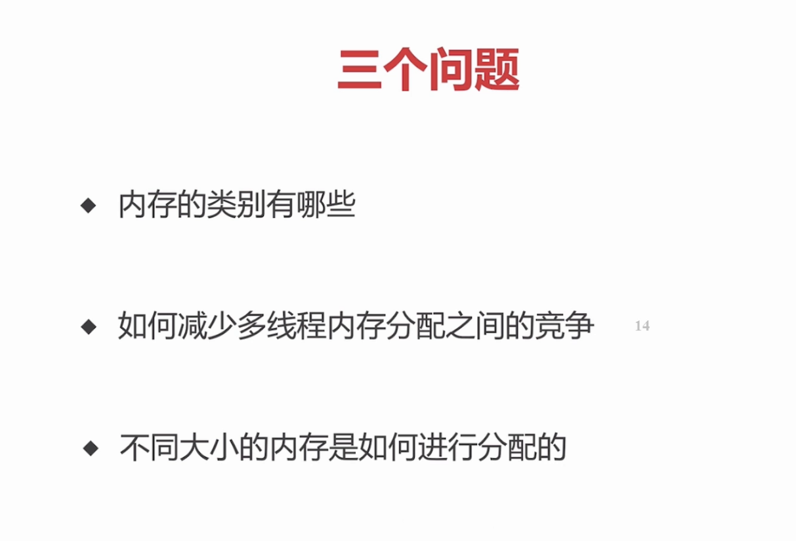
1.	三个维度
2.	threadLocal的原理，每个线程和一个arena进行绑定
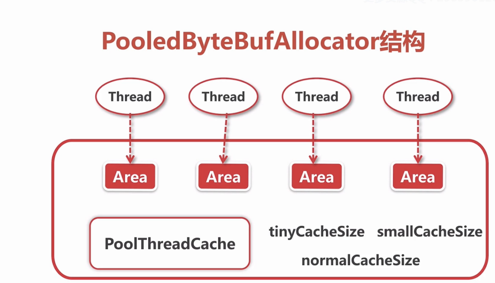
3. 通过申请一个chunk ，进行分层切分，多层定位。使不同的需求大小有一个相匹配的内存位置
## 1. bytebuf结构以及重要API
### 1.1 bytebuf 结构
```
* <pre>
 *      +-------------------+------------------+------------------+
 *      | discardable bytes |  readable bytes  |  writable bytes  |
 *      |                   |     (CONTENT)    |                  |
 *      +-------------------+------------------+------------------+
 *      |                   |                  |                  |
 *      0      <=      readerIndex   <=   writerIndex    <=    capacity
 * </pre>
```
###  1.2 read, set write方法

## 1.2 bytebuf分类 内存分配

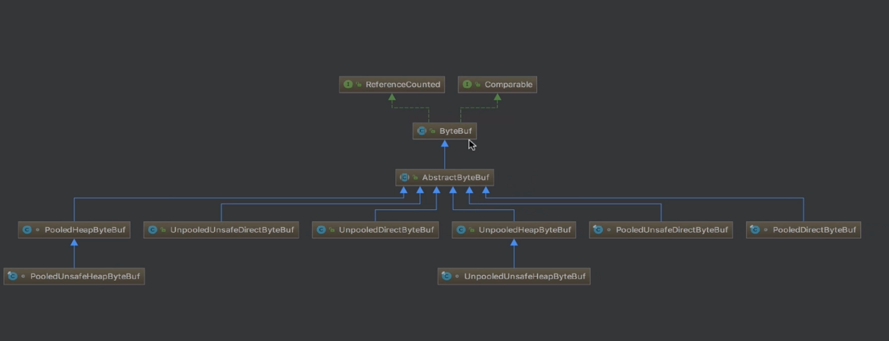
### 1.2.1 pooled 和 unpooled
+	pooled : 每一次都是从预先分配好的一段内存中去取 一段连续的内存 组成一个bytebuf
+	unpooled: 每次调用系统api，向系统申请一段内存
### 1.2.2 unsafe和非unsafe
+	unsafe（依赖JDK底层的unsafe对象）: 每次可以拿到内存地址，对这个地址进行读写操作
+	非unsafe（不会依赖JDK底层的unsafe对象）：
### 1.2.3  head和direct
+	heap: 在堆上进行内存分配的，GC管理自动释放
+	direct: 调用JDK的api进行内存分配的，不受JVM控制，不会被GC的，需要手动释放

## 2. bytebufAllocatior分析
所有的bytebuf都是由它分配出来的，netty的一个内存管理器
最顶层的抽象 io.netty.buffer.ByteBufAllocator：单纯的一个抽象，基本就是 headpBuf ,directBuf
骨架：io.netty.buffer.AbstractByteBufAllocator
### 2.1 bytebufAllocatior两大子类
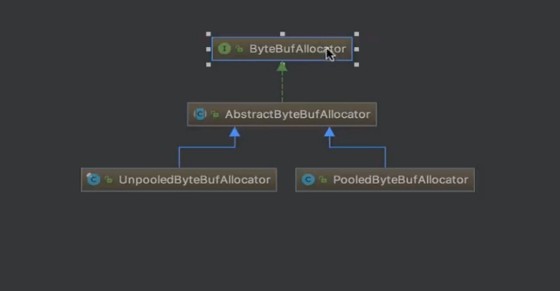
netty的内存分配 pooled 和 unpooled 维度是靠bytebufAllocatior结构图决定 safe和unsafe是自动判别的
### 2.2 UnPooledByteBufAllocator分析
创建bytebuf的时候自动判断 hasUnsafe
```
 @Override
    protected ByteBuf newHeapBuffer(int initialCapacity, int maxCapacity) {
        return PlatformDependent.hasUnsafe() ?
                new InstrumentedUnpooledUnsafeHeapByteBuf(this, initialCapacity, maxCapacity) :
                new InstrumentedUnpooledHeapByteBuf(this, initialCapacity, maxCapacity);
    }

    @Override
    protected ByteBuf newDirectBuffer(int initialCapacity, int maxCapacity) {
        final ByteBuf buf;
        if (PlatformDependent.hasUnsafe()) {
            buf = noCleaner ? new InstrumentedUnpooledUnsafeNoCleanerDirectByteBuf(this, initialCapacity, maxCapacity) :
                    new InstrumentedUnpooledUnsafeDirectByteBuf(this, initialCapacity, maxCapacity);
        } else {
            buf = new InstrumentedUnpooledDirectByteBuf(this, initialCapacity, maxCapacity);
        }
        return disableLeakDetector ? buf : toLeakAwareBuffer(buf);
    }
```
#### 2.2.3 heap内存分配
InstrumentedUnpooledHeapByteBuf 和 InstrumentedUnpooledUnsafeHeapByteBuf区别 主要在getbyte：
+	InstrumentedUnpooledHeapByteBuf:io.netty.buffer.HeapByteBufUtil.getByte(byte[], int)
调用数组实现
```
  static byte getByte(byte[] memory, int index) {
        return memory[index];
    }
```
+	InstrumentedUnpooledUnsafeHeapByteBuf:  io.netty.util.internal.PlatformDependent0.getByte(byte[], int)
调用unsafe对象来进行操作
```
static byte getByte(byte[] data, int index) {
        return UNSAFE.getByte(data, BYTE_ARRAY_BASE_OFFSET + index);
    }
```
#### 2.2.4 direct（堆外）内存分配 
这个就是主要调用JDk底层的方法区创建bytebuf
InstrumentedUnpooledDirectByteBuf 和  InstrumentedUnpooledUnsafeDirectByteBuf 的区别
io.netty.buffer.UnpooledDirectByteBuf._getByte(int)
用buffer直接操作
```
  @Override
    protected byte _getByte(int index) {
        return buffer.get(index);
    }

```
+	InstrumentedUnpooledDirectByteBuf:

+	InstrumentedUnpooledUnsafeDirectByteBuf
io.netty.util.internal.PlatformDependent0.getByte(long)
调用unsafe对象来进行操作
```
  static byte getByte(long address) {
        return UNSAFE.getByte(address);
    }
```


### 2.3 PooledByteBufAllocator概述
io.netty.buffer.PooledByteBufAllocator
```
@Override
    protected ByteBuf newHeapBuffer(int initialCapacity, int maxCapacity) {
        PoolThreadCache cache = threadCache.get();
        PoolArena<byte[]> heapArena = cache.heapArena;

        final ByteBuf buf;
        if (heapArena != null) {
            buf = heapArena.allocate(cache, initialCapacity, maxCapacity);
        } else {
            buf = PlatformDependent.hasUnsafe() ?
                    new UnpooledUnsafeHeapByteBuf(this, initialCapacity, maxCapacity) :
                    new UnpooledHeapByteBuf(this, initialCapacity, maxCapacity);
        }

        return toLeakAwareBuffer(buf);
    }

    @Override
    protected ByteBuf newDirectBuffer(int initialCapacity, int maxCapacity) {
        PoolThreadCache cache = threadCache.get();
        PoolArena<ByteBuffer> directArena = cache.directArena;

        final ByteBuf buf;
        if (directArena != null) {
            buf = directArena.allocate(cache, initialCapacity, maxCapacity);
        } else {
            buf = PlatformDependent.hasUnsafe() ?
                    UnsafeByteBufUtil.newUnsafeDirectByteBuf(this, initialCapacity, maxCapacity) :
                    new UnpooledDirectByteBuf(this, initialCapacity, maxCapacity);
        }

        r
```
#### 2.3.1 拿到线程局部缓存PoolThreadCache
io.netty.buffer.PooledByteBufAllocator.PoolThreadLocalCache
```
final class PoolThreadLocalCache extends FastThreadLocal<PoolThreadCache> 
继承FastThreadLocal 实际可以看成threadLocal  只是实现更快

   @Override
        protected synchronized PoolThreadCache initialValue() {
			// 可以把heapArena 叫成竞技场
            final PoolArena<byte[]> heapArena = leastUsedArena(heapArenas);
            final PoolArena<ByteBuffer> directArena = leastUsedArena(directArenas);

            Thread current = Thread.currentThread();
            if (useCacheForAllThreads || current instanceof FastThreadLocalThread) {
                return new PoolThreadCache(
                        heapArena, directArena, tinyCacheSize, smallCacheSize, normalCacheSize,
                        DEFAULT_MAX_CACHED_BUFFER_CAPACITY, DEFAULT_CACHE_TRIM_INTERVAL);
            }
            // No caching so just use 0 as sizes.
            return new PoolThreadCache(heapArena, directArena, 0, 0, 0, 0, 0);
        }
```

#### 2.3.2 在线程局部缓存的area上进行内存分配
heapArea 初始化 io.netty.buffer.PooledByteBufAllocator.PooledByteBufAllocator(boolean, int, int, int, int, int, int, int, boolean, int)
```
		// 这里其实会创建两种数组  heap和DirectArea两种  。
         if (nHeapArena > 0) {
			 // 创建一个poolArea的数组
            heapArenas = newArenaArray(nHeapArena);
            List<PoolArenaMetric> metrics = new ArrayList<PoolArenaMetric>(heapArenas.length);
            for (int i = 0; i < heapArenas.length; i ++) {
                PoolArena.HeapArena arena = new PoolArena.HeapArena(this,
                        pageSize, maxOrder, pageShifts, chunkSize,
                        directMemoryCacheAlignment);
                heapArenas[i] = arena;
                metrics.add(arena);
            }
            heapArenaMetrics = Collections.unmodifiableList(metrics);
        } else {
            heapArenas = null;
            heapArenaMetrics = Collections.emptyList();
        }

        if (nDirectArena > 0) {
            directArenas = newArenaArray(nDirectArena);
            List<PoolArenaMetric> metrics = new ArrayList<PoolArenaMetric>(directArenas.length);
            for (int i = 0; i < directArenas.length; i ++) {
                PoolArena.DirectArena arena = new PoolArena.DirectArena(
                        this, pageSize, maxOrder, pageShifts, chunkSize, directMemoryCacheAlignment);
                directArenas[i] = arena;
                metrics.add(arena);
            }
            directArenaMetrics = Collections.unmodifiableList(metrics);
        } else {
            directArenas = null;
            directArenaMetrics = Collections.emptyList();
        }
			
			
				 @SuppressWarnings("unchecked")
    private static <T> PoolArena<T>[] newArenaArray(int size) {
        return new PoolArena[size];
    }
```
nHeapArena初始化
```
// 两倍cpu的核数  这里的默认其实是和创建NioEventGroup默认一样的个数。让每个线程都有一个area
  final int defaultMinNumArena = NettyRuntime.availableProcessors() * 2;
        final int defaultChunkSize = DEFAULT_PAGE_SIZE << DEFAULT_MAX_ORDER;
  DEFAULT_NUM_HEAP_ARENA = Math.max(0,
                SystemPropertyUtil.getInt(
                        "io.netty.allocator.numHeapArenas",
                        (int) Math.min(
                                defaultMinNumArena,
                                runtime.maxMemory() / defaultChunkSize / 2 / 3)));
        DEFAULT_NUM_DIRECT_ARENA = Math.max(0,
                SystemPropertyUtil.getInt(
                        "io.netty.allocator.numDirectArenas",
                        (int) Math.min(
                                defaultMinNumArena,
                                PlatformDependent.maxDirectMemory() / defaultChunkSize / 2 / 3)));
```

area其实有两种  heap和direct 这里就统称为一种
PoolThreadCache 拿到一个area作为成员变量，再把这个area塞到某个线程里面,并且可以维护底层的一个bytebuf对象，比如有人用了1024内存，然后释放了，就进了这个buffer对象，
这个buffer对象有三个参数。其实就是代表了可以分配多少的问题
```
private final int tinyCacheSize;
    private final int smallCacheSize;
    private final int normalCacheSize;
```
以tinyCacheSize 为例 io.netty.buffer.PooledByteBufAllocator.PoolThreadLocalCache.initialValue()
这里的这三个值是以成员变量传进去的
```
   @Override
        protected synchronized PoolThreadCache initialValue() {
            final PoolArena<byte[]> heapArena = leastUsedArena(heapArenas);
            final PoolArena<ByteBuffer> directArena = leastUsedArena(directArenas);

            Thread current = Thread.currentThread();
            if (useCacheForAllThreads || current instanceof FastThreadLocalThread) {
                return new PoolThreadCache(
                        heapArena, directArena, tinyCacheSize, smallCacheSize, normalCacheSize,
                        DEFAULT_MAX_CACHED_BUFFER_CAPACITY, DEFAULT_CACHE_TRIM_INTERVAL);
            }
            // No caching so just use 0 as sizes.
            return new PoolThreadCache(heapArena, directArena, 0, 0, 0, 0, 0);
        }
```
io.netty.buffer.PoolThreadCache.PoolThreadCache(PoolArena<byte[]>, PoolArena<ByteBuffer>, int, int, int, int, int)
```
 PoolThreadCache(PoolArena<byte[]> heapArena, PoolArena<ByteBuffer> directArena,
                    int tinyCacheSize, int smallCacheSize, int normalCacheSize,
                    int maxCachedBufferCapacity, int freeSweepAllocationThreshold) {
        if (maxCachedBufferCapacity < 0) {
            throw new IllegalArgumentException("maxCachedBufferCapacity: "
                    + maxCachedBufferCapacity + " (expected: >= 0)");
        }
        this.freeSweepAllocationThreshold = freeSweepAllocationThreshold;
        this.heapArena = heapArena;
        this.directArena = directArena;
        if (directArena != null) {
            tinySubPageDirectCaches = createSubPageCaches(
                    tinyCacheSize, PoolArena.numTinySubpagePools, SizeClass.Tiny);
            smallSubPageDirectCaches = createSubPageCaches(
                    smallCacheSize, directArena.numSmallSubpagePools, SizeClass.Small);

            numShiftsNormalDirect = log2(directArena.pageSize);
            normalDirectCaches = createNormalCaches(
                    normalCacheSize, maxCachedBufferCapacity, directArena);

            directArena.numThreadCaches.getAndIncrement();
        } else {
            // No directArea is configured so just null out all caches
            tinySubPageDirectCaches = null;
            smallSubPageDirectCaches = null;
            normalDirectCaches = null;
            numShiftsNormalDirect = -1;
        }
        if (heapArena != null) {
            // Create the caches for the heap allocations
            tinySubPageHeapCaches = createSubPageCaches(
                    tinyCacheSize, PoolArena.numTinySubpagePools, SizeClass.Tiny);
            smallSubPageHeapCaches = createSubPageCaches(
                    smallCacheSize, heapArena.numSmallSubpagePools, SizeClass.Small);

            numShiftsNormalHeap = log2(heapArena.pageSize);
            normalHeapCaches = createNormalCaches(
                    normalCacheSize, maxCachedBufferCapacity, heapArena);

            heapArena.numThreadCaches.getAndIncrement();
        } else {
            // No heapArea is configured so just null out all caches
            tinySubPageHeapCaches = null;
            smallSubPageHeapCaches = null;
            normalHeapCaches = null;
            numShiftsNormalHeap = -1;
        }

        // Only check if there are caches in use.
        if ((tinySubPageDirectCaches != null || smallSubPageDirectCaches != null || normalDirectCaches != null
                || tinySubPageHeapCaches != null || smallSubPageHeapCaches != null || normalHeapCaches != null)
                && freeSweepAllocationThreshold < 1) {
            throw new IllegalArgumentException("freeSweepAllocationThreshold: "
                    + freeSweepAllocationThreshold + " (expected: > 0)");
        }
    }
	-------------------------------------------------
	// 这里MemoryRegionCache 是一个缓存对象，表示这种可以缓存多少个 。
	    private static <T> MemoryRegionCache<T>[] createSubPageCaches(
            int cacheSize, int numCaches, SizeClass sizeClass) {
        if (cacheSize > 0 && numCaches > 0) {
            @SuppressWarnings("unchecked")
            MemoryRegionCache<T>[] cache = new MemoryRegionCache[numCaches];
            for (int i = 0; i < cache.length; i++) {
                // TODO: maybe use cacheSize / cache.length
				// 表示不同大小的一个队列，表示这种大小的缓存我可以缓存多少个
                cache[i] = new SubPageMemoryRegionCache<T>(cacheSize, sizeClass);
            }
            return cache;
        } else {
            return null;
        }
    }
```
进入SubPageMemoryRegionCache
```
MemoryRegionCache(int size, SizeClass sizeClass) {
            this.size = MathUtil.safeFindNextPositivePowerOfTwo(size);
            queue = PlatformDependent.newFixedMpscQueue(this.size);
            this.sizeClass = sizeClass;
        }
```
io.netty.buffer.PoolThreadCache.SubPageMemoryRegionCache<T>
### 2.4 directArena分配direct内存的流程
#### 2.4.1 从对象池里面拿到一个bytebuf进行复用
io.netty.buffer.PooledByteBufAllocator.newDirectBuffer(int, int)
```
io.netty.buffer.PooledByteBufAllocator.newDirectBuffer(int, int)
  @Override
    protected ByteBuf newDirectBuffer(int initialCapacity, int maxCapacity) {
        PoolThreadCache cache = threadCache.get();
        PoolArena<ByteBuffer> directArena = cache.directArena;

        final ByteBuf buf;
        if (directArena != null) {
            buf = directArena.allocate(cache, initialCapacity, maxCapacity);
        } else {
            buf = PlatformDependent.hasUnsafe() ?
                    UnsafeByteBufUtil.newUnsafeDirectByteBuf(this, initialCapacity, maxCapacity) :
                    new UnpooledDirectByteBuf(this, initialCapacity, maxCapacity);
        }

        return toLeakAwareBuffer(buf);
    }
	
	
	  PooledByteBuf<T> allocate(PoolThreadCache cache, int reqCapacity, int maxCapacity) {
		 // 拿到一个对象
        PooledByteBuf<T> buf = newByteBuf(maxCapacity);
		// 就是拿到一个内存，把buf的内存地址等信息进行初始化
        allocate(cache, buf, reqCapacity);
        return buf;
    }
```
因为我们以direct进行示例所以进入io.netty.buffer.PoolArena.DirectArena.newByteBuf(int)
```
 @Override
        protected PooledByteBuf<ByteBuffer> newByteBuf(int maxCapacity) {
            if (HAS_UNSAFE) {
                return PooledUnsafeDirectByteBuf.newInstance(maxCapacity);
            } else {
                return PooledDirectByteBuf.newInstance(maxCapacity);
            }
        }
```
io.netty.buffer.PooledUnsafeDirectByteBuf
```
 static PooledUnsafeDirectByteBuf newInstance(int maxCapacity) {
	 //	RECYCLER 从名字来看 就是有回收的 对象池。这里判断是否有这歌bytebuf对象，有的话直接缓存 ，没有就创建
        PooledUnsafeDirectByteBuf buf = RECYCLER.get();
       // 进行复用
		buf.reuse(maxCapacity);
        return buf;
    }
```

io.netty.util.Recycler.get()
```

    @SuppressWarnings("unchecked")
    public final T get() {
        if (maxCapacityPerThread == 0) {
            return newObject((Handle<T>) NOOP_HANDLE);
        }
        Stack<T> stack = threadLocal.get();
        DefaultHandle<T> handle = stack.pop();
        if (handle == null) {
            handle = stack.newHandle();
            handle.value = newObject(handle);
        }
        return (T) handle.value;
    }
```
io.netty.buffer.PooledByteBuf.reuse(int)
```
 /**
     * Method must be called before reuse this {@link PooledByteBufAllocator}
     */
    final void reuse(int maxCapacity) {
        maxCapacity(maxCapacity);
        setRefCnt(1);
        setIndex0(0, 0);
        discardMarks();
    }
	
	final void discardMarks() {
        markedReaderIndex = markedWriterIndex = 0;
    }
```

#### 2.4.2 从缓存上进行内存分配
#### 2.4.3 从内存堆上进行分配
下面的代码都是先从缓存进行分配，分配不了的时候再实际分配
io.netty.buffer.PooledByteBufAllocator.newDirectBuffer(int, int)
```
io.netty.buffer.PooledByteBufAllocator.newDirectBuffer(int, int)
  @Override
    protected ByteBuf newDirectBuffer(int initialCapacity, int maxCapacity) {
        PoolThreadCache cache = threadCache.get();
        PoolArena<ByteBuffer> directArena = cache.directArena;

        final ByteBuf buf;
        if (directArena != null) {
            buf = directArena.allocate(cache, initialCapacity, maxCapacity);
        } else {
            buf = PlatformDependent.hasUnsafe() ?
                    UnsafeByteBufUtil.newUnsafeDirectByteBuf(this, initialCapacity, maxCapacity) :
                    new UnpooledDirectByteBuf(this, initialCapacity, maxCapacity);
        }

        return toLeakAwareBuffer(buf);
    }
	
	
	  PooledByteBuf<T> allocate(PoolThreadCache cache, int reqCapacity, int maxCapacity) {
		 // 拿到一个对象
        PooledByteBuf<T> buf = newByteBuf(maxCapacity);
		// 就是拿到一个内存，把buf的内存地址等信息进行初始化  
		// 其实就是这里
        allocate(cache, buf, reqCapacity);
        return buf;
    }
```
io.netty.buffer.PoolArena.allocate(PoolThreadCache, PooledByteBuf<T>, int)
```
private void allocate(PoolThreadCache cache, PooledByteBuf<T> buf, final int reqCapacity) {
        final int normCapacity = normalizeCapacity(reqCapacity);
        if (isTinyOrSmall(normCapacity)) { // capacity < pageSize
            int tableIdx;
            PoolSubpage<T>[] table;
            boolean tiny = isTiny(normCapacity);
			//  都是现在缓存上进行分配，如果没分配成功就实际分配
            if (tiny) { // < 512
                if (cache.allocateTiny(this, buf, reqCapacity, normCapacity)) {
                    // was able to allocate out of the cache so move on
                    return;
                }
                tableIdx = tinyIdx(normCapacity);
                table = tinySubpagePools;
            } else {
                if (cache.allocateSmall(this, buf, reqCapacity, normCapacity)) {
                    // was able to allocate out of the cache so move on
                    return;
                }
                tableIdx = smallIdx(normCapacity);
                table = smallSubpagePools;
            }

            final PoolSubpage<T> head = table[tableIdx];

            /**
             * Synchronize on the head. This is needed as {@link PoolChunk#allocateSubpage(int)} and
             * {@link PoolChunk#free(long)} may modify the doubly linked list as well.
             */
            synchronized (head) {
                final PoolSubpage<T> s = head.next;
                if (s != head) {
                    assert s.doNotDestroy && s.elemSize == normCapacity;
                    long handle = s.allocate();
                    assert handle >= 0;
                    s.chunk.initBufWithSubpage(buf, handle, reqCapacity);
                    incTinySmallAllocation(tiny);
                    return;
                }
            }
            synchronized (this) {
                allocateNormal(buf, reqCapacity, normCapacity);
            }

            incTinySmallAllocation(tiny);
            return;
        }
        if (normCapacity <= chunkSize) {
			// 先在缓存上进行内存分配
            if (cache.allocateNormal(this, buf, reqCapacity, normCapacity)) {
                // was able to allocate out of the cache so move on
                return;
            }
			//  缓存没成功就实际去分配一块内存
            synchronized (this) {
                allocateNormal(buf, reqCapacity, normCapacity);
                ++allocationsNormal;
            }
        } else {
			
            // Huge allocations are never served via the cache so just call allocateHuge
            allocateHuge(buf, reqCapacity);
        }
    }

```
### 2.5 内存规格介绍
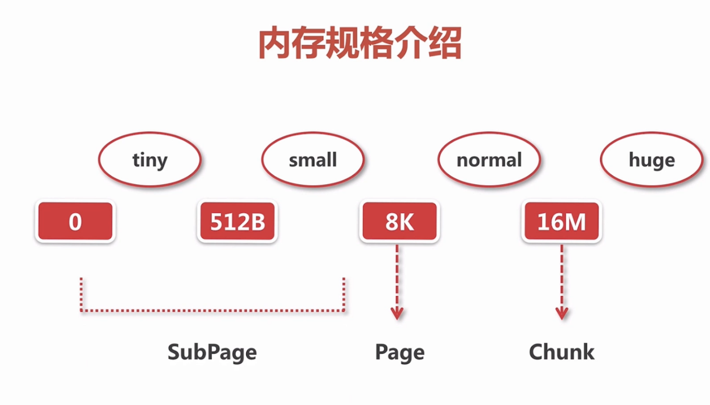
为什么是16M呢？ 因为netty每次都是以chunk去申请内存的。如果需要1M，那么以先申请1chunk=16m的内存。再从这16m里面去拿连续的1m内存去分配
但是16M还是太大，就会进行切分，按每个8k进行切分，正好是2的11次方个2048个，
### 2.6 命中缓存的分配逻辑
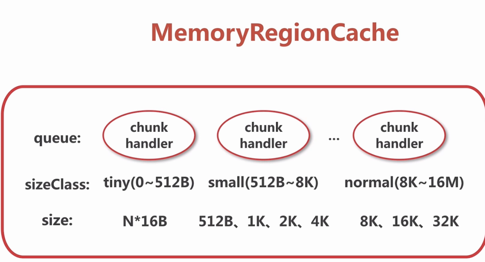
MemoryReginCache 里面都是固定大小
1. handler 都指向唯一一段连续的内存
2. sizeClass:内存规格
#### 2.6.1 MemoryRegionCache
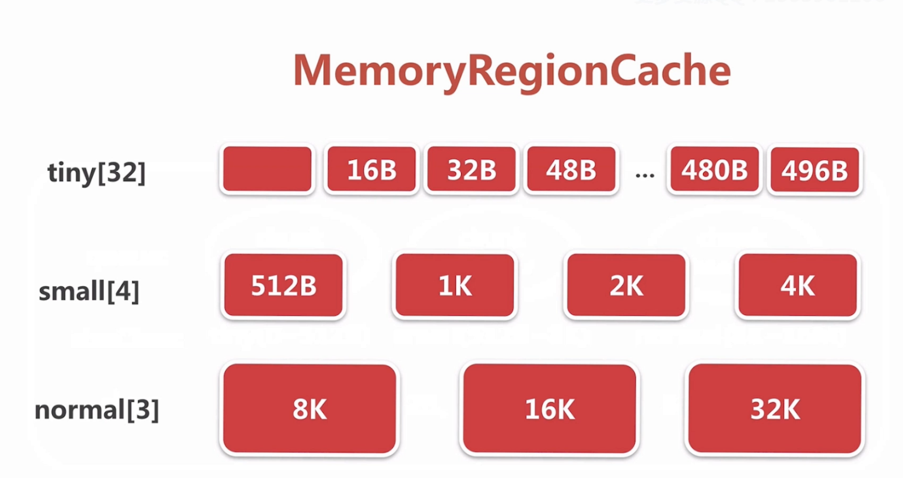
io.netty.buffer.PoolThreadCache.MemoryRegionCache<T>
// 同一个size的bytebuf哪些能够直接利用
``` private abstract static class MemoryRegionCache<T> {
		private final int size;
		// 存储每种大小的buffer
        private final Queue<Entry<T>> queue;
		/**
		 * enum SizeClass {
				Tiny,
				Small,
				Normal
			}
		 */
        private final SizeClass sizeClass;
        private int allocations;

        MemoryRegionCache(int size, SizeClass sizeClass) {
            this.size = MathUtil.safeFindNextPositivePowerOfTwo(size);
            queue = PlatformDependent.newFixedMpscQueue(this.size);
            this.sizeClass = sizeClass;
        }
```
cache 分为 tiny small normal
在这里维护的io.netty.buffer.PoolThreadCache 
因为PoolThreadCache 是每个线程维护的对象，那么每个线程都会有一下的几个数据
``` 
    // Hold the caches for the different size classes, which are tiny, small and normal.
    private final MemoryRegionCache<byte[]>[] tinySubPageHeapCaches;
    private final MemoryRegionCache<byte[]>[] smallSubPageHeapCaches;
    private final MemoryRegionCache<ByteBuffer>[] tinySubPageDirectCaches;
    private final MemoryRegionCache<ByteBuffer>[] smallSubPageDirectCaches;
    private final MemoryRegionCache<byte[]>[] normalHeapCaches;
    private final MemoryRegionCache<ByteBuffer>[] normalDirectCaches;
```
以tinySubPageDirectCaches举例
```
  PoolThreadCache(PoolArena<byte[]> heapArena, PoolArena<ByteBuffer> directArena,
          .........
        if (directArena != null) {
			// 在这里进行初始化
			// tinyCacheSize 默认512B 。PoolArena.numTinySubpagePools默认16
			// 看下面代码，可知其实创建了32 （16？）个节点 每个节点都是不同类型的一个队列，每个队列商都默认512
            tinySubPageDirectCaches = createSubPageCaches(
                    tinyCacheSize, PoolArena.numTinySubpagePools, SizeClass.Tiny);
            smallSubPageDirectCaches = createSubPageCaches(
                    smallCacheSize, directArena.numSmallSubpagePools, SizeClass.Small);

            numShiftsNormalDirect = log2(directArena.pageSize);
            normalDirectCaches = createNormalCaches(
                    normalCacheSize, maxCachedBufferCapacity, directArena);

            directArena.numThreadCaches.getAndIncrement();
      .........
```
io.netty.buffer.PoolThreadCache.createSubPageCaches(int, int, SizeClass)
```
 private static <T> MemoryRegionCache<T>[] createSubPageCaches(
            int cacheSize, int numCaches, SizeClass sizeClass) {
        if (cacheSize > 0 && numCaches > 0) {
            @SuppressWarnings("unchecked")
			// 创建一个数组，numCaches 数组长度
            MemoryRegionCache<T>[] cache = new MemoryRegionCache[numCaches];
            for (int i = 0; i < cache.length; i++) {
                // TODO: maybe use cacheSize / cache.length
				// 跟进这个new方法
                cache[i] = new SubPageMemoryRegionCache<T>(cacheSize, sizeClass);
            }
            return cache;
        } else {
            return null;
        }
    }
```
io.netty.buffer.PoolThreadCache.MemoryRegionCache.MemoryRegionCache(int, SizeClass)
```
 MemoryRegionCache(int size, SizeClass sizeClass) {
			// 规则化  查找下一个大于等于当前数的2次幂的一个数  传进来512 这样这里还是512
            this.size = MathUtil.safeFindNextPositivePowerOfTwo(size);
            queue = PlatformDependent.newFixedMpscQueue(this.size);
            this.sizeClass = sizeClass;
        }
```
### 2.7 命中缓存的分配流程
分配入口io.netty.buffer.PoolArena.allocate(PoolThreadCache, PooledByteBuf<T>, int)
```
 private void allocate(PoolThreadCache cache, PooledByteBuf<T> buf, final int reqCapacity) {
	 //	规格化
        final int normCapacity = normalizeCapacity(reqCapacity);
        if (isTinyOrSmall(normCapacity)) { // capacity < pageSize
            int tableIdx;
            PoolSubpage<T>[] table;
            boolean tiny = isTiny(normCapacity);
            if (tiny) { // < 512
			// 看一下 cache.allocateTity 因为其他cache 都差不多
                if (cache.allocateTiny(this, buf, reqCapacity, normCapacity)) {
                    // was able to allocate out of the cache so move on
                    return;
                }
                tableIdx = tinyIdx(normCapacity);
                table = tinySubpagePools;
            } else {
                if (cache.allocateSmall(this, buf, reqCapacity, normCapacity)) {
                    // was able to allocate out of the cache so move on
                    return;
                }
                tableIdx = smallIdx(normCapacity);
                table = smallSubpagePools;
            }

            final PoolSubpage<T> head = table[tableIdx];

            /**
             * Synchronize on the head. This is needed as {@link PoolChunk#allocateSubpage(int)} and
             * {@link PoolChunk#free(long)} may modify the doubly linked list as well.
             */
            synchronized (head) {
                final PoolSubpage<T> s = head.next;
                if (s != head) {
                    assert s.doNotDestroy && s.elemSize == normCapacity;
                    long handle = s.allocate();
                    assert handle >= 0;
                    s.chunk.initBufWithSubpage(buf, handle, reqCapacity);
                    incTinySmallAllocation(tiny);
                    return;
                }
            }
            synchronized (this) {
                allocateNormal(buf, reqCapacity, normCapacity);
            }

            incTinySmallAllocation(tiny);
            return;
        }
        if (normCapacity <= chunkSize) {
            if (cache.allocateNormal(this, buf, reqCapacity, normCapacity)) {
                // was able to allocate out of the cache so move on
                return;
            }
            synchronized (this) {
                allocateNormal(buf, reqCapacity, normCapacity);
                ++allocationsNormal;
            }
        } else {
            // Huge allocations are never served via the cache so just call allocateHuge
            allocateHuge(buf, reqCapacity);
        }
    }
```
io.netty.buffer.PoolArena.normalizeCapacity(int)
```
int normalizeCapacity(int reqCapacity) {
        if (reqCapacity < 0) {
            throw new IllegalArgumentException("capacity: " + reqCapacity + " (expected: 0+)");
        }

        if (reqCapacity >= chunkSize) {
            return directMemoryCacheAlignment == 0 ? reqCapacity : alignCapacity(reqCapacity);
        }

        if (!isTiny(reqCapacity)) { // >= 512
            // Doubled

            int normalizedCapacity = reqCapacity;
            normalizedCapacity --;
            normalizedCapacity |= normalizedCapacity >>>  1;
            normalizedCapacity |= normalizedCapacity >>>  2;
            normalizedCapacity |= normalizedCapacity >>>  4;
            normalizedCapacity |= normalizedCapacity >>>  8;
            normalizedCapacity |= normalizedCapacity >>> 16;
            normalizedCapacity ++;

            if (normalizedCapacity < 0) {
                normalizedCapacity >>>= 1;
            }
            assert directMemoryCacheAlignment == 0 || (normalizedCapacity & directMemoryCacheAlignmentMask) == 0;

            return normalizedCapacity;
        }

        if (directMemoryCacheAlignment > 0) {
            return alignCapacity(reqCapacity);
        }

        // Quantum-spaced
        if ((reqCapacity & 15) == 0) {
            return reqCapacity;
        }

        return (reqCapacity & ~15) + 16;
    }
```
#### 2.7.1 看一下某种的cache，分配内存
看一下io.netty.buffer.PoolThreadCache.allocateTiny(PoolArena<?>, PooledByteBuf<?>, int, int)
```
boolean allocateTiny(PoolArena<?> area, PooledByteBuf<?> buf, int reqCapacity, int normCapacity) {
        return allocate(cacheForTiny(area, normCapacity), buf, reqCapacity);
    }
```
1. 找到对应的size的MemoryRegionSize
io.netty.buffer.PoolThreadCache.cacheForTiny(PoolArena<?>, int)
```
 private MemoryRegionCache<?> cacheForSmall(PoolArena<?> area, int normCapacity) {
        int idx = PoolArena.smallIdx(normCapacity);
        if (area.isDirect()) {
            return cache(smallSubPageDirectCaches, idx);
        }
        return cache(smallSubPageHeapCaches, idx);
    }
	
	
	 static int tinyIdx(int normCapacity) {
        return normCapacity >>> 4;
    }
```
io.netty.buffer.PoolThreadCache.allocate(MemoryRegionCache<?>, PooledByteBuf, int)
```
@SuppressWarnings({ "unchecked", "rawtypes" })
    private boolean allocate(MemoryRegionCache<?> cache, PooledByteBuf buf, int reqCapacity) {
        if (cache == null) {
            // no cache found so just return false here
            return false;
        }
        boolean allocated = cache.allocate(buf, reqCapacity);
        if (++ allocations >= freeSweepAllocationThreshold) {
            allocations = 0;
            trim();
        }
        return allocated;
    }
	
	
	public final boolean allocate(PooledByteBuf<T> buf, int reqCapacity) {
		// 1. 弹出一个entry
            Entry<T> entry = queue.poll();
            if (entry == null) {
                return false;
            }
			// 2.  初始化
            initBuf(entry.chunk, entry.handle, buf, reqCapacity);
			// 3. 回收
            entry.recycle();

            // allocations is not thread-safe which is fine as this is only called from the same thread all time.
            ++ allocations;
            return true;
        }
```
```
 static final class Entry<T> {
            final Handle<Entry<?>> recyclerHandle;
            PoolChunk<T> chunk;   // 哪一块内存
            long handle = -1;  // 起定位作用

            Entry(Handle<Entry<?>> recyclerHandle) {
                this.recyclerHandle = recyclerHandle;
            }
```
2. 从queue<entry<T>>弹出一个entry<T>给bytebuf进行初始化  entry代表某个chunk下的一段连续内存
initBuf(entry.chunk, entry.handle, buf, reqCapacity);
io.netty.buffer.PoolChunk.initBufWithSubpage(PooledByteBuf<T>, long, int, int)
```
 private void initBufWithSubpage(PooledByteBuf<T> buf, long handle, int bitmapIdx, int reqCapacity) {
        assert bitmapIdx != 0;

        int memoryMapIdx = memoryMapIdx(handle);

        PoolSubpage<T> subpage = subpages[subpageIdx(memoryMapIdx)];
        assert subpage.doNotDestroy;
        assert reqCapacity <= subpage.elemSize;

        buf.init(
            this, handle,
            runOffset(memoryMapIdx) + (bitmapIdx & 0x3FFFFFFF) * subpage.elemSize + offset,
                reqCapacity, subpage.elemSize, arena.parent.threadCache());
    }
```
io.netty.buffer.PooledByteBuf.init0(PoolChunk<T>, long, int, int, int, PoolThreadCache)
```

    private void init0(PoolChunk<T> chunk, long handle, int offset, int length, int maxLength, PoolThreadCache cache) {
        assert handle >= 0;
        assert chunk != null;

        this.chunk = chunk;
        memory = chunk.memory;
        allocator = chunk.arena.parent;
        this.cache = cache;
        this.handle = handle;
        this.offset = offset;
        this.length = length;
        this.maxLength = maxLength;
        tmpNioBuf = null;
    }
```
3. 将弹出的entry扔到对象池中进行复用
io.netty.buffer.PoolThreadCache.MemoryRegionCache.Entry.recycle()
```

            void recycle() {
				// 表示不指向任何一个内存
                chunk = null;
                handle = -1;
                recyclerHandle.recycle(this);
            }
			
			
			
			@Override
        public void recycle(Object object) {
            if (object != value) {
                throw new IllegalArgumentException("object does not belong to handle");
            }
			
			//  压到栈里面
            stack.push(this);
        }
```
### 2.8 arena、chunk、page、subpage概念
#### 2.8.1 arena
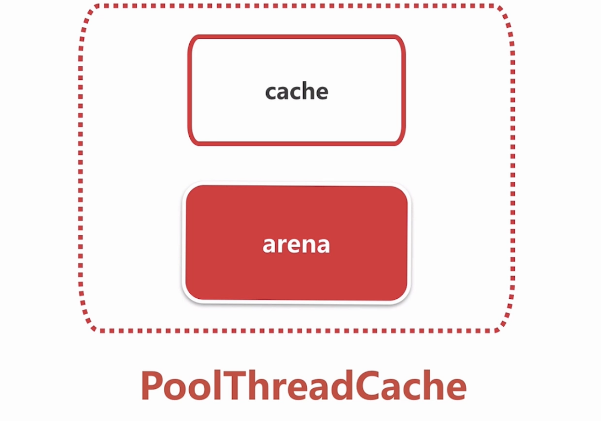
分配都是走的ThreadLocalCache .里面包含了cache和arena
cache: 直接缓存了一片内存
arena： 直接开辟一片内存
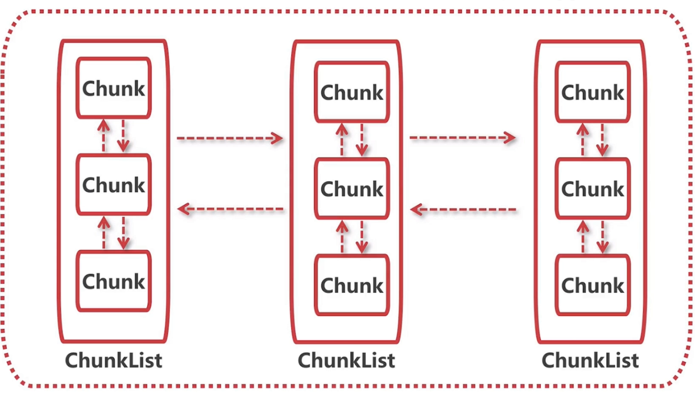
chunkList  然后通过双向列表进行连接
```
final class PoolThreadCache {

    private static final InternalLogger logger = InternalLoggerFactory.getInstance(PoolThreadCache.class);

    final PoolArena<byte[]> heapArena;
    final PoolArena<ByteBuffer> directArena;
```
#### 2.8.2 chunk
io.netty.buffer.PoolArena<T>
```
//	表示不同使用率的chunkList的一个结合
	private final PoolChunkList<T> q050;
    private final PoolChunkList<T> q025;
    private final PoolChunkList<T> q000;
    private final PoolChunkList<T> qInit;
    private final PoolChunkList<T> q075;
    private final PoolChunkList<T> q100;
	
		q100 = new PoolChunkList<T>(this, null, 100, Integer.MAX_VALUE, chunkSize);
        q075 = new PoolChunkList<T>(this, q100, 75, 100, chunkSize);
		// 最小使用率是50 最大是100
        q050 = new PoolChunkList<T>(this, q075, 50, 100, chunkSize);
        q025 = new PoolChunkList<T>(this, q050, 25, 75, chunkSize);
        q000 = new PoolChunkList<T>(this, q025, 1, 50, chunkSize);
        qInit = new PoolChunkList<T>(this, q000, Integer.MIN_VALUE, 25, chunkSize);
		// 双向链表连接
        q100.prevList(q075);
        q075.prevList(q050);
        q050.prevList(q025);
        q025.prevList(q000);
        q000.prevList(null);
        qInit.prevList(qInit);
```
#### 2.8.3 page
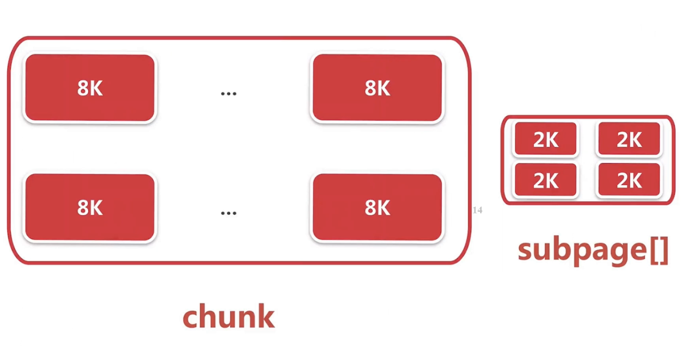
chunk太大，划分成以8k为单位的page，就可以以page为单位进行内存分配
#### 2.8.4 subpage
page可以继续划分成subpage 可不同的大小
io.netty.buffer.PoolArena<T>
```
 private final PoolSubpage<T>[] tinySubpagePools;
    private final PoolSubpage<T>[] smallSubpagePools;
```
io.netty.buffer.PoolSubpage<T>
```
final class PoolSubpage<T> implements PoolSubpageMetric {

    final PoolChunk<T> chunk;
    private final int memoryMapIdx;
    private final int runOffset;
    private final int pageSize;
    private final long[] bitmap;

    PoolSubpage<T> prev;
    PoolSubpage<T> next;

    boolean doNotDestroy;
	// 当前子页是以多大数值进行划分的 
    int elemSize;
    private int maxNumElems;
    private int bitmapLength;
    private int nextAvail;
    private int numAvail;
```
###  2.9 page 级别内存分配
io.netty.buffer.PoolArena.allocate(PoolThreadCache, PooledByteBuf<T>, int)
```
private void allocate(PoolThreadCache cache, PooledByteBuf<T> buf, final int reqCapacity) {
        ..............
		// 看这里 也就是normCapacity<= 16M》
        if (normCapacity <= chunkSize) {
			// 缓存分配
            if (cache.allocateNormal(this, buf, reqCapacity, normCapacity)) {
                // was able to allocate out of the cache so move on
                return;
            }
            synchronized (this) {
				// page级别分配  这里分配的是n个page，不会分配page里面一个连续的空间 
                allocateNormal(buf, reqCapacity, normCapacity);
                ++allocationsNormal;
            }
        } else {
            // Huge allocations are never served via the cache so just call allocateHuge
            allocateHuge(buf, reqCapacity);
        }
    }
```
io.netty.buffer.PoolArena.allocateNormal(PooledByteBuf<T>, int, int)
```
private void allocateNormal(PooledByteBuf<T> buf, int reqCapacity, int normCapacity) {
	2.9.1 尝试在当前chunk上进行分配
        if (q050.allocate(buf, reqCapacity, normCapacity) || q025.allocate(buf, reqCapacity, normCapacity) ||
            q000.allocate(buf, reqCapacity, normCapacity) || qInit.allocate(buf, reqCapacity, normCapacity) ||
            q075.allocate(buf, reqCapacity, normCapacity)) {
            return;
        }

        // Add a new chunk. 
		// 2.9.2 如果没有就创建一个chunk进行分配
        PoolChunk<T> c = newChunk(pageSize, maxOrder, pageShifts, chunkSize);
		// 2.9.3 分配 初始化
        long handle = c.allocate(normCapacity);
        assert handle > 0;
        c.initBuf(buf, handle, reqCapacity);
        qInit.add(c);
    }
```
#### 2.9.1 尝试在当前chunk上进行分配
从head节点往下遍历，对于每个chunk尝试去分配，如果handle<0说明没分配到，就去下个进行分配 如果到了末尾还没分配到说明这个chunk没办法分配
如果handle>0就调用init方法 如果他的使用率大于最大使用率就从当前chunk进行移除 去下个chunk里面
```
boolean allocate(PooledByteBuf<T> buf, int reqCapacity, int normCapacity) {
        if (head == null || normCapacity > maxCapacity) {
            // Either this PoolChunkList is empty or the requested capacity is larger then the capacity which can
            // be handled by the PoolChunks that are contained in this PoolChunkList.
            return false;
        }

        for (PoolChunk<T> cur = head;;) {
            long handle = cur.allocate(normCapacity);
            if (handle < 0) {
                cur = cur.next;
                if (cur == null) {
                    return false;
                }
            } else {
                cur.initBuf(buf, handle, reqCapacity);
                if (cur.usage() >= maxUsage) {
                    remove(cur);
                    nextList.add(cur);
                }
                return true;
            }
        }
    }
```
#### 2.9.2 如果没有就创建一个chunk进行分配
io.netty.buffer.PoolChunk<ByteBuffer>
```
 @Override
        protected PoolChunk<ByteBuffer> newChunk(int pageSize, int maxOrder,
                int pageShifts, int chunkSize) {
            if (directMemoryCacheAlignment == 0) {
                return new PoolChunk<ByteBuffer>(this,
                        allocateDirect(chunkSize), pageSize, maxOrder,
                        pageShifts, chunkSize, 0);
            }
			// 进入这个方法
            final ByteBuffer memory = allocateDirect(chunkSize
                    + directMemoryCacheAlignment);
            return new PoolChunk<ByteBuffer>(this, memory, pageSize,
                    maxOrder, pageShifts, chunkSize,
                    offsetCacheLine(memory));
        }
	
	// 调用JDK的api 返回一个直接内存
	private static ByteBuffer allocateDirect(int capacity) {
            return PlatformDependent.useDirectBufferNoCleaner() ?
                    PlatformDependent.allocateDirectNoCleaner(capacity) : ByteBuffer.allocateDirect(capacity);
        }
```
PoolChunk 构造函数
```
 PoolChunk(PoolArena<T> arena, T memory, int pageSize, int maxOrder, int pageShifts, int chunkSize, int offset) {
        unpooled = false;
        this.arena = arena;
        this.memory = memory;
        this.pageSize = pageSize;
        this.pageShifts = pageShifts;
        this.maxOrder = maxOrder;
        this.chunkSize = chunkSize;
        this.offset = offset;
        unusable = (byte) (maxOrder + 1);
        log2ChunkSize = log2(chunkSize);
        subpageOverflowMask = ~(pageSize - 1);
        freeBytes = chunkSize;

        assert maxOrder < 30 : "maxOrder should be < 30, but is: " + maxOrder;
        maxSubpageAllocs = 1 << maxOrder;

        // Generate the memory map.
		// 表示了第几个节点在第几层，然后就可以精确定位了
        memoryMap = new byte[maxSubpageAllocs << 1];
        depthMap = new byte[memoryMap.length];
        int memoryMapIndex = 1;
        for (int d = 0; d <= maxOrder; ++ d) { // move down the tree one level at a time
		// d是数据的深度
            int depth = 1 << d;
            for (int p = 0; p < depth; ++ p) {
                // in each level traverse left to right and set value to the depth of subtree
				// 这里就可一直到这是第几层 第几个节点
                memoryMap[memoryMapIndex] = (byte) d; 
                depthMap[memoryMapIndex] = (byte) d;
                memoryMapIndex ++;
            }
        }

        subpages = newSubpageArray(maxSubpageAllocs);
    }
```
io.netty.buffer.PoolChunk.allocate(int)
```
  long allocate(int normCapacity) {
        if ((normCapacity & subpageOverflowMask) != 0) { // >= pageSize
		//  run在这里是一串的意思
            return allocateRun(normCapacity);
        } else {
            return allocateSubpage(normCapacity);
        }
    }
	
	
	  private long allocateRun(int normCapacity) {
		  // 算出前面说的第几层空间
        int d = maxOrder - (log2(normCapacity) - pageShifts);
		// id是这层的第几个空闲节点， 如果找到了就打上一个标记，说已经被分配了
        int id = allocateNode(d);
        if (id < 0) {
            return id;
        }
        freeBytes -= runLength(id);
        return id;
    }
	
	// 在某层，逐个节点去分配
	 private int allocateNode(int d) {
        int id = 1;
        int initial = - (1 << d); // has last d bits = 0 and rest all = 1
        byte val = value(id);
        if (val > d) { // unusable
            return -1;
        }
        while (val < d || (id & initial) == 0) { // id & initial == 1 << d for all ids at depth d, for < d it is 0
            id <<= 1;
            val = value(id);
            if (val > d) {
                id ^= 1;
                val = value(id);
            }
        }
        byte value = value(id);
        assert value == d && (id & initial) == 1 << d : String.format("val = %d, id & initial = %d, d = %d",
                value, id & initial, d);
        setValue(id, unusable); // mark as unusable
		// 逐层标记被使用
        updateParentsAlloc(id);
        return id;
    }
	
	// 这个层次是什么样子的
	private byte value(int id) {
        return memoryMap[id];
    }
	
	// 逐层标记被使用
	 private void updateParentsAlloc(int id) {
        while (id > 1) {
            int parentId = id >>> 1;
            byte val1 = value(id);
            byte val2 = value(id ^ 1);
            byte val = val1 < val2 ? val1 : val2;
            setValue(parentId, val);
            id = parentId;
        }
    }
```
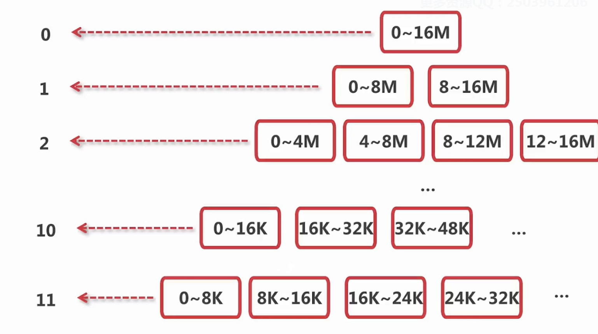
说明 0~16M是第一个节点 0，1，2，3代表数据深度
#### 2.9.3 初始化一个pooledbytebuf
io.netty.buffer.PoolChunk.initBuf(PooledByteBuf<T>, long, int)
```
    void initBuf(PooledByteBuf<T> buf, long handle, int reqCapacity) {
        int memoryMapIdx = memoryMapIdx(handle);
        int bitmapIdx = bitmapIdx(handle);
        if (bitmapIdx == 0) {
            byte val = value(memoryMapIdx);
            assert val == unusable : String.valueOf(val);
            buf.init(this, handle, runOffset(memoryMapIdx) + offset, reqCapacity, runLength(memoryMapIdx),
                     arena.parent.threadCache());
        } else {
            initBufWithSubpage(buf, handle, bitmapIdx, reqCapacity);
        }
    }
	
	io.netty.buffer.PooledUnsafeDirectByteBuf.init(PoolChunk<ByteBuffer>, long, int, int, int, PoolThreadCache)
	 @Override
    void init(PoolChunk<ByteBuffer> chunk, long handle, int offset, int length, int maxLength,
              PoolThreadCache cache) {
        super.init(chunk, handle, offset, length, maxLength, cache);
        initMemoryAddress();
    }
```	
### 2.10 subpage 级别的内存分配allocateTiny
io.netty.buffer.PoolArena.allocate(PoolThreadCache, PooledByteBuf<T>, int)
```
private void allocate(PoolThreadCache cache, PooledByteBuf<T> buf, final int reqCapacity) {
        final int normCapacity = normalizeCapacity(reqCapacity);
        if (isTinyOrSmall(normCapacity)) { // capacity < pageSize
            int tableIdx;
            PoolSubpage<T>[] table;
            boolean tiny = isTiny(normCapacity);
            if (tiny) { // < 512
                if (cache.allocateTiny(this, buf, reqCapacity, normCapacity)) {
                    // was able to allocate out of the cache so move on
                    return;
                }
				// normCapacity >>>> 4 除以16
                tableIdx = tinyIdx(normCapacity);
                table = tinySubpagePools;
            } else {
                if (cache.allocateSmall(this, buf, reqCapacity, normCapacity)) {
                    // was able to allocate out of the cache so move on
                    return;
                }
                tableIdx = smallIdx(normCapacity);
                table = smallSubpagePools;
            }
			// 拿到一个头结点
            final PoolSubpage<T> head = table[tableIdx];

            /**
             * Synchronize on the head. This is needed as {@link PoolChunk#allocateSubpage(int)} and
             * {@link PoolChunk#free(long)} may modify the doubly linked list as well.
             */
            synchronized (head) {
                final PoolSubpage<T> s = head.next;
				// 因为初始这里为空 所以返回一个false
                if (s != head) {
                    assert s.doNotDestroy && s.elemSize == normCapacity;
                    long handle = s.allocate();
                    assert handle >= 0;
                    s.chunk.initBufWithSubpage(buf, handle, reqCapacity);
                    incTinySmallAllocation(tiny);
                    return;
                }
            }
			
			 synchronized (this) {
				 // 最后进入这里
                allocateNormal(buf, reqCapacity, normCapacity);
            }

            incTinySmallAllocation(tiny);
            return;
        }
            
```
io.netty.buffer.PoolArena.allocateNormal(PooledByteBuf<T>, int, int)
```
 // Method must be called inside synchronized(this) { ... } block
    private void allocateNormal(PooledByteBuf<T> buf, int reqCapacity, int normCapacity) {
        if (q050.allocate(buf, reqCapacity, normCapacity) || q025.allocate(buf, reqCapacity, normCapacity) ||
            q000.allocate(buf, reqCapacity, normCapacity) || qInit.allocate(buf, reqCapacity, normCapacity) ||
            q075.allocate(buf, reqCapacity, normCapacity)) {
            return;
        }

        // Add a new chunk.
        PoolChunk<T> c = newChunk(pageSize, maxOrder, pageShifts, chunkSize);
		// 先进这里 拿到handle
        long handle = c.allocate(normCapacity);
        assert handle > 0;
		// 初始化
        c.initBuf(buf, handle, reqCapacity);
        qInit.add(c);
    }
```
io.netty.buffer.PoolChunk.allocate(int)
```
  long allocate(int normCapacity) {
        if ((normCapacity & subpageOverflowMask) != 0) { // >= pageSize
		//  run在这里是一串的意思
            return allocateRun(normCapacity);
        } else {
			// 走的这个分支
            return allocateSubpage(normCapacity);
        }
    }
```
io.netty.buffer.PoolChunk.allocateSubpage(int)
```
 private long allocateSubpage(int normCapacity) {
        // Obtain the head of the PoolSubPage pool that is owned by the PoolArena and synchronize on it.
        // This is need as we may add it back and so alter the linked-list structure.
        PoolSubpage<T> head = arena.findSubpagePoolHead(normCapacity);
        synchronized (head) {
            int d = maxOrder; // subpages are only be allocated from pages i.e., leaves
            int id = allocateNode(d);
            if (id < 0) {
                return id;
            }

            final PoolSubpage<T>[] subpages = this.subpages;
            final int pageSize = this.pageSize;

            freeBytes -= pageSize;

            int subpageIdx = subpageIdx(id);
            PoolSubpage<T> subpage = subpages[subpageIdx];
			// 初次进来是null
            if (subpage == null) {
				// 新建一个subpage
                subpage = new PoolSubpage<T>(head, this, id, runOffset(id), pageSize, normCapacity);
				// 并把这个下表赋值成subpage
                subpages[subpageIdx] = subpage;
            } else {
                subpage.init(head, normCapacity);
            }
			
			//  分配
            return subpage.allocate();
        }
    }
```
io.netty.buffer.PoolSubpage.PoolSubpage(PoolSubpage<T>, PoolChunk<T>, int, int, int, int)
```
 PoolSubpage(PoolSubpage<T> head, PoolChunk<T> chunk, int memoryMapIdx, int runOffset, int pageSize, int elemSize) {
        this.chunk = chunk;
        this.memoryMapIdx = memoryMapIdx;
        this.runOffset = runOffset;
        this.pageSize = pageSize;
        bitmap = new long[pageSize >>> 10]; // pageSize / 16 / 64
        init(head, elemSize);
    }


 void init(PoolSubpage<T> head, int elemSize) {
        doNotDestroy = true;
        this.elemSize = elemSize; // 此次分配的大小 每个节点的大小  
        if (elemSize != 0) {
            maxNumElems = numAvail = pageSize / elemSize;
            nextAvail = 0;
            bitmapLength = maxNumElems >>> 6;
            if ((maxNumElems & 63) != 0) {
                bitmapLength ++;
            }

            for (int i = 0; i < bitmapLength; i ++) {
                bitmap[i] = 0;
            }
        }
        addToPool(head);
    }

// 因为已经初始化了一个subpage 就可以加入这个双向链表中了
private void addToPool(PoolSubpage<T> head) {
        assert prev == null && next == null;
        prev = head;
        next = head.next;
        next.prev = this;
        head.next = this;
    }
```
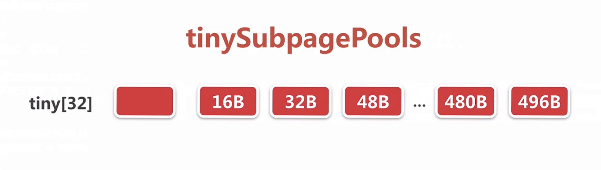
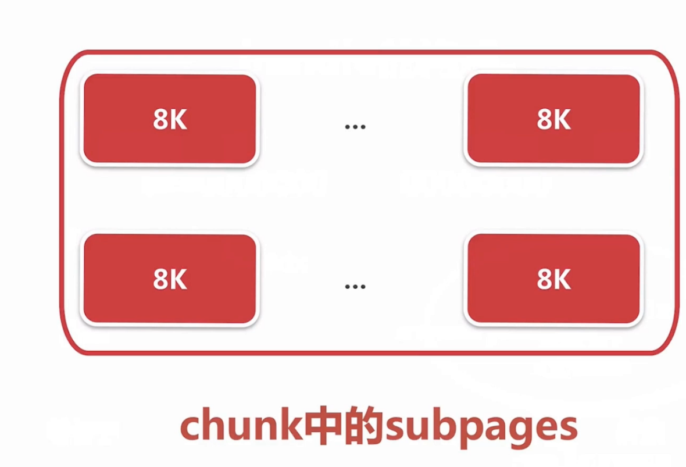
io.netty.buffer.PoolSubpage.allocate()
```
 long allocate() {
        if (elemSize == 0) {
            return toHandle(0);
        }

        if (numAvail == 0 || !doNotDestroy) {
            return -1;
        }

        final int bitmapIdx = getNextAvail();
        int q = bitmapIdx >>> 6;
        int r = bitmapIdx & 63;
        assert (bitmap[q] >>> r & 1) == 0;
        bitmap[q] |= 1L << r;

        if (-- numAvail == 0) {
            removeFromPool();
        }

        return toHandle(bitmapIdx);
    }
```
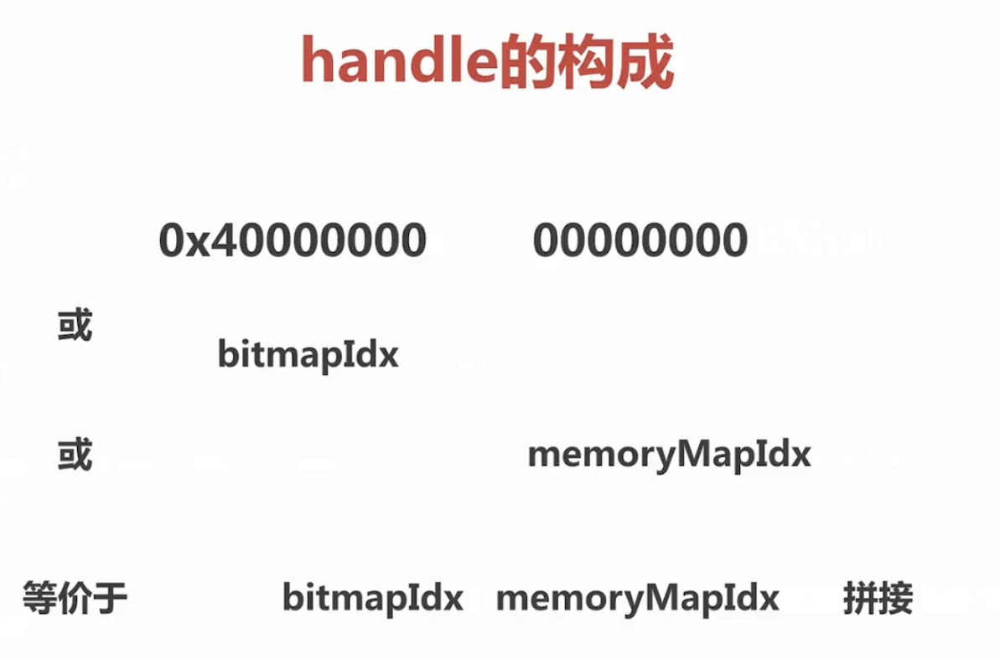
io.netty.buffer.PoolArena.allocateNormal(PooledByteBuf<T>, int, int)
```
 private void allocateNormal(PooledByteBuf<T> buf, int reqCapacity, int normCapacity) {
        if (q050.allocate(buf, reqCapacity, normCapacity) || q025.allocate(buf, reqCapacity, normCapacity) ||
            q000.allocate(buf, reqCapacity, normCapacity) || qInit.allocate(buf, reqCapacity, normCapacity) ||
            q075.allocate(buf, reqCapacity, normCapacity)) {
            return;
        }

        // Add a new chunk.
        PoolChunk<T> c = newChunk(pageSize, maxOrder, pageShifts, chunkSize);
        long handle = c.allocate(normCapacity);
        assert handle > 0;
        c.initBuf(buf, handle, reqCapacity);
        qInit.add(c);
    }
```
io.netty.buffer.PoolChunk.initBuf(PooledByteBuf<T>, long, int)
```
 void initBuf(PooledByteBuf<T> buf, long handle, int reqCapacity) {
        int memoryMapIdx = memoryMapIdx(handle);
        int bitmapIdx = bitmapIdx(handle);
        if (bitmapIdx == 0) {
            byte val = value(memoryMapIdx);
            assert val == unusable : String.valueOf(val);
            buf.init(this, handle, runOffset(memoryMapIdx) + offset, reqCapacity, runLength(memoryMapIdx),
                     arena.parent.threadCache());
        } else {
            initBufWithSubpage(buf, handle, bitmapIdx, reqCapacity);
        }
    }
	
	
	  private void initBufWithSubpage(PooledByteBuf<T> buf, long handle, int bitmapIdx, int reqCapacity) {
        assert bitmapIdx != 0;

        int memoryMapIdx = memoryMapIdx(handle);

        PoolSubpage<T> subpage = subpages[subpageIdx(memoryMapIdx)];
        assert subpage.doNotDestroy;
        assert reqCapacity <= subpage.elemSize;

        buf.init(
            this, handle,
            runOffset(memoryMapIdx) + (bitmapIdx & 0x3FFFFFFF) * subpage.elemSize + offset,
                reqCapacity, subpage.elemSize, arena.parent.threadCache());
    }
```

#### 2.10.1 定位于一个subpage对象
#### 2.10.2 初始化一个subpage
#### 3.10.3 初始化一个pooledbytebuf 

###  2.11 bytebuf回收
io.netty.buffer.AbstractReferenceCountedByteBuf.release0(int)
```
private boolean release0(int decrement) {
        int oldRef = refCntUpdater.getAndAdd(this, -decrement);
		// 你引用的一个值等于减少的一个值，也就是bytebuf没有被引用的了
        if (oldRef == decrement) {
            deallocate();
            return true;
        } else if (oldRef < decrement || oldRef - decrement > oldRef) {
            // Ensure we don't over-release, and avoid underflow.
            refCntUpdater.getAndAdd(this, decrement);
            throw new IllegalReferenceCountException(oldRef, -decrement);
        }
        return false;
    }
```
io.netty.buffer.PooledByteBuf.deallocate()
```
  @Override
    protected final void deallocate() {
        if (handle >= 0) {
            final long handle = this.handle;
			// handle为-1 不指向任何一个内存
            this.handle = -1;
            memory = null;
            tmpNioBuf = null;
			//2.11.1 连续的内存区段加到缓存
			// 2.11.2 标记连续的内存区段为 未使用
			// 以上两个取一个
            chunk.arena.free(chunk, handle, maxLength, cache);
            chunk = null;
			//  2.11.3 byteBuf加入对象池
            recycle();
        }
    }
```
#### 2.11.1 连续的内存区段加到缓存
io.netty.buffer.PoolArena.free(PoolChunk<T>, long, int, PoolThreadCache)
```

    void free(PoolChunk<T> chunk, long handle, int normCapacity, PoolThreadCache cache) {
        if (chunk.unpooled) {
            int size = chunk.chunkSize();
            destroyChunk(chunk);
            activeBytesHuge.add(-size);
            deallocationsHuge.increment();
        } else {
					// 因为是pooled 
            SizeClass sizeClass = sizeClass(normCapacity);
						// 尝试加到一个缓存里面
            if (cache != null && cache.add(this, chunk, handle, normCapacity, sizeClass)) {
                // cached so not free it.
                return;
            }

            freeChunk(chunk, handle, sizeClass);
        }
    }
```
io.netty.buffer.PoolThreadCache.add(PoolArena<?>, PoolChunk, long, int, SizeClass)
```
  @SuppressWarnings({ "unchecked", "rawtypes" })
    boolean add(PoolArena<?> area, PoolChunk chunk, long handle, int normCapacity, SizeClass sizeClass) {
        MemoryRegionCache<?> cache = cache(area, normCapacity, sizeClass);
        if (cache == null) {
            return false;
        }
				// 封装成一个实体加入queue里面
        return cache.add(chunk, handle);
    }
		
		
		private MemoryRegionCache<?> cache(PoolArena<?> area, int normCapacity, SizeClass sizeClass) {
        switch (sizeClass) {
				// 对应某种类型
        case Normal:
            return cacheForNormal(area, normCapacity);
        case Small:
            return cacheForSmall(area, normCapacity);
        case Tiny:
            return cacheForTiny(area, normCapacity);
        default:
            throw new Error();
        }
    }
		
		以tiny为例
		
		private MemoryRegionCache<?> cacheForTiny(PoolArena<?> area, int normCapacity) {
        int idx = PoolArena.tinyIdx(normCapacity);
        if (area.isDirect()) {
            return cache(tinySubPageDirectCaches, idx);
        }
        return cache(tinySubPageHeapCaches, idx);
    }
		
		private static <T> MemoryRegionCache<T> cache(MemoryRegionCache<T>[] cache, int idx) {
        if (cache == null || idx > cache.length - 1) {
            return null;
        }
        return cache[idx];
    }
```
返回看上面 把handle和chunk封装成一个实体加入queue里面
 io.netty.buffer.PoolThreadCache.MemoryRegionCache.add(PoolChunk<T>, long)
```
@SuppressWarnings("unchecked")
        public final boolean add(PoolChunk<T> chunk, long handle) {
            Entry<T> entry = newEntry(chunk, handle);
            boolean queued = queue.offer(entry);
            if (!queued) {
                // If it was not possible to cache the chunk, immediately recycle the entry
                entry.recycle();
            }

            return queued;
        }
```
#### 2.11.2 标记连续的内存区段为 未使用
如果没有加入queue io.netty.buffer.PoolArena.freeChunk(PoolChunk<T>, long, SizeClass)
```
void freeChunk(PoolChunk<T> chunk, long handle, SizeClass sizeClass) {
        final boolean destroyChunk;
        synchronized (this) {
            switch (sizeClass) {
            case Normal:
                ++deallocationsNormal;
                break;
            case Small:
                ++deallocationsSmall;
                break;
            case Tiny:
                ++deallocationsTiny;
                break;
            default:
                throw new Error();
            }
            destroyChunk = !chunk.parent.free(chunk, handle);
        }
        if (destroyChunk) {
            // destroyChunk not need to be called while holding the synchronized lock.
            destroyChunk(chunk);
        }
    }
		
		
		
```
io.netty.buffer.PoolChunkList.free(PoolChunk<T>, long)
```
boolean free(PoolChunk<T> chunk, long handle) {
		// chunk释放掉一段连续内存
        chunk.free(handle);
        if (chunk.usage() < minUsage) {
            remove(chunk);
            // Move the PoolChunk down the PoolChunkList linked-list.
            return move0(chunk);
        }
        return true;
    }
```
这段逻辑是区分是page还是subpage
io.netty.buffer.PoolChunk.free(long)
```
void free(long handle) {
        int memoryMapIdx = memoryMapIdx(handle);
        int bitmapIdx = bitmapIdx(handle);

        if (bitmapIdx != 0) { // free a subpage
            PoolSubpage<T> subpage = subpages[subpageIdx(memoryMapIdx)];
            assert subpage != null && subpage.doNotDestroy;

            // Obtain the head of the PoolSubPage pool that is owned by the PoolArena and synchronize on it.
            // This is need as we may add it back and so alter the linked-list structure.
            PoolSubpage<T> head = arena.findSubpagePoolHead(subpage.elemSize);
            synchronized (head) {
                if (subpage.free(head, bitmapIdx & 0x3FFFFFFF)) {
                    return;
                }
            }
        }
        freeBytes += runLength(memoryMapIdx);
        setValue(memoryMapIdx, depth(memoryMapIdx));
        updateParentsFree(memoryMapIdx);
    }
```
#### 2.11.3 byteBuf加入对象池
io.netty.util.Recycler.DefaultHandle.recycle(Object)
```

```

总结：
	1。bytebuf 分类 和api
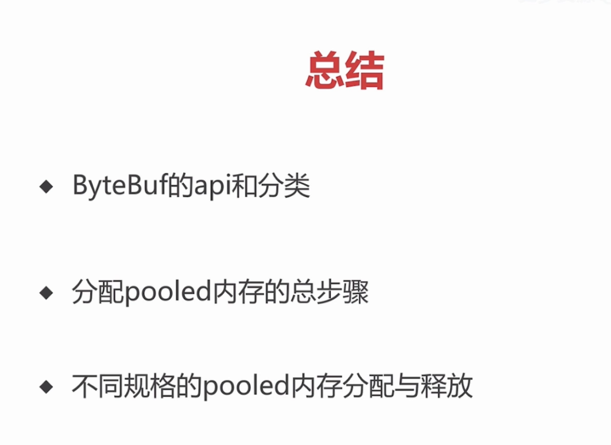