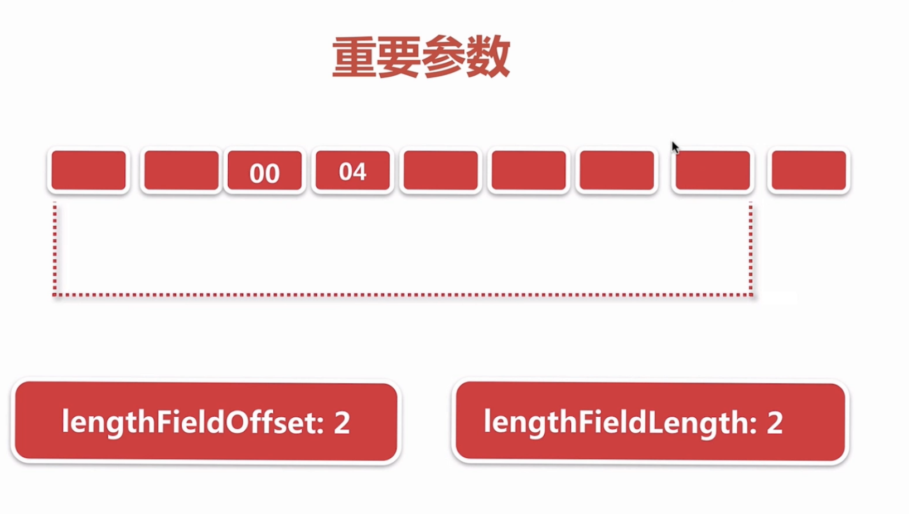

## 解码

### 基本理解
把2进制的数据流解析成我们自定义的数据包

### 1 解码器基类 抽象解码器ByteToMessageDecoder
#### 1.1 累加字节流
io.netty.handler.codec.ByteToMessageDecoder.channelRead(ChannelHandlerContext, Object)
```
 @Override
    public void channelRead(ChannelHandlerContext ctx, Object msg) throws Exception {
		// 收到消息 是bytebuf类型就进行解码器处理
        if (msg instanceof ByteBuf) {
			// 累加器
			// 相当于一个list
            CodecOutputList out = CodecOutputList.newInstance();
            try {
                ByteBuf data = (ByteBuf) msg;
				// 第一次读进来的
                first = cumulation == null;
                if (first) {
                    cumulation = data;
                } else {
					// 1.1不是第一次 就 让当前读到的数据和 累加的数据进行累加
                    cumulation = cumulator.cumulate(ctx.alloc(), cumulation, data);
                }
				// 1.2调用子类去解析 把out 把解析到的数据放到list中向下传播
                callDecode(ctx, cumulation, out);
            } catch (DecoderException e) {
                throw e;
            } catch (Exception e) {
                throw new DecoderException(e);
            } finally {
                if (cumulation != null && !cumulation.isReadable()) {
                    numReads = 0;
                    cumulation.release();
                    cumulation = null;
                } else if (++ numReads >= discardAfterReads) {
                    // We did enough reads already try to discard some bytes so we not risk to see a OOME.
                    // See https://github.com/netty/netty/issues/4275
                    numReads = 0;
                    discardSomeReadBytes();
                }
				// 1.3 相下进行传播
                int size = out.size();
                decodeWasNull = !out.insertSinceRecycled();
                fireChannelRead(ctx, out, size);
                out.recycle();
            }
        } else {
			// 不是就向下传播
            ctx.fireChannelRead(msg);
        }
```
看一下 cumulator
```
 */
    public static final Cumulator MERGE_CUMULATOR = new Cumulator() {
        @Override
        public ByteBuf cumulate(ByteBufAllocator alloc, ByteBuf cumulation, ByteBuf in) {
            final ByteBuf buffer;
			// 判断 当前的写指针 向后偏移读到的数据长度，如果写不下了 就扩容 
            if (cumulation.writerIndex() > cumulation.maxCapacity() - in.readableBytes()
                    || cumulation.refCnt() > 1 || cumulation.isReadOnly()) {
                // Expand cumulation (by replace it) when either there is not more room in the buffer
                // or if the refCnt is greater then 1 which may happen when the user use slice().retain() or
                // duplicate().retain() or if its read-only.
                //
                // See:
                // - https://github.com/netty/netty/issues/2327
                // - https://github.com/netty/netty/issues/1764
                buffer = expandCumulation(alloc, cumulation, in.readableBytes());
            } else {
				//  如果 不需要扩容，buffer赋值成cumulation
                buffer = cumulation;
            }
			// 写到累加
            buffer.writeBytes(in);
			// 将写进来了的数据进行释放
            in.release();
            return buffer;
        }
    };
```
#### 1.2 调用子类的decode方法进行解析
```
protected void callDecode(ChannelHandlerContext ctx, ByteBuf in, List<Object> out) {
        try {
            while (in.isReadable()) {
				// 判断是否有对象 
                int outSize = out.size();

                if (outSize > 0) {
					// 有对象就向下传播 当前list清空
                    fireChannelRead(ctx, out, outSize);
                    out.clear();

                    // Check if this handler was removed before continuing with decoding.
                    // If it was removed, it is not safe to continue to operate on the buffer.
                    //
                    // See:
                    // - https://github.com/netty/netty/issues/4635
                    if (ctx.isRemoved()) {
                        break;
                    }
                    outSize = 0;
                }
				// 记录以前的index
                int oldInputLength = in.readableBytes();
				// 实际子类解析
                decodeRemovalReentryProtection(ctx, in, out);

                // Check if this handler was removed before continuing the loop.
                // If it was removed, it is not safe to continue to operate on the buffer.
                //
                // See https://github.com/netty/netty/issues/1664
                if (ctx.isRemoved()) {
                    break;
                }
				// 相等就说明 解析器 没有解析任何数据
                if (outSize == out.size()) {
					// 并没有从in中读取到数据  ，说明当前的累加器 并不足以成一个完整的数据包
                    if (oldInputLength == in.readableBytes()) {
                        break;
                    } else {
						// 没有解析到数据 我已经从in读取了数据 只是还没有解析到对象
                        continue;
                    }
                }
				//  根据上个判断说明 减去了数据，但现在说明没有从累加器读取数据 爆出异常
                if (oldInputLength == in.readableBytes()) {
                    throw new DecoderException(
                            StringUtil.simpleClassName(getClass()) +
                                    ".decode() did not read anything but decoded a message.");
                }

                if (isSingleDecode()) {
                    break;
                }
            }
        } catch (DecoderException e) {
            throw e;
        } catch (Exception cause) {
            throw new DecoderException(cause);
        }
    }
	
	
	  final void decodeRemovalReentryProtection(ChannelHandlerContext ctx, ByteBuf in, List<Object> out)
            throws Exception {
        decodeState = STATE_CALLING_CHILD_DECODE;
        try {
			// 实际解析方法
            decode(ctx, in, out);
        } finally {
            boolean removePending = decodeState == STATE_HANDLER_REMOVED_PENDING;
            decodeState = STATE_INIT;
            if (removePending) {
                handlerRemoved(ctx);
            }
        }
    }
```
#### 1.3 解析到的bytebuf向下传播
### 2 netty常见的解码器分析
#### 2.1 基于固定长度的解码
io.netty.handler.codec.FixedLengthFrameDecoder
只有唯一一个成员变量 frameLength
```
/**
 * A decoder that splits the received {@link ByteBuf}s by the fixed number
 * of bytes. For example, if you received the following four fragmented packets:
 * <pre>
 * +---+----+------+----+
 * | A | BC | DEFG | HI |
 * +---+----+------+----+
 * </pre>
 * A {@link FixedLengthFrameDecoder}{@code (3)} will decode them into the
 * following three packets with the fixed length:
 * <pre>
 * +-----+-----+-----+
 * | ABC | DEF | GHI |
 * +-----+-----+-----+
 * </pre>
 */
public class FixedLengthFrameDecoder extends ByteToMessageDecoder {

    private final int frameLength;

    /**

	/**
	 * in  字节累加器 
	 * out 存放对象的容器
	 * 
	 */
  @Override
    protected final void decode(ChannelHandlerContext ctx, ByteBuf in, List<Object> out) throws Exception {
        Object decoded = decode(ctx, in);
        if (decoded != null) {
			// 如果解析到了 就给out 让父类进行向下传播
            out.add(decoded);
        }
    }
	
	
	 /**
     * Create a frame out of the {@link ByteBuf} and return it.
     *
     * @param   ctx             the {@link ChannelHandlerContext} which this {@link ByteToMessageDecoder} belongs to
     * @param   in              the {@link ByteBuf} from which to read data
     * @return  frame           the {@link ByteBuf} which represent the frame or {@code null} if no frame could
     *                          be created.
     */
	// 这里返回null 其实对应父类的
	/**
	 
	 *// 解析
	 *  decodeRemovalReentryProtection(ctx, in, out);

                // Check if this handler was removed before continuing the loop.
                // If it was removed, it is not safe to continue to operate on the buffer.
                //
                // See https://github.com/netty/netty/issues/1664
                if (ctx.isRemoved()) {
                    break;
                }
				// 如果存放对象的容器没有改变，说明没有读取数据，所以就直接break；直接跳出，等待下次
                if (outSize == out.size()) {
                    if (oldInputLength == in.readableBytes()) {
                        break;
                    } else {
                        continue;
                    }
                }
	 */
    protected Object decode(
            @SuppressWarnings("UnusedParameters") ChannelHandlerContext ctx, ByteBuf in) throws Exception {
		// 如果不够那么长就返回null
        if (in.readableBytes() < frameLength) {
            return null;
        } else {
			// 从当前的累加器截取这么长的一段数据
            return in.readRetainedSlice(frameLength);
        }
    }
```
#### 2.2 行解码
以"\r\n","\n"为结尾
io.netty.handler.codec.LineBasedFrameDecoder
```
/**
 * A decoder that splits the received {@link ByteBuf}s on line endings.
 * <p>
 * Both {@code "\n"} and {@code "\r\n"} are handled.
 * For a more general delimiter-based decoder, see {@link DelimiterBasedFrameDecoder}.
 */
public class LineBasedFrameDecoder extends ByteToMessageDecoder {

    /** Maximum length of a frame we're willing to decode.  */
	// 解码的最大长度，如果大于这个长度有可能就会进入丢弃模式
    private final int maxLength;
    /** Whether or not to throw an exception as soon as we exceed maxLength. */
	// 如果为true，超出这个异常就立即抛出异常  false 就晚点进行抛出
    private final boolean failFast;
	// 最终解析的数据包带不带这个换行符  ；true就不带，false 就带
    private final boolean stripDelimiter;

    /** True if we're discarding input because we're already over maxLength.  */
	// discarding为true 就是属于丢弃模式
    private boolean discarding;
	// 解码到现在 已经丢弃了多少字节
    private int discardedBytes;

    /** Last scan position. */
    private int offset;
	
	
	。。。。。。。。。。
	  @Override
    protected final void decode(ChannelHandlerContext ctx, ByteBuf in, List<Object> out) throws Exception {
        Object decoded = decode(ctx, in);
        if (decoded != null) {
            out.add(decoded);
        }
    }
	
	
	
	 /**
     * Create a frame out of the {@link ByteBuf} and return it.
     *
     * @param   ctx             the {@link ChannelHandlerContext} which this {@link ByteToMessageDecoder} belongs to
     * @param   buffer          the {@link ByteBuf} from which to read data
     * @return  frame           the {@link ByteBuf} which represent the frame or {@code null} if no frame could
     *                          be created.
     */
    protected Object decode(ChannelHandlerContext ctx, ByteBuf buffer) throws Exception {
		// 找换行符
        final int eol = findEndOfLine(buffer);
		// 首次 discarding = false 所以进入这个方法
        if (!discarding) {
            if (eol >= 0) {
                final ByteBuf frame;
				// 计算换行符到可读字节的长度
                final int length = eol - buffer.readerIndex();
				// 分隔符的长度
                final int delimLength = buffer.getByte(eol) == '\r'? 2 : 1;
				
				// 如果该行长度大于设置的最大长度
                if (length > maxLength) {
					// 可读位置 指向换行符后的第一个可读字节
                    buffer.readerIndex(eol + delimLength);
                    fail(ctx, length);
                    return null;
                }
				// 是否把分隔符算在数据包里面  true 就不算
                if (stripDelimiter) {
                    frame = buffer.readRetainedSlice(length);
					// 跳过分隔符
                    buffer.skipBytes(delimLength);
                } else {
                    frame = buffer.readRetainedSlice(length + delimLength);
                }

                return frame;
            } else {
				// 没找到换行符
                final int length = buffer.readableBytes();
				// 判断长度是否大于了最大解析长度，大于就抛异常 进行下一段的解析 。没超就直接返回null
                if (length > maxLength) {
					// 抛弃的长度
                    discardedBytes = length;
					// 直接把读指针标记到写指针
                    buffer.readerIndex(buffer.writerIndex());
					// 标记当前进入丢弃模式
                    discarding = true;
                    offset = 0;
                    if (failFast) {
						// 立即传播一个异常
                        fail(ctx, "over " + discardedBytes);
                    }
                }
                return null;
            }
        } else {
			// 丢弃模式 找到换行符
            if (eol >= 0) {
				// 判断丢弃多少字节
                final int length = discardedBytes + eol - buffer.readerIndex();
				// 换行符长度
                final int delimLength = buffer.getByte(eol) == '\r'? 2 : 1;
				// 移动读指针 
                buffer.readerIndex(eol + delimLength);
				// 重置丢弃长度和非丢弃模式
                discardedBytes = 0;
                discarding = false;
				//判断是否是立即传播异常
                if (!failFast) {
                    fail(ctx, length);
                }
            } else {
				// 没读到换行度 继续移动指针 和累加丢弃长度 
                discardedBytes += buffer.readableBytes();
                buffer.readerIndex(buffer.writerIndex());
            }
            return null;
        }
    } 
	
	
	
	 /**
     * Returns the index in the buffer of the end of line found.
     * Returns -1 if no end of line was found in the buffer.
     */
    private int findEndOfLine(final ByteBuf buffer) {
        int totalLength = buffer.readableBytes();
		//  ByteProcessor.FIND_LF =》  static final byte LINE_FEED = (byte) '\n';
		// 找'\n' 如果'\n'前面是'\r'那么坐标又指向'\r'
        int i = buffer.forEachByte(buffer.readerIndex() + offset, totalLength - offset, ByteProcessor.FIND_LF);
        if (i >= 0) {
            offset = 0;
            if (i > 0 && buffer.getByte(i - 1) == '\r') {
                i--;
            }
        } else {
            offset = totalLength;
        }
        return i;
    }
```


#### 2.3 基于长度域解码器参数分析

io.netty.handler.codec.LengthFieldBasedFrameDecoder
```
/**

 *
 * <h3>2 bytes length field at offset 0, do not strip header</h3>

 * <pre>
 * <b>lengthFieldOffset</b>   = <b>0</b>
 * <b>lengthFieldLength</b>   = <b>2</b>
 * lengthAdjustment    = 0
 * initialBytesToStrip = 0 (= do not strip header)
 *
 * BEFORE DECODE (14 bytes)         AFTER DECODE (14 bytes)
 * +--------+----------------+      +--------+----------------+
 * | Length | Actual Content |----->| Length | Actual Content |
 * | 0x000C | "HELLO, WORLD" |      | 0x000C | "HELLO, WORLD" |
 * +--------+----------------+      +--------+----------------+
 * </pre>
 *
 * <h3>2 bytes length field at offset 0, strip header</h3>
 *
 * <pre>
 * lengthFieldOffset   = 0
 * lengthFieldLength   = 2
 * lengthAdjustment    = 0
 * <b>initialBytesToStrip</b> = <b>2</b> (= the length of the Length field)
 *
 * BEFORE DECODE (14 bytes)         AFTER DECODE (12 bytes)
 * +--------+----------------+      +----------------+
 * | Length | Actual Content |----->| Actual Content |
 * | 0x000C | "HELLO, WORLD" |      | "HELLO, WORLD" |
 * +--------+----------------+      +----------------+
 * </pre>
 *
 * <h3>2 bytes length field at offset 0, do not strip header, the length field
 *     represents the length of the whole message</h3>
 *
 * <pre>
 * lengthFieldOffset   =  0
 * lengthFieldLength   =  2
 * <b>lengthAdjustment</b>    = <b>-2</b> (= the length of the Length field)
 * initialBytesToStrip =  0
 *
 * BEFORE DECODE (14 bytes)         AFTER DECODE (14 bytes)
 * +--------+----------------+      +--------+----------------+
 * | Length | Actual Content |----->| Length | Actual Content |
 * | 0x000E | "HELLO, WORLD" |      | 0x000E | "HELLO, WORLD" |
 * +--------+----------------+      +--------+----------------+
 * </pre>
 *
 * <h3>3 bytes length field at the end of 5 bytes header, do not strip header</h3>

 * <pre>
 * <b>lengthFieldOffset</b>   = <b>2</b> (= the length of Header 1)
 * <b>lengthFieldLength</b>   = <b>3</b>
 * lengthAdjustment    = 0
 * initialBytesToStrip = 0
 *
 * BEFORE DECODE (17 bytes)                      AFTER DECODE (17 bytes)
 * +----------+----------+----------------+      +----------+----------+----------------+
 * | Header 1 |  Length  | Actual Content |----->| Header 1 |  Length  | Actual Content |
 * |  0xCAFE  | 0x00000C | "HELLO, WORLD" |      |  0xCAFE  | 0x00000C | "HELLO, WORLD" |
 * +----------+----------+----------------+      +----------+----------+----------------+
 * </pre>
 *
 * <h3>3 bytes length field at the beginning of 5 bytes header, do not strip header</h3>
 *
 * <pre>
 * lengthFieldOffset   = 0
 * lengthFieldLength   = 3
 * <b>lengthAdjustment</b>    = <b>2</b> (= the length of Header 1)
 * initialBytesToStrip = 0
 *
 * BEFORE DECODE (17 bytes)                      AFTER DECODE (17 bytes)
 * +----------+----------+----------------+      +----------+----------+----------------+
 * |  Length  | Header 1 | Actual Content |----->|  Length  | Header 1 | Actual Content |
 * | 0x00000C |  0xCAFE  | "HELLO, WORLD" |      | 0x00000C |  0xCAFE  | "HELLO, WORLD" |
 * +----------+----------+----------------+      +----------+----------+----------------+
 * </pre>
 *
 * <h3>2 bytes length field at offset 1 in the middle of 4 bytes header,
 *     strip the first header field and the length field</h3>
 *
 * <pre>
 * lengthFieldOffset   = 1 (= the length of HDR1)
 * lengthFieldLength   = 2
 * <b>lengthAdjustment</b>    = <b>1</b> (= the length of HDR2)
 * <b>initialBytesToStrip</b> = <b>3</b> (= the length of HDR1 + LEN)
 *
 * BEFORE DECODE (16 bytes)                       AFTER DECODE (13 bytes)
 * +------+--------+------+----------------+      +------+----------------+
 * | HDR1 | Length | HDR2 | Actual Content |----->| HDR2 | Actual Content |
 * | 0xCA | 0x000C | 0xFE | "HELLO, WORLD" |      | 0xFE | "HELLO, WORLD" |
 * +------+--------+------+----------------+      +------+----------------+
 * </pre>
 *
 * <h3>2 bytes length field at offset 1 in the middle of 4 bytes header,
 *     strip the first header field and the length field, the length field
 *     represents the length of the whole message</h3>
 *
 * <pre>
 * lengthFieldOffset   =  1
 * lengthFieldLength   =  2
 * <b>lengthAdjustment</b>    = <b>-3</b> (= the length of HDR1 + LEN, negative)
 * <b>initialBytesToStrip</b> = <b> 3</b>
 *
 * BEFORE DECODE (16 bytes)                       AFTER DECODE (13 bytes)
 * +------+--------+------+----------------+      +------+----------------+
 * | HDR1 | Length | HDR2 | Actual Content |----->| HDR2 | Actual Content |
 * | 0xCA | 0x0010 | 0xFE | "HELLO, WORLD" |      | 0xFE | "HELLO, WORLD" |
 * +------+--------+------+----------------+      +------+----------------+
 * </pre>
 * @see LengthFieldPrepender
 */
public class LengthFieldBasedFrameDecoder extends ByteToMessageDecoder {

    private final ByteOrder byteOrder;
    private final int maxFrameLength;
	// 长度域在数据流二进制的偏移量  第几个字节开始表示的是长度
    private final int lengthFieldOffset;
	// 表示长度的长度
    private final int lengthFieldLength;
    private final int lengthFieldEndOffset;
	// 数据包调节长度 从length鱼后 加上这个开始数 表示真实数据包的长度  
    private final int lengthAdjustment;
	// 从头跳过的字节数
    private final int initialBytesToStrip;
    private final boolean failFast;
	// 是否丢弃模式
    private boolean discardingTooLongFrame;
	// 丢弃长度有
    private long tooLongFrameLength;
	// 
    private long bytesToDiscard;

```
#### 2.4 基于长度域解码器 解码
```
 protected Object decode(ChannelHandlerContext ctx, ByteBuf in) throws Exception {
        if (discardingTooLongFrame) {
            discardingTooLongFrame(in);
        }

        if (in.readableBytes() < lengthFieldEndOffset) {
            return null;
        }

        int actualLengthFieldOffset = in.readerIndex() + lengthFieldOffset;
        long frameLength = getUnadjustedFrameLength(in, actualLengthFieldOffset, lengthFieldLength, byteOrder);

        if (frameLength < 0) {
            failOnNegativeLengthField(in, frameLength, lengthFieldEndOffset);
        }

        frameLength += lengthAdjustment + lengthFieldEndOffset;

        if (frameLength < lengthFieldEndOffset) {
            failOnFrameLengthLessThanLengthFieldEndOffset(in, frameLength, lengthFieldEndOffset);
        }

        if (frameLength > maxFrameLength) {
            exceededFrameLength(in, frameLength);
            return null;
        }

        // never overflows because it's less than maxFrameLength
        int frameLengthInt = (int) frameLength;
        if (in.readableBytes() < frameLengthInt) {
            return null;
        }

        if (initialBytesToStrip > frameLengthInt) {
            failOnFrameLengthLessThanInitialBytesToStrip(in, frameLength, initialBytesToStrip);
        }
        in.skipBytes(initialBytesToStrip);

        // extract frame
        int readerIndex = in.readerIndex();
        int actualFrameLength = frameLengthInt - initialBytesToStrip;
        ByteBuf frame = extractFrame(ctx, in, readerIndex, actualFrameLength);
        in.readerIndex(readerIndex + actualFrameLength);
        return frame;
    }
```
##### 2.4.1 计算需要抽取数据包长度 

2位head：
2位长度域： 长度包括head和长度域长度

数据包是跳过 head和长度长度域  
```

	if (in.readableBytes() < lengthFieldEndOffset) {  //  lengthFieldEndOffset = lengthFieldOffset + lengthFieldLength;
           return null;
    }
	// 绝对读取偏移量  
	int actualLengthFieldOffset = in.readerIndex() + lengthFieldOffset;
	
	long frameLength = getUnadjustedFrameLength(in, actualLengthFieldOffset, lengthFieldLength, byteOrder);
	// 长度域小于0  抛出异常
	 if (frameLength < 0) {
            failOnNegativeLengthField(in, frameLength, lengthFieldEndOffset);
        }
	// 完整长度 把有效字节流全部算进去  实际需要抽取的数据包长度
	frameLength += lengthAdjustment + lengthFieldEndOffset;
	// 数据包长度域长度 小于偏移长度 
	if (frameLength < lengthFieldEndOffset) {
		failOnFrameLengthLessThanLengthFieldEndOffset(in, frameLength, lengthFieldEndOffset);
	}
	
	
	。。。。。。。。。。。
	// never overflows because it's less than maxFrameLength
	// 数据域长度小于 读取的长度  说明数据数据不全 等待下次读取
	int frameLengthInt = (int) frameLength;
	if (in.readableBytes() < frameLengthInt) {
		return null;
	}
	

```
```
  protected long getUnadjustedFrameLength(ByteBuf buf, int offset, int length, ByteOrder order) {
        buf = buf.order(order);
        long frameLength;
        switch (length) {
        case 1:
            frameLength = buf.getUnsignedByte(offset);
            break;
        case 2:
            frameLength = buf.getUnsignedShort(offset);
            break;
        case 3:
            frameLength = buf.getUnsignedMedium(offset);
            break;
        case 4:
            frameLength = buf.getUnsignedInt(offset);
            break;
        case 8:
            frameLength = buf.getLong(offset);
            break;
        default:
            throw new DecoderException(
                    "unsupported lengthFieldLength: " + lengthFieldLength + " (expected: 1, 2, 3, 4, or 8)");
        }
        return frameLength;
    }
```
##### 2.4.2 跳过字节处理
```
// 如果跳过的长度 大于 数据域长度 抛出异常
if (initialBytesToStrip > frameLengthInt) {
            failOnFrameLengthLessThanInitialBytesToStrip(in, frameLength, initialBytesToStrip);
        }
		// 跳过一段 	
		in.skipBytes(initialBytesToStrip);
		// 找到数据度的开始读取
		int readerIndex = in.readerIndex();
		// 实际数据域长度
		int actualFrameLength = frameLengthInt - initialBytesToStrip;
        ByteBuf frame = extractFrame(ctx, in, readerIndex, actualFrameLength);
        in.readerIndex(readerIndex + actualFrameLength);
        return frame;

```
##### 2.4.3 丢弃模式下处理
```
	 // 丢弃模式
	if (discardingTooLongFrame) {
            discardingTooLongFrame(in);
        }
		
	
	// 设置丢弃模式	
	if (frameLength > maxFrameLength) {
            exceededFrameLength(in, frameLength);
            return null;
        }

```
丢弃模式
```
  private void discardingTooLongFrame(ByteBuf in) {
        long bytesToDiscard = this.bytesToDiscard;
        int localBytesToDiscard = (int) Math.min(bytesToDiscard, in.readableBytes());
        in.skipBytes(localBytesToDiscard);
        bytesToDiscard -= localBytesToDiscard;
        this.bytesToDiscard = bytesToDiscard;

        failIfNecessary(false);
    }
```
设置丢弃模式
```
 private void exceededFrameLength(ByteBuf in, long frameLength) {
        long discard = frameLength - in.readableBytes();
        tooLongFrameLength = frameLength;

        if (discard < 0) {
            // buffer contains more bytes then the frameLength so we can discard all now
            in.skipBytes((int) frameLength);
        } else {
            // Enter the discard mode and discard everything received so far.
            discardingTooLongFrame = true;
            bytesToDiscard = discard;
            in.skipBytes(in.readableBytes());
        }
		//  判断是否还处于丢弃模式
        failIfNecessary(true);
    }
	
	
	 private void failIfNecessary(boolean firstDetectionOfTooLongFrame) {
        if (bytesToDiscard == 0) {
            // Reset to the initial state and tell the handlers that
            // the frame was too large.
            long tooLongFrameLength = this.tooLongFrameLength;
            this.tooLongFrameLength = 0;
            discardingTooLongFrame = false;
            if (!failFast || firstDetectionOfTooLongFrame) {
                fail(tooLongFrameLength);
            }
        } else {
            // Keep discarding and notify handlers if necessary.
            if (failFast && firstDetectionOfTooLongFrame) {
                fail(tooLongFrameLength);
            }
        }
    }
```
#### 总结