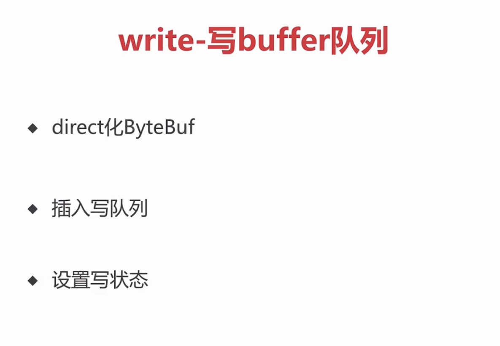

问题：如何把对象编程字节流，最终写到soket底层
# 编码
## writeAndFlush

```
public class BizHandler extends ChannelInboundHandlerAdapter {
    @Override
    public void channelRead(ChannelHandlerContext ctx, Object msg) throws Exception {
        //...

        User user = new User(19, "zhangsan");

        ctx.channel().writeAndFlush(user);
    }
}
```
io.netty.channel.DefaultChannelPipeline.writeAndFlush(Object)
//c从tail开始传播
```
@Override
    public final ChannelFuture writeAndFlush(Object msg) {
        return tail.writeAndFlush(msg);
    }
```
io.netty.channel.AbstractChannelHandlerContext.writeAndFlush(Object, ChannelPromise)
```
 @Override
    public ChannelFuture writeAndFlush(Object msg, ChannelPromise promise) {
        if (msg == null) {
            throw new NullPointerException("msg");
        }

        if (isNotValidPromise(promise, true)) {
            ReferenceCountUtil.release(msg);
            // cancelled
            return promise;
        }
		//  true是带刷新的
        write(msg, true, promise);

        return promise;
    }
	
	。。。
	
	    private void write(Object msg, boolean flush, ChannelPromise promise) {
        AbstractChannelHandlerContext next = findContextOutbound();
        final Object m = pipeline.touch(msg, next);
        EventExecutor executor = next.executor();
		// 是注册过的线程直接执行
        if (executor.inEventLoop()) {
            if (flush) {
				// 跟进这个方法
                next.invokeWriteAndFlush(m, promise);
            } else {
                next.invokeWrite(m, promise);
            }
        } else {
			// 不是就封装成一个任务再进行执行
            AbstractWriteTask task;
            if (flush) {
                task = WriteAndFlushTask.newInstance(next, m, promise);
            }  else {
                task = WriteTask.newInstance(next, m, promise);
            }
            safeExecute(executor, task, promise, m);
        }
    }
	
	
	。。。。。。。。。。。。
	private void invokeWriteAndFlush(Object msg, ChannelPromise promise) {
        if (invokeHandler()) {
			// 只做了两个工作  write0 和flush0
            invokeWrite0(msg, promise);
            invokeFlush0();
        } else {
            writeAndFlush(msg, promise);
        }
    }
	
	
	   private void invokeWrite0(Object msg, ChannelPromise promise) {
        try {
            ((ChannelOutboundHandler) handler()).write(this, msg, promise);
        } catch (Throwable t) {
            notifyOutboundHandlerException(t, promise);
        }
    }
	
	
	    private void invokeFlush0() {
        try {
            ((ChannelOutboundHandler) handler()).flush(this);
        } catch (Throwable t) {
            notifyHandlerException(t);
        }
    }
```

从tail开始往前传播（outBound事件）.重点看head的flush方法如何调用底层进行传输的
## 3. 编码器MessageToByteEncoder处理逻辑
```
public class Encoder extends MessageToByteEncoder<User> {
    @Override
    protected void encode(ChannelHandlerContext ctx, User user, ByteBuf out) throws Exception {

        byte[] bytes = user.getName().getBytes();
        out.writeInt(4 + bytes.length);
        out.writeInt(user.getAge());
        out.writeBytes(bytes);
    }
}
```
io.netty.handler.codec.MessageToByteEncoder.write(ChannelHandlerContext, Object, ChannelPromise)
重点分析这个方法
```
@Override
    public void write(ChannelHandlerContext ctx, Object msg, ChannelPromise promise) throws Exception {
        ByteBuf buf = null;
        try {
			// 1.匹配对象 可以就处理
            if (acceptOutboundMessage(msg)) {
                @SuppressWarnings("unchecked")
				//  2.转类型 分配内存
                I cast = (I) msg;
                buf = allocateBuffer(ctx, cast, preferDirect);
                try {
					// 3。编码实现
                    encode(ctx, cast, buf);
                } finally {
					// 4.释放原始对象
                    ReferenceCountUtil.release(cast);
                }
				// 5.传播数据
                if (buf.isReadable()) {
					// 需要详看这个
                    ctx.write(buf, promise);
                } else {
					// 没有可读的 就释放
                    buf.release();
                    ctx.write(Unpooled.EMPTY_BUFFER, promise);
                }
                buf = null;
            } else {
				// 不可以就给下个handler 进行处理
                ctx.write(msg, promise);
            }
        } catch (EncoderException e) {
            throw e;
        } catch (Throwable e) {
            throw new EncoderException(e);
        } finally {
            if (buf != null) {
				// 释放
                buf.release();
            }
        }
    }
```

### 2.1 分配内存
```
   protected ByteBuf allocateBuffer(ChannelHandlerContext ctx, @SuppressWarnings("unused") I msg,
                               boolean preferDirect) throws Exception {
        if (preferDirect) {
            return ctx.alloc().ioBuffer();
        } else {
            return ctx.alloc().heapBuffer();
        }
    }
```
## 3 head
上面说的方法write方法 最终回到head里面

io.netty.channel.DefaultChannelPipeline.HeadContext.write(ChannelHandlerContext, Object, ChannelPromise)
```

        @Override
        public void write(ChannelHandlerContext ctx, Object msg, ChannelPromise promise) throws Exception {
            unsafe.write(msg, promise);
        }
```
io.netty.channel.AbstractChannel.AbstractUnsafe.write(Object, ChannelPromise)
```
  public final void write(Object msg, ChannelPromise promise) {
            assertEventLoop();

            ChannelOutboundBuffer outboundBuffer = this.outboundBuffer;
            if (outboundBuffer == null) {
                // If the outboundBuffer is null we know the channel was closed and so
                // need to fail the future right away. If it is not null the handling of the rest
                // will be done in flush0()
                // See https://github.com/netty/netty/issues/2362
                safeSetFailure(promise, WRITE_CLOSED_CHANNEL_EXCEPTION);
                // release message now to prevent resource-leak
                ReferenceCountUtil.release(msg);
                return;
            }

            int size;
            try {
				// 重点看这里 反正转成一个堆外内存  direct化bytebuf
                msg = filterOutboundMessage(msg);
                size = pipeline.estimatorHandle().size(msg);
                if (size < 0) {
                    size = 0;
                }
            } catch (Throwable t) {
                safeSetFailure(promise, t);
                ReferenceCountUtil.release(msg);
                return;
            }
			
			// 插入写队列
            outboundBuffer.addMessage(msg, size, promise);
        }
```
io.netty.channel.nio.AbstractNioByteChannel.filterOutboundMessage(Object)
```
   @Override
    protected final Object filterOutboundMessage(Object msg) {
        if (msg instanceof ByteBuf) {
            ByteBuf buf = (ByteBuf) msg;
            if (buf.isDirect()) {
                return msg;
            }

            return newDirectBuffer(buf);
        }

        if (msg instanceof FileRegion) {
            return msg;
        }

        throw new UnsupportedOperationException(
                "unsupported message type: " + StringUtil.simpleClassName(msg) + EXPECTED_TYPES);
    }
```
io.netty.channel.nio.AbstractNioChannel.newDirectBuffer(ByteBuf)
```
    protected final ByteBuf newDirectBuffer(ByteBuf buf) {
        final int readableBytes = buf.readableBytes();
        if (readableBytes == 0) {
            ReferenceCountUtil.safeRelease(buf);
            return Unpooled.EMPTY_BUFFER;
        }

        final ByteBufAllocator alloc = alloc();
        if (alloc.isDirectBufferPooled()) {
            ByteBuf directBuf = alloc.directBuffer(readableBytes);
            directBuf.writeBytes(buf, buf.readerIndex(), readableBytes);
            ReferenceCountUtil.safeRelease(buf);
            return directBuf;
        }

        final ByteBuf directBuf = ByteBufUtil.threadLocalDirectBuffer();
        if (directBuf != null) {
            directBuf.writeBytes(buf, buf.readerIndex(), readableBytes);
            ReferenceCountUtil.safeRelease(buf);
            return directBuf;
        }

        // Allocating and deallocating an unpooled direct buffer is very expensive; give up.
        return buf;
    }
```
### 3.2 插入写队列
io.netty.channel.ChannelOutboundBuffer.addMessage(Object, int, ChannelPromise)


```
   public void addMessage(Object msg, int size, ChannelPromise promise) {
        Entry entry = Entry.newInstance(msg, size, total(msg), promise);
		// 默认是null
        if (tailEntry == null) {
            flushedEntry = null;
        } else {
            Entry tail = tailEntry;
            tail.next = entry;
        }
        tailEntry = entry;
        if (unflushedEntry == null) {
            unflushedEntry = entry;
        }

        // increment pending bytes after adding message to the unflushed arrays.
        // See https://github.com/netty/netty/issues/1619
		// 统计当前有多少字节
        incrementPendingOutboundBytes(entry.pendingSize, false);
    }

```
指针介绍
```
 // Entry(flushedEntry) --> ... Entry(unflushedEntry) --> ... Entry(tailEntry)
    //
    // The Entry that is the first in the linked-list structure that was flushed
	// 第一个被flush
    private Entry flushedEntry;
    // The Entry which is the first unflushed in the linked-list structure
	// 第一个没有被flush
    private Entry unflushedEntry;
    // The Entry which represents the tail of the buffer
    private Entry tailEntry;
    // The number of flushed entries that are not written yet
    private int flushed;

```
io.netty.channel.ChannelOutboundBuffer.incrementPendingOutboundBytes(long, boolean)
```
   private void incrementPendingOutboundBytes(long size, boolean invokeLater) {
        if (size == 0) {
            return;
        }

        long newWriteBufferSize = TOTAL_PENDING_SIZE_UPDATER.addAndGet(this, size);
		// 这里会比较是否是大于了最大的字节数
        if (newWriteBufferSize > channel.config().getWriteBufferHighWaterMark()) {
			// 超过就
            setUnwritable(invokeLater);
        }
    }
	
	。。。。。。。其实就是64K。。。。。。。。。。。。
	 private static final int DEFAULT_LOW_WATER_MARK = 32 * 1024;
    private static final int DEFAULT_HIGH_WATER_MARK = 64 * 1024;

    public static final WriteBufferWaterMark DEFAULT =
            new WriteBufferWaterMark(DEFAULT_LOW_WATER_MARK, DEFAULT_HIGH_WATER_MARK, false);
```
io.netty.channel.ChannelOutboundBuffer.setUnwritable(boolean)
```
    private void setUnwritable(boolean invokeLater) {
        for (;;) {
            final int oldValue = unwritable;
            final int newValue = oldValue | 1;
            if (UNWRITABLE_UPDATER.compareAndSet(this, oldValue, newValue)) {
                if (oldValue == 0 && newValue != 0) {
                    fireChannelWritabilityChanged(invokeLater);
                }
                break;
            }
        }
    }
```

## flush
1.刷新标志，添加写状态
2. 遍历buffer队列，过滤bytebuf
3. 调用JDK底层API,进行自旋写
io.netty.channel.DefaultChannelPipeline.HeadContext.flush(ChannelHandlerContext)
```
 @Override
        public void flush(ChannelHandlerContext ctx) throws Exception {
            unsafe.flush();
        }
```
io.netty.channel.AbstractChannel.AbstractUnsafe.flush()
```
      @Override
        public final void flush() {
            assertEventLoop();

            ChannelOutboundBuffer outboundBuffer = this.outboundBuffer;
            if (outboundBuffer == null) {
                return;
            }
						// 1.刷新标志，添加写状态
            outboundBuffer.addFlush();
            flush0();
        }

```
io.netty.channel.ChannelOutboundBuffer.addFlush()
```
 public void addFlush() {
        // There is no need to process all entries if there was already a flush before and no new messages
        // where added in the meantime.
        //
        // See https://github.com/netty/netty/issues/2577
        Entry entry = unflushedEntry;
				// 一般entry 不为null  flushedEntry为null
        if (entry != null) {
            if (flushedEntry == null) {
                // there is no flushedEntry yet, so start with the entry
                flushedEntry = entry;
            }
            do {
                flushed ++;
                if (!entry.promise.setUncancellable()) {
                    // Was cancelled so make sure we free up memory and notify about the freed bytes
                    int pending = entry.cancel();
										// 进这个方法
                    decrementPendingOutboundBytes(pending, false, true);
                }
                entry = entry.next;
            } while (entry != null);

            // All flushed so reset unflushedEntry
            unflushedEntry = null;
        }
    }
		。。。。。。。。。
		  private void decrementPendingOutboundBytes(long size, boolean invokeLater, boolean notifyWritability) {
        if (size == 0) {
            return;
        }
				// flush 一个大小要从总的减去
        long newWriteBufferSize = TOTAL_PENDING_SIZE_UPDATER.addAndGet(this, -size);
				// 一直减到一个值的时候  32K
        if (notifyWritability && newWriteBufferSize < channel.config().getWriteBufferLowWaterMark()) {
					// 设置写状态
            setWritable(invokeLater);
        }
    }
```

上面操作完成后 指针情况
 flushentry 第一个
 unflushentry 是null  所以 标志缓冲区里没有 需要flush的了
 ### 4.2 遍历buffer队列，过滤bytebuf
 ```
 
         @SuppressWarnings("deprecation")
         protected void flush0() {
					 // 避免重复进入
             if (inFlush0) {
                 // Avoid re-entrance
                 return;
             }
 
             final ChannelOutboundBuffer outboundBuffer = this.outboundBuffer;
             if (outboundBuffer == null || outboundBuffer.isEmpty()) {
                 return;
             }
 
             inFlush0 = true;
 
             // Mark all pending write requests as failure if the channel is inactive.
             if (!isActive()) {
                 try {
                     if (isOpen()) {
                         outboundBuffer.failFlushed(FLUSH0_NOT_YET_CONNECTED_EXCEPTION, true);
                     } else {
                         // Do not trigger channelWritabilityChanged because the channel is closed already.
                         outboundBuffer.failFlushed(FLUSH0_CLOSED_CHANNEL_EXCEPTION, false);
                     }
                 } finally {
                     inFlush0 = false;
                 }
                 return;
             }
 
             try {
							 // 其实就是这个方法
                 doWrite(outboundBuffer);
             } catch (Throwable t) {
                 if (t instanceof IOException && config().isAutoClose()) {
                     /**
                      * Just call {@link #close(ChannelPromise, Throwable, boolean)} here which will take care of
                      * failing all flushed messages and also ensure the actual close of the underlying transport
                      * will happen before the promises are notified.
                      *
                      * This is needed as otherwise {@link #isActive()} , {@link #isOpen()} and {@link #isWritable()}
                      * may still return {@code true} even if the channel should be closed as result of the exception.
                      */
                     close(voidPromise(), t, FLUSH0_CLOSED_CHANNEL_EXCEPTION, false);
                 } else {
                     try {
                         shutdownOutput(voidPromise(), t);
                     } catch (Throwable t2) {
                         close(voidPromise(), t2, FLUSH0_CLOSED_CHANNEL_EXCEPTION, false);
                     }
                 }
             } finally {
                 inFlush0 = false;
             }
         }
```
### 4.2
io.netty.channel.nio.AbstractNioByteChannel.doWrite(ChannelOutboundBuffer)
```
    @Override
    protected void doWrite(ChannelOutboundBuffer in) throws Exception {
				// 一个自旋 16次  最多尝试16次
        int writeSpinCount = config().getWriteSpinCount();
        do {
					// 当前flushentry
            Object msg = in.current();
						// 过滤byte buf
            if (msg == null) {
                // Wrote all messages.
                clearOpWrite();
                // Directly return here so incompleteWrite(...) is not called.
                return;
            }
						// 自旋的写  如果成功一次就返回一个1
            writeSpinCount -= doWriteInternal(in, msg);
        } while (writeSpinCount > 0);
			
        incompleteWrite(writeSpinCount < 0);
    }
		
	
```
in.current();	
```
    public Object current() {
        Entry entry = flushedEntry;
        if (entry == null) {
            return null;
        }

        return entry.msg;
    }
```
io.netty.channel.nio.AbstractNioByteChannel.doWriteInternal(ChannelOutboundBuffer, Object)
```
private int doWriteInternal(ChannelOutboundBuffer in, Object msg) throws Exception {
				//过滤
        if (msg instanceof ByteBuf) {
            ByteBuf buf = (ByteBuf) msg;
						// 如果没有可写的就返回
            if (!buf.isReadable()) {
                in.remove();
                return 0;
            }
						// 返回写了多少字节
            final int localFlushedAmount = doWriteBytes(buf);
						// 如果不大于0  说明JDK现在有点忙 还是其他原因直接跳出去 
            if (localFlushedAmount > 0) {
                in.progress(localFlushedAmount);
                if (!buf.isReadable()) {
                    in.remove();
                }
                return 1;
            }
        } else if (msg instanceof FileRegion) {
            FileRegion region = (FileRegion) msg;
            if (region.transferred() >= region.count()) {
                in.remove();
                return 0;
            }

            long localFlushedAmount = doWriteFileRegion(region);
            if (localFlushedAmount > 0) {
                in.progress(localFlushedAmount);
                if (region.transferred() >= region.count()) {
                    in.remove();
                }
                return 1;
            }
        } else {
            // Should not reach here.
            throw new Error();
        }
        return WRITE_STATUS_SNDBUF_FULL;
    }
```

io.netty.channel.socket.nio.NioSocketChannel.doWriteBytes(ByteBuf)
```
 @Override
    protected int doWriteBytes(ByteBuf buf) throws Exception {
        final int expectedWrittenBytes = buf.readableBytes();
        return buf.readBytes(javaChannel(), expectedWrittenBytes);
    }
```
io.netty.buffer.PooledDirectByteBuf.readBytes(GatheringByteChannel, int)
默认的是这个 
```
 @Override
    public int readBytes(GatheringByteChannel out, int length) throws IOException {
        checkReadableBytes(length);
        int readBytes = getBytes(readerIndex, out, length, true);
        readerIndex += readBytes;
        return readBytes;
    }
		
		
	.....
	 private int getBytes(int index, GatheringByteChannel out, int length, boolean internal) throws IOException {
        checkIndex(index, length);
        if (length == 0) {
            return 0;
        }

        ByteBuffer tmpBuf;
        if (internal) {
            tmpBuf = internalNioBuffer();
        } else {
            tmpBuf = memory.duplicate();
        }
        index = idx(index);
        tmpBuf.clear().position(index).limit(index + length);
				// jdk底层方法 返回写了多少字节
        return out.write(tmpBuf);
    }
```
io.netty.channel.ChannelOutboundBuffer.progress(long)
```
		//计算写了多少了
    public void progress(long amount) {
        Entry e = flushedEntry;
        assert e != null;
        ChannelPromise p = e.promise;
        if (p instanceof ChannelProgressivePromise) {
            long progress = e.progress + amount;
            e.progress = progress;
            ((ChannelProgressivePromise) p).tryProgress(progress, e.total);
        }
    }
```
io.netty.channel.ChannelOutboundBuffer.remove()
```
  /**
     * Will remove the current message, mark its {@link ChannelPromise} as success and return {@code true}. If no
     * flushed message exists at the time this method is called it will return {@code false} to signal that no more
     * messages are ready to be handled.
     */
    public boolean remove() {
        Entry e = flushedEntry;
        if (e == null) {
            clearNioBuffers();
            return false;
        }
        Object msg = e.msg;

        ChannelPromise promise = e.promise;
        int size = e.pendingSize;

        removeEntry(e);

        if (!e.cancelled) {
            // only release message, notify and decrement if it was not canceled before.
            ReferenceCountUtil.safeRelease(msg);
            safeSuccess(promise);
            decrementPendingOutboundBytes(size, false, true);
        }

        // recycle the entry
        e.recycle();

        return true;
    }
		
		//  移动指针，一道最后一位就是null
		 private void removeEntry(Entry e) {
        if (-- flushed == 0) {
            // processed everything
            flushedEntry = null;
            if (e == tailEntry) {
                tailEntry = null;
                unflushedEntry = null;
            }
        } else {
            flushedEntry = e.next;
        }
    }
```
## 总结
如何把对象写成字节流写到socket底层
1. 通过write pipeline 逐层往前传播
2. 传播搭配encode节点 继承MessageToByteEncoder 转成bytebuf
3. 分配一个bytebuf ，继续调用write方法。最终传到head节点
4. 通过unsafe 去解决。
5. unsafe自己维护的一个缓冲区，并且会判断是否超过bytebuf的阈值（64k），如果超过了就不能写了，设置不可写状态
6. 没超过就继续写
7. 通过flush方法，底层的unsafe去实现，调整缓冲区指针，自旋写，然后变成JDK可识别的bytebuffer对象写进socket
8. JDK底层的channel去是实现，写完了就删除节点
9. 并且判断阈值，如果小于阈值（32k）就改变状态