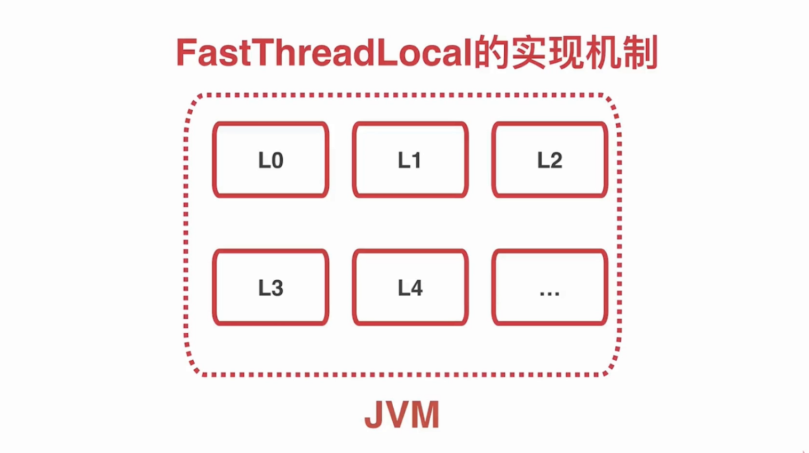
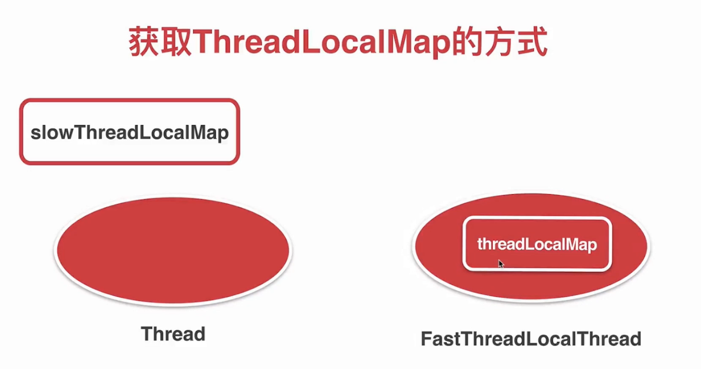

# 8. 两个性能优化工具类
## 1. FastThreadLocal
### 1.1 fastThreadLocal的实现机制
#### 1.1.1 fastThreadLocal的
```
// final 没有static 说明每个ThreadLocal都有这样一个值
  private final int index;

    public FastThreadLocal() {
		// 给index 赋值
        index = InternalThreadLocalMap.nextVariableIndex();
    }
	
	
	
    public static int nextVariableIndex() {
        int index = nextIndex.getAndIncrement();
        if (index < 0) {
            nextIndex.decrementAndGet();
            throw new IllegalStateException("too many thread-local indexed variables");
        }
        return index;
    }

```

每一个fastThreadLocal都有一个索引值
#### 1.1.2 fastThreadLocal的get()实现
1. 获取ThreadLocalMap
2. 通过索引取出对象
3. 如果没有这个对象 就初始化
```
   public static InternalThreadLocalMap get() {
        Thread thread = Thread.currentThread();
        if (thread instanceof FastThreadLocalThread) {
            return fastGet((FastThreadLocalThread) thread);
        } else {
            return slowGet();
        }
    }
```
io.netty.util.internal.InternalThreadLocalMap.get()
```
    public static InternalThreadLocalMap get() {
        Thread thread = Thread.currentThread();
        if (thread instanceof FastThreadLocalThread) {
            return fastGet((FastThreadLocalThread) thread);
        } else {
            return slowGet();
        }
    }

    private static InternalThreadLocalMap fastGet(FastThreadLocalThread thread) {
        InternalThreadLocalMap threadLocalMap = thread.threadLocalMap();
        if (threadLocalMap == null) {
            thread.setThreadLocalMap(threadLocalMap = new InternalThreadLocalMap());
        }
        return threadLocalMap;
    }
	
	
	// 获取JDK的ThreadLocal  是希望普通的线程也能使用fastThreadLocal
	    private static InternalThreadLocalMap slowGet() {
        ThreadLocal<InternalThreadLocalMap> slowThreadLocalMap = UnpaddedInternalThreadLocalMap.slowThreadLocalMap;
        InternalThreadLocalMap ret = slowThreadLocalMap.get();
        if (ret == null) {
            ret = new InternalThreadLocalMap();
            slowThreadLocalMap.set(ret);
        }
        return ret;
    }
```

FastThreadLocalThread 自己维护了一个map
普通Thread是获取JDK底层自己维护的一个Map

每个Thread都维护了铜一个InternalThreadLocalMap 通过索引值直接去获取对象
#### 1.1.3 fastThreadLocal的set()实现
1.	获取ThreadLocalMap对象
2.	直接通过索引获取对象
3.	如果是set删除  那就remove
## 2. Recycler 轻量对象池
主要回收bytebuf

